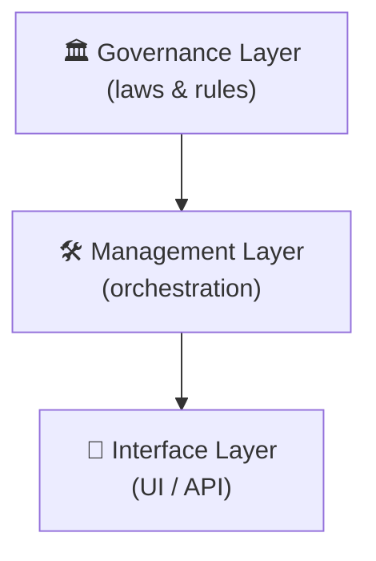
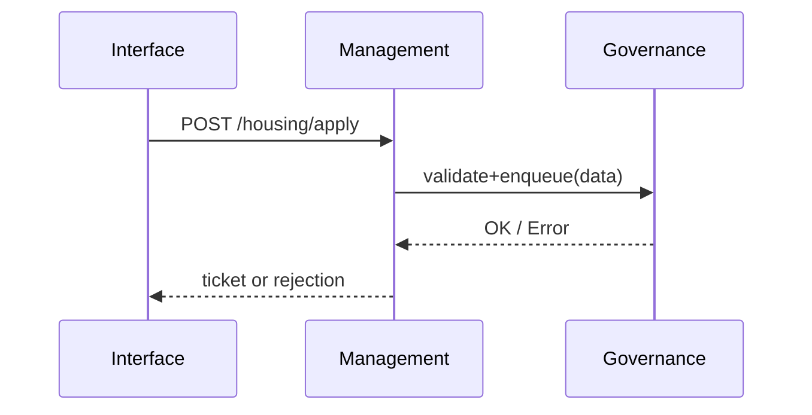

# Chapter 1: Three-Layer Governance Model

> “Imagine a public capitol where every floor has just one job:  
>  1️⃣ write the rules, 2️⃣ make sure they’re followed, 3️⃣ greet the public.”  

The Three-Layer Governance Model is HMS’s architectural “capitol.”  
Every domain—health, housing, finance—uses the same three floors so newcomers can immediately picture **where** to plug things in and experts can evolve any one layer without collapsing the rest.

---

## 1. Why do we need it? – A Tiny Story

You, Alex, want to apply for a federal **Affordable Housing Voucher** online.

1. You open a housing portal and fill out a form.  
2. Behind the scenes the system decides whether the form is valid, if your income qualifies, and which office should review it.  
3. You receive a friendly dashboard: “Application received. ETA 5 days.”

Without a clear separation, UI tweaks could accidentally break policy checks, or new legislation could force a full rewrite. The Three-Layer Model prevents that by keeping each concern on its own floor.

---

## 2. Meet the Floors



| Floor | Nickname | What It Owns | Example (Housing Voucher) |
|-------|----------|--------------|---------------------------|
| 1. Governance | “Lawmakers” | Policies, regulations, compliance checks | Rule: “Household income ≤ 80% area median” |
| 2. Management | “Enforcers”   | Workflow, service mesh, monitoring | Route application to nearest housing office |
| 3. Interface  | “Clerks”      | Web/Mobile UI, public API, docs | The form you filled & status dashboard |

### 2.1 Governance Layer (Policy & Compliance)
• Defines rules in code (see [Chapter 2](02_hms_cdf___policy_engine___codified_democracy_foundation__.md))  
• Provides audit trails (“why was Alex rejected?”)  

### 2.2 Management Layer (Service Orchestration)
• Coordinates micro-services (coming in [Chapter 3](03_hms_micro_services_backbone_.md))  
• Retries, logs, and meters all calls  

### 2.3 Interface Layer (UI / API)
• Everything a citizen or agency system touches  
• Built from micro-frontends (see [Chapter 6](06_front_end_micro_frontends__hms_mfe__.md))

---

## 3. A 15-Second Code Peek

Below, the UI posts your application. **Notice how each layer stays tiny and focused.**

```python
# interface_layer/housing_portal.py
resp = api.post("/housing/apply", json=form_data)
print(resp.json())       # → {"ticket":"HV-2024-001","status":"received"}
```
Explanation: The Interface Layer only **collects** data and shows a response.

```python
# management_layer/router.py
def route_application(data):
    office = find_closest_office(data["zipcode"])
    return governance.check_and_enqueue(data, office)
```
Explanation: Management decides **where** to send the application and delegates rule-checking.

```python
# governance_layer/rules.py
INCOME_THRESHOLD = 0.8  # 80% of AMI

def check_and_enqueue(data, office):
    if data["income"] > data["ami"] * INCOME_THRESHOLD:
        return {"error":"Income too high"}, 422
    # else push to message queue for office
    queue.send(office, data)
    return {"ticket":ticket_id(data), "status":"received"}, 202
```
Explanation: Governance **accepts or rejects** based on law, then enqueues.

All three blocks are < 20 lines, yet the full flow works—thanks to the clear floors.

---

## 4. What Happens Under the Hood?



Step-by-step:  
1. **Interface** collects data.  
2. **Management** decides location and calls **Governance**.  
3. **Governance** checks law, records audit, queues job.  
4. Results bubble back to the citizen.

---

## 5. When Would I Touch Each Floor?

• New legislation passes → update the **Governance** rule files only.  
• You add SMS notifications → modify **Management** workflow.  
• Designers refresh branding → tweak **Interface** CSS.

Because layers are independent, each team can sprint without stepping on the others.

---

## 6. Relation to the Rest of HMS

The model is our skeleton; the remaining chapters add flesh:

• Policy engine details live in [HMS-CDF](02_hms_cdf___policy_engine___codified_democracy_foundation__.md).  
• Service mesh & retries appear in [HMS Micro-services Backbone](03_hms_micro_services_backbone_.md).  
• Front-end composition arrives in [Front-End Micro-Frontends](06_front_end_micro_frontends__hms_mfe__.md).  
… and so on.

---

## 7. Summary

You learned:

1. The Three-Layer Governance Model’s purpose and layout.  
2. How it cleanly separates policy, orchestration, and user interaction.  
3. A tiny housing-voucher walk-through showing the layers in action.

In the next chapter we dive into the **brains** of the first floor: the Policy Engine that turns legislation into executable code.

[Next Chapter → HMS-CDF  (Policy Engine / Codified Democracy Foundation)](02_hms_cdf___policy_engine___codified_democracy_foundation__.md)

---

Generated by [AI Codebase Knowledge Builder](https://github.com/The-Pocket/Tutorial-Codebase-Knowledge)