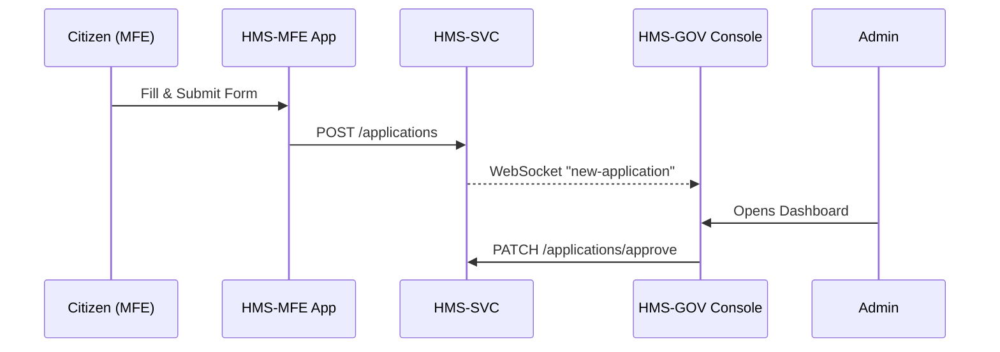

# Chapter 1: User Interface Suite (HMS-MFE & HMS-GOV)

Welcome to HMS-DOC!  
We will spend this first chapter exploring the “faces” of the system—the screens citizens and agency staff actually touch.

Imagine Jane, a parent in Ohio, opening her phone to renew SNAP benefits. She taps through a few friendly pages, uploads a pay stub, and hits **Submit**. Minutes later Mark, a case manager at the Federal Mediation and Conciliation Service, sees Jane’s application in his web console, reviews it, and clicks **Approve**.  

Jane used **HMS-MFE**; Mark used **HMS-GOV**.  
Together they form the **User Interface Suite**.

---

## 1. Why Do We Need a Suite?

Government programs serve **millions** of people but must look and feel consistent—like every federal form sharing the same eagle-emblazoned header. Without a shared UI, each agency might build:

* its own color palette  
* its own “Submit” button  
* its own (possibly inaccessible) form widgets

The Suite solves this by providing:

1. HMS-MFE — Mobile & Citizen Front Ends  
2. HMS-GOV — Administrator & Staff Consoles  
3. A Shared Component Library — One source of truth for typography, colors, ARIA labels, etc.

Change a color in one place, and every agency inherits it automatically.

---

## 2. Key Concepts in Plain English

| Concept | Think of it like… | Why it matters |
|---------|------------------|----------------|
| HMS-MFE | A single countertop touchscreen in every post office | Citizens always know where to “line up.” |
| HMS-GOV | The clerk’s back-office dashboard | Staff can process requests quickly. |
| Shared Components | Pre-stamped envelopes | Guarantees federal branding & WCAG accessibility. |
| Micro-Frontends | Lego blocks | Each agency can plug in its own small apps. |
| Theme Switcher | A coat of paint | OSTP wants blue; FMCS wants green—still same internals. |

---

## 3. Quick Start: Spinning Up HMS-MFE Locally

Below is the tiniest possible React app using HMS shared components.  
(We pretend the library is published as `@hms/components`.)

```jsx
// src/App.js
import { Button, Container, Header } from '@hms/components';
import React from 'react';

export default function App() {
  return (
    <Container>
      <Header title="Benefit Renewal" />
      <p>Welcome back, Jane!</p>
      <Button onClick={() => alert('Submitted!')}>
        Submit Renewal
      </Button>
    </Container>
  );
}
```

What happens?  
1. `Container` centers content and enforces 16 px base font.  
2. `Header` applies the approved federal typeface and a “§” icon.  
3. `Button` already has keyboard focus styling and ARIA roles—no extra work!

---

## 4. Building a Small Complaint Form

Suppose OSTP needs a public feedback form.

```jsx
// pages/Complaint.jsx
import { TextArea, Button } from '@hms/components';
import { useState } from 'react';
import api from '../util/api';           // thin wrapper around fetch()

export default function Complaint() {
  const [msg, setMsg] = useState('');
  return (
    <>
      <TextArea
        label="Describe your concern"
        value={msg}
        onChange={e => setMsg(e.target.value)}
      />
      <Button
        disabled={!msg}
        onClick={() => api.post('/complaints', { body: msg })}
      >
        File Complaint
      </Button>
    </>
  );
}
```

Once submitted, the message is routed to HMS-SVC back-end services (covered in [Backend Services Layer (HMS-SVC)](11_backend_services_layer__hms_svc__.md)) and then displayed to staff in HMS-GOV.

---

## 5. A 10-Second Tour of HMS-GOV

Agency consoles look similar but show privileged tools:

```jsx
// src/routes/BudgetReview.jsx
import { Table, Badge, Button } from '@hms/components';

const rows = [
  { program: 'Wildland Fire Grants', amount: '$1.2M', status: 'Pending' },
];

export default () => (
  <Table
    data={rows}
    columns={['program', 'amount', 'status']}
    renderStatus={s => <Badge tone={s === 'Pending' ? 'warning' : 'success'}>{s}</Badge>}
    actions={row => <Button small>Approve</Button>}
  />
);
```

Again, zero CSS!—all style comes from the shared library.

---

## 6. Under the Hood (Non-Code Walk-through)



1. Jane presses **Submit** in MFE.  
2. HMS-MFE makes a REST call to HMS-SVC.  
3. HMS-SVC emits a real-time notification.  
4. Mark’s GOV console auto-refreshes.  
5. Mark approves, and the status flows back.

---

## 7. Peeking at the Internal Folder Layout

```
hms-ui/
 ├─ mfe/          # citizen facing
 ├─ gov/          # admin facing
 ├─ components/   # shared library
 └─ theme/        # colors, spacing tokens
```

A tiny snippet shows how both apps import the **same** button:

```js
// components/index.js
export { default as Button } from './Button';
```

```js
// mfe/pages/Renew.jsx
import { Button } from '../../components';
```

```js
// gov/pages/Approve.jsx
import { Button } from '../../components';
```

Because the path is identical, upgrades are universal.

---

## 8. Relationship to Other HMS Topics

* Automatic routing and helpful breadcrumbs will be detailed in [Intent-Driven Navigation & AI-Guided Journeys](02_intent_driven_navigation___ai_guided_journeys_.md).  
* The component library itself gets a deep dive in [Modular Component Library](04_modular_component_library_.md).  
* Access checks for GOV dashboards tie into [Role-Based Access Control & Accountability Ledger](09_role_based_access_control___accountability_ledger_.md).

---

## 9. Recap

You’ve learned:

1. The purpose of HMS-MFE (citizen) and HMS-GOV (staff).  
2. How a shared component library enforces branding and accessibility.  
3. A quick coding example for each side.  
4. The high-level request flow behind a submission.

Pretty neat, right? 🎉

Next, we’ll see how users *navigate* these interfaces without getting lost—powered by AI hints and intent prediction. Continue to [Intent-Driven Navigation & AI-Guided Journeys](02_intent_driven_navigation___ai_guided_journeys_.md).

---

Generated by [AI Codebase Knowledge Builder](https://github.com/The-Pocket/Tutorial-Codebase-Knowledge)