# Chapter 2: HMS-CDF  (Policy Engine / Codified Democracy Foundation)

*(If you skipped ahead, you may want to peek at [Chapter 1: Three-Layer Governance Model](01_three_layer_governance_model_.md) for the big picture.)*

---

## 1. Why Do We Need a “Policy Engine”?

Picture the Federal Aviation Administration (FAA) in 2025.  
Congress just passed the *Safe Skies for Drones Act*, a 60-page bill that

1. sets a **400 ft altitude limit** for hobby drones,  
2. requires **night-time lights**, and  
3. allows local parks to apply for **time-limited waivers**.

Citizens expect the new rules to show up **tomorrow** in every flight-planning app.  
Traditionally this would mean:

* lawyers interpret the bill,  
* IT writes SQL or if-statements,  
* auditors chase email threads when something goes wrong.

HMS-CDF turns that marathon into a **relay** where each legislative step is encoded, audited, and executable—*without* skipping parliamentary procedure.

---

## 2. What Exactly *Is* HMS-CDF?

Think of HMS-CDF as **“git for laws + a Rust runtime.”**

| Piece                 | Analogy (Congress)        | What It Does in HMS-CDF                              |
|-----------------------|---------------------------|------------------------------------------------------|
| Policy Module         | A Bill                    | Rust crate + metadata that defines a rule set        |
| State Machine         | Committee > Floor > Law   | Valid transition map (draft → markup → vote → live)  |
| Audit Trail           | Congressional Record      | Cryptographic log of *who* changed *what* *when*     |
| Time-Travel Debugger  | C-SPAN Rewind             | Replay past states to answer “why did we deny Anna?” |

Everything lives in **plain files** so agencies can:

* fork (`git clone`) an existing rule set (e.g., Medicare),  
* tweak numbers in one commit, and  
* deploy through an automated vote pipeline.

---

## 3. A 60-Second Walk-Through

Let’s codify the *400 ft drone limit*.

### 3.1 Draft the Rule (Bill)

```rust
// file: drone_altitude.rs
rule!("MAX_ALTITUDE")  // unique ID
     .description("Max legal altitude for hobby drones")
     .units("feet")
     .set(400);
```

**What just happened?**  
We created a *draft* rule with an ID, a description, and a value.

### 3.2 Committee Markup – Amend the Number

```rust
// file: committee_patch.rs
amend!("MAX_ALTITUDE").set(500);  // raise to 500 ft
```

A committee can file an **amendment** (just another Rust function). The engine records:

```
▶ Amendment a1 by @Rep.Cruz raise 400→500 ft
```

### 3.3 Floor Vote – Accept or Reject

```rust
// file: vote.rs
vote!("MAX_ALTITUDE", accept_amendment = true);
```

If the vote passes, the state machine slides the rule into **ENACTED** status.

```
📜 MAX_ALTITUDE enacted @ block 982734 (value = 500 ft)
```

### 3.4 Query from a Citizen App

```python
alt = api.get("/rules/MAX_ALTITUDE").json()["value"]
print(alt)              # → 500
```

The UI (Interface Layer) doesn’t care about committees or votes—it just sees the live value.

---

## 4. How Do I Use HMS-CDF in My Project?

### 4.1 Scaffolding a New Policy Module

```bash
hms-cdf init faa-drone-regs
cd faa-drone-regs
```

Command output:

```
✔ Created policy.toml
✔ Added src/lib.rs
✔ Added CI workflow: draft→markup→vote→live
```

### 4.2 Register a Rule & Run Tests

```bash
echo 'rule!("MAX_WEIGHT").units("grams").set(250);' >> src/weight.rs
cargo test
```

The included test harness **denies compilation** if any required step (e.g., vote) is missing.

---

## 5. What Happens Under the Hood?


1. **Citizen App** asks for a rule.  
2. **Management Layer** proxies the request.  
3. **CDF Engine** verifies the rule is *ENACTED* and immutable.  
4. Every read/write is notarized in **LOG**.  
5. Value returns to the user.

---

## 6. Peeking Inside the Engine (Tiny Code Tour)

### 6.1 State Machine Definition

```rust
// src/state.rs  (12 lines)
#[derive(Clone)]
pub enum Status { Draft, Markup, Voting, Enacted }

pub fn next(current: Status, action: &str) -> Option<Status> {
    use Status::*;
    match (current, action) {
        (Draft,   "submit_markup") => Some(Markup),
        (Markup,  "start_vote")    => Some(Voting),
        (Voting,  "vote_pass")     => Some(Enacted),
        _                          => None,
    }
}
```

*Less than 15 lines to keep rules honest.*  
If someone tries to jump straight from Draft → Enacted, `next()` returns `None` and the build fails.

### 6.2 “Time-Travel” Query

```rust
// src/history.rs  (18 lines)
pub fn at(block: u64, id: &str) -> Option<Rule> {
    let snapshot = ledger::load(block);
    snapshot.rules.get(id).cloned()
}
```

Call `at(982700, "MAX_ALTITUDE")` to see the pre-vote value (400 ft).

---

## 7. Where Does HMS-CDF Sit In the Bigger HMS House?

* Governance Layer brain (this chapter)  
* Orchestrated by micro-services you’ll meet in [HMS Micro-services Backbone](03_hms_micro_services_backbone_.md)  
* Served to citizens through front-ends in [Front-End Micro-Frontends](06_front_end_micro_frontends__hms_mfe__.md)

Keep this mental map:

```mermaid
graph TD
  CDF["🏛️ HMS-CDF (Rules)"] --> ACT["🛠️ HMS-ACT (Workflows)"]
  ACT --> MFE["🖥️ HMS-MFE (UI)"]
```



---

## 8. Summary & Next Steps

In this chapter you learned:

1. Why codifying laws as executable Rust makes government moves **auditable, predictable, and lightning-fast**.  
2. The core pieces of HMS-CDF: Policy Modules, State Machines, Audit Trails, and Time-Travel.  
3. How to draft, amend, vote on, and query a rule with a few CLI commands and tiny code snippets.

Ready to see how these rules flow through fleets of micro-services?  
Jump to [Chapter 3: HMS Micro-services Backbone](03_hms_micro_services_backbone_.md).

---

---

Generated by [AI Codebase Knowledge Builder](https://github.com/The-Pocket/Tutorial-Codebase-Knowledge)