# Chapter 2: Intent-Driven Navigation & AI-Guided Journeys

*(a beginner-friendly walkthrough)*  

[← Back to Chapter 1: User Interface Suite (HMS-MFE & HMS-GOV)](01_user_interface_suite__hms_mfe___hms_gov__.md)

---

## 0. Why Do We Need “Intent-Driven” Anything?

Picture Maria, a farmer in New Mexico.  
She heard about a **Rural Broadband Expansion Grant**, but has **no idea** what form it lives in or which agency owns it.  
On the old web, she might:

1. Google random PDF links  
2. Download a 40-page instructions booklet  
3. Abandon the process out of frustration  

With HMS, Maria simply opens the app and answers one question:

> **“What do you want to do today?”**  
> &nbsp;&nbsp;• *“Apply for a rural broadband grant”*  

An AI concierge instantly assembles a step-by-step journey—no hunting for form numbers, no jargon.  
That is Intent-Driven Navigation.

---

## 1. Key Concepts in Plain English

| Term | Imagine it like… | Why it matters |
|------|------------------|----------------|
| **Intent Prompt** | A hotel concierge desk | You state your goal; the system figures out the route. |
| **Journey Planner Agent** | GPS route calculation | Breaks the big goal into bite-sized steps. |
| **Dynamic Screen Stack** | LEGO train track pieces | Screens snap together based on the plan. |
| **Smart Shortcuts** | Waze rerouting | Metrics help the AI shorten journeys over time. |
| **Feedback Loop** | Comment box at the exit | Data flows back so journeys keep improving. |

---

## 2. A 3-Minute Demo (Tiny Code Sample)

Below is a **minimal** React snippet showing how HMS-MFE calls the journey engine.

```jsx
// pages/IntentPrompt.jsx (12 lines)
import { IntentInput } from '@hms/components';
import { useState } from 'react';
import api from '../util/api';  // thin wrapper around fetch()

export default function IntentPrompt() {
  const [intent, setIntent] = useState('');

  const startJourney = async () => {
    const { journeyId } = await api.post('/journeys', { intent });
    window.location = `/journey/${journeyId}`;   // go to first step
  };

  return <IntentInput
    label="What do you want to do?"
    value={intent}
    onChange={e => setIntent(e.target.value)}
    onSubmit={startJourney}
  />;
}
```

What happens?

1. The user types a free-text goal.  
2. We `POST /journeys` with that goal.  
3. The server returns a new `journeyId`.  
4. The front-end redirects to the journey’s first screen.

*Under 20 lines, but we’ve already replaced a maze of links and PDFs!*

---

## 3. Under the Hood: How a Journey Is Built

```mermaid
sequenceDiagram
    participant Citizen as 🧑‍🌾 Maria (HMS-MFE)
    participant MFE as Intent Prompt
    participant JP as Journey Planner Agent
    participant UI as Dynamic Screen Stack
    participant GOV as Grant Reviewer (HMS-GOV)

    Citizen->>MFE: "Apply for rural broadband grant"
    MFE->>JP: POST /journeys { intent }
    JP-->>UI: [Step1, Step2, Step3…]
    Citizen->>UI: Upload docs / fill fields
    UI->>GOV: Final submission package
```



1. The **Journey Planner Agent** (an LLM-backed microservice) classifies the intent and looks up required steps in a policy database.  
2. It returns a lightweight array of step definitions (JSON).  
3. The **Dynamic Screen Stack** component renders one step at a time.  
4. Each user interaction records timing & click data for later optimization.

---

## 4. Anatomy of a Journey Definition

```json
// Example: journey/broadband.json
[
  { "id": "eligibilityCheck", "type": "form", "fields": ["zip", "farmSize"] },
  { "id": "documentUpload",  "type": "upload", "accept": ["pdf","jpg"] },
  { "id": "review",          "type": "summary" },
  { "id": "eSign",           "type": "signature" }
]
```

Explanation:

• The **Journey Planner** picks these steps based on policy rules and Maria’s profile (e.g., location = rural).  
• The front-end simply loops through this array and renders the matching micro-front-end for each `type`.  
• If the agency updates policy tomorrow (say, removes `eSign`), the next user automatically experiences the shorter path—no redeploy needed.

---

## 5. A Tiny Renderer Loop

```jsx
// components/JourneyRenderer.jsx (18 lines)
import React from 'react';
import screens from './screenRegistry';  // maps type → React component

export default function JourneyRenderer({ journey }) {
  const [stepIndex, setStep] = React.useState(0);
  const StepComp = screens[journey[stepIndex].type];

  const onNext = data => {
    /* save data ... */
    if (stepIndex + 1 < journey.length) setStep(stepIndex + 1);
    else window.location = '/done';
  };

  return <StepComp meta={journey[stepIndex]} onNext={onNext} />;
}
```

You don’t need to hard-wire anything; new screen types just register in `screenRegistry`.

---

## 6. Collecting Metrics for Smarter Paths

Every completed journey writes an “audit crumb”:

```ts
// pseudo-schema
crumb = {
  journeyId,
  stepId,
  dwellTimeMs,
  outcome: "success" | "error",
  timestamp
}
```

A nightly agent (covered later in [Specialized AI Agents (HMS-A2A)](05_specialized_ai_agents__hms_a2a__.md)) clusters slow or error-prone steps and suggests:

* Removing redundant questions  
* Reordering steps for better completion rates  
* Auto-filling known data from other federal systems

---

## 7. Relationship to Other HMS Pieces

• Screens rendered here are built from the shared components you met in [User Interface Suite](01_user_interface_suite__hms_mfe___hms_gov__.md).  
• AI agents that plan and optimize journeys plug into the governance rules explained in [AI Governance Model](06_ai_governance_model_.md) and are overseen by [Human-in-the-Loop Oversight](07_human_in_the_loop__hitl__oversight_.md).  
• Role checks before showing a step use [Role-Based Access Control & Accountability Ledger](09_role_based_access_control___accountability_ledger_.md).  

---

## 8. Mini-FAQ

**Q: What if the AI misunderstands the intent?**  
A: The first step is always a lightweight confirmation screen—“You’re about to apply for a Rural Broadband Grant. Is that correct?” Users can backtrack or rephrase.

**Q: How do agencies add a new journey?**  
Answer: Drop a new JSON file in the *policy store* and add metadata (title, eligibility rules). No recompilation.

**Q: Does it work offline?**  
Journeys cache the next step locally; rural users with spotty internet can proceed until submission.

---

## 9. Recap & Next Steps

In this chapter you learned:

1. The motive behind Intent-Driven Navigation.  
2. How an **Intent Prompt → Journey Planner → Dynamic Screens** pipeline works.  
3. Why feedback crumbs are gold for continuous improvement.  
4. How only a handful of lines of code can launch a fully AI-guided flow.

In the next chapter we’ll peek under the hood of the overall **Three-Layer Domain Architecture** that lets all these pieces talk cleanly.

[→ Continue to Chapter 3: Three-Layer Domain Architecture](03_three_layer_domain_architecture_.md)

---

Generated by [AI Codebase Knowledge Builder](https://github.com/The-Pocket/Tutorial-Codebase-Knowledge)