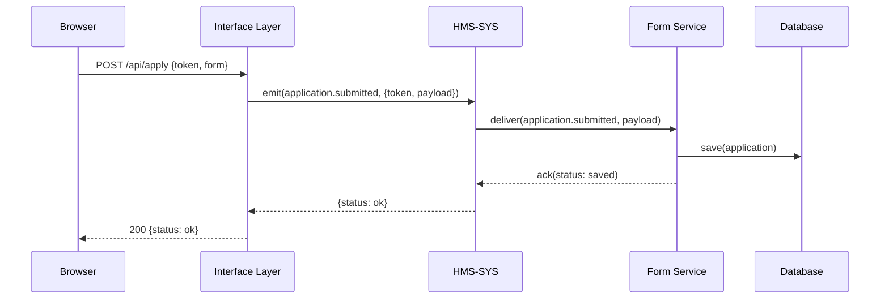

# Chapter 2: Interface Layer

Now that you’ve seen how HMS-SYS acts as our “central utility plant” in [Chapter 1: Core System Platform (HMS-SYS)](01_core_system_platform__hms_sys__.md), it’s time to build the “translator booth” between frontends and backends: the **Interface Layer**.

## 1. Motivation & Central Use Case

Imagine you work for a federal agency that provides small-business loans. Your web team builds a React portal, and your backend team builds microservices for authentication, application processing, and notifications. Without a shared interface, each side writes its own API definitions and message formats—quickly leading to confusion.

**Enter the Interface Layer**, which:
- Defines and enforces a single set of REST/WebSocket endpoints.
- Shares UI component contracts (field names, validation rules).
- Routes requests or messages through HMS-SYS without leaking complexity.

You can think of it as the interpreter in a UN summit: frontend experts speak in “web app” language, backend experts speak in “microservice” language, and the Interface Layer translates perfectly.

## 2. Key Concepts

1. **API Gateway**  
   A lightweight server exposing well‐defined HTTP (or WebSocket) endpoints for the frontend.

2. **Shared Schemas & Validation**  
   JSON Schemas or TypeScript definitions that guarantee both sides agree on data shapes.

3. **Routing & Protocol Translation**  
   The layer converts HTTP calls into HMS-SYS events (or direct microservice calls) and vice versa.

## 3. Using the Interface Layer

### 3.1 Define an Endpoint

Let’s expose a “submit application” endpoint in `interface/index.js`:

```js
// interface/index.js
const express      = require('express');
const CoreClient   = require('../hms-sys/client');
const { validate } = require('./validator');

const app    = express();
const client = new CoreClient('http://localhost:4000');

app.use(express.json());

app.post('/api/apply', validate('Application'), async (req, res) => {
  const { token, form } = req.body;
  // Translate HTTP request into an event for HMS-SYS
  const result = await client.emit('application.submitted', { token, payload: form });
  res.status(result.status === 'ok' ? 200 : 400).json(result);
});

app.listen(3000, () => console.log('Interface Layer on port 3000'));
```

This code:
- Sets up an Express server on port 3000.
- Validates incoming JSON against a shared schema.
- Emits an `application.submitted` event to HMS-SYS.
- Returns the final status to the client.

### 3.2 Example Request & Response

**Request**  
POST http://localhost:3000/api/apply  
```json
{
  "token": "eyJ…",
  "form": { "name": "Alice", "amount": 50000 }
}
```

**Response**  
```json
{ "status": "ok" }
```

## 4. Under the Hood: Step-by-Step Flow



1. **Browser** calls **Interface Layer**.  
2. **Interface Layer** validates and emits an event to **HMS-SYS**.  
3. **HMS-SYS** routes to the **Form Service**.  
4. **Form Service** writes to the **Database** and acknowledges.  
5. The result travels back to the **Browser**.

## 5. Under the Hood: Implementation Details

### 5.1 Validator Module (`interface/validator.js`)

```js
// interface/validator.js
const Ajv = require('ajv');
const schemas = {
  Application: { type: 'object', properties: {
    token: { type: 'string' },
    form:  { type: 'object' }
  }, required: ['token','form'] }
};

const ajv = new Ajv();
function validate(name) {
  const validate = ajv.compile(schemas[name]);
  return (req, res, next) => {
    if (!validate(req.body)) {
      return res.status(400).json({ error: validate.errors });
    }
    next();
  };
}

module.exports = { validate };
```

- Uses **Ajv** to enforce shared JSON schemas.
- Rejects malformed requests before they reach your backend.

### 5.2 Routing Logic

We already saw the POST handler in `interface/index.js`. Internally, it:

1. **Checks** the request body via `validate()`.  
2. **Calls** `CoreClient.emit(event, data)` from [Chapter 1](01_core_system_platform__hms_sys__.md).  
3. **Maps** the core’s response into an HTTP status and JSON payload.

## 6. Summary & Next Steps

In this chapter you learned:
- Why an **Interface Layer** is like a translator booth for web and microservices.
- How to define a simple HTTP endpoint that forwards to HMS-SYS.
- How shared schemas ensure both sides agree on data shapes.
- The step-by-step event flow from browser to database.

Up next, we’ll see how to build richer **Backend APIs** in [Chapter 3: Backend API (HMS-API / HMS-MKT)](03_backend_api__hms_api___hms_mkt__.md).

---

Generated by [AI Codebase Knowledge Builder](https://github.com/The-Pocket/Tutorial-Codebase-Knowledge)