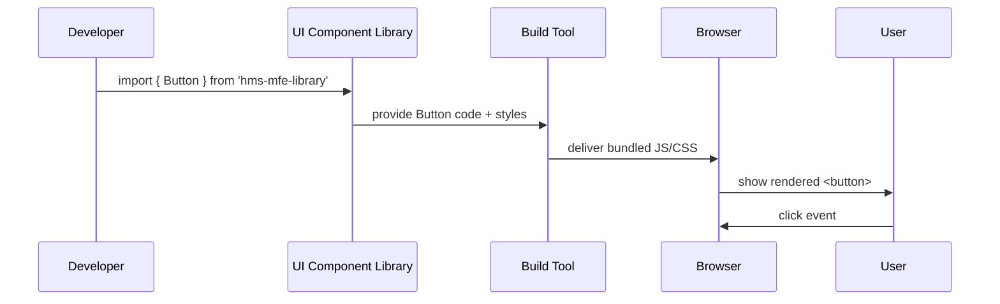

# Chapter 2: UI Component Library (HMS-MFE)

Welcome back! In [Chapter 1: Interface Layer](01_interface_layer_.md) we saw how HMS-MFE presents forms and screens to users. Now we’ll dive into the **UI Component Library**—our standardized toolkit for building those screens quickly and consistently.

---

## 1. Why a Component Library? (Motivation)

Imagine the Federal Highway Administration (FHWA) needs to build two new portals:

- One for reporting road damage  
- Another for tracking maintenance schedules  

Without a shared library, each team might reinvent:

- Buttons with different colors  
- Form inputs that validate differently  
- Charts that look inconsistent  

With our **UI Component Library**, devs and designers simply pick from prebuilt, accessible, branded components. The result:

- Same look-and-feel across all agency portals  
- Faster development (drag-and-drop, reusable code)  
- Built-in accessibility and theming  

---

## 2. Key Concepts

1. **Atomic Components**  
   - Tiny building blocks: Button, InputField, Card  
2. **Composite Components**  
   - Bigger pieces built from atomics: Form, Modal, DataTable  
3. **Theming & Styling**  
   - Central theme file for colors, fonts, spacing  
4. **Accessibility**  
   - Keyboard navigation, ARIA labels, focus states baked in  
5. **Storybook Preview**  
   - Live playground where designers review each component  

---

## 3. Putting It to Work: A Sample “Citizen Feedback” Form

Suppose the Office on Violence Against Women wants a simple feedback form. Here’s how you’d use the library:

```jsx
// File: src/pages/FeedbackForm.jsx
import React, { useState } from 'react';
import { Form, InputField, Button } from 'hms-mfe-library';

export default function FeedbackForm() {
  const [values, setValues] = useState({ name: '', comments: '' });

  function handleChange(e) {
    setValues({ ...values, [e.target.name]: e.target.value });
  }

  function handleSubmit(e) {
    e.preventDefault();
    alert('Thanks, ' + values.name + '!');
    // …send to API…
  }

  return (
    <Form onSubmit={handleSubmit}>
      <InputField
        name="name"
        label="Your Name"
        value={values.name}
        onChange={handleChange}
        required
      />
      <InputField
        name="comments"
        label="Comments"
        type="textarea"
        value={values.comments}
        onChange={handleChange}
        required
      />
      <Button type="submit" label="Submit Feedback" />
    </Form>
  );
}
```

Explanation:
- We import three components from our library.
- We wire up state and handlers as usual.
- Each component already follows FHWA branding and accessibility rules.

---

## 4. Under the Hood: How a Component Renders

Here’s a simple flow of what happens when you use `<Button>` in your code:



1. **Developer** imports a component.  
2. **Library** hands over the React code and CSS variables.  
3. **Bundler** (e.g., Webpack) packages everything.  
4. **Browser** renders the element.  
5. **User** interacts, triggering props like `onClick`.

---

## 5. Inside the Library: A Peek at Button

Here’s how our atomic `Button` might be defined:

```jsx
// File: hms-mfe-library/components/Button.jsx
import React from 'react';
import './Button.css'; // Branded styles

export function Button({ label, onClick, type = 'button' }) {
  return (
    <button className="hms-btn" type={type} onClick={onClick}>
      {label}
    </button>
  );
}
```

And the CSS could reference a theme:

```css
/* File: hms-mfe-library/components/Button.css */
.hms-btn {
  background-color: var(--primary-color);
  color: white;
  padding: 0.5rem 1rem;
  border: none;
  border-radius: 4px;
  cursor: pointer;
}
.hms-btn:focus {
  outline: 2px solid var(--focus-color);
}
```

The theme file sits at the root of the library:

```js
// File: hms-mfe-library/theme.js
export default {
  '--primary-color': '#005ea2',
  '--focus-color': '#ffbf47',
  // …other design tokens…
};
```

---

## 6. Analogy Recap

Think of the UI Component Library as:

- A **Lego set**: Each brick (button, input) snaps together to form castles (forms, dashboards).  
- A **style guide** in code: Designers and devs share the same “official” toolkit.  
- A **time-saver**: Build new portals by assembling tested, accessible parts.

---

## Conclusion

You’ve learned:

- Why a shared component library speeds up development and ensures consistency.  
- How to import and use basic atoms like `Button` and `InputField`.  
- What happens under the hood when you render these components.

Next up: securing these UIs with **[Authentication & Authorization](03_authentication___authorization_.md)**.

---

Generated by [AI Codebase Knowledge Builder](https://github.com/The-Pocket/Tutorial-Codebase-Knowledge)