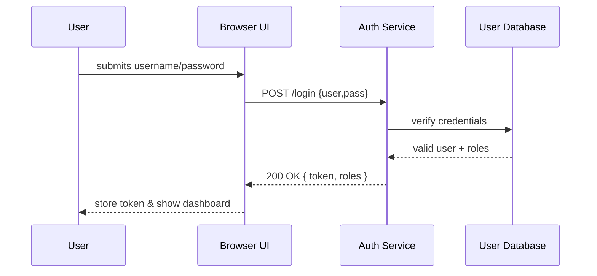

# Chapter 3: Authentication & Authorization

Welcome back! In [Chapter 2: UI Component Library (HMS-MFE)](02_ui_component_library__hms_mfe__.md) we built beautiful forms and buttons. Now let’s secure them! We’ll learn how HMS checks “who you are” (authentication) and “what you can do” (authorization)—just like a secure badge checkpoint at a federal office building.

---

## 1. Why Authentication & Authorization? (Motivation)

Imagine three users at a Department of Justice portal:

1. **Citizen**: Views their case status.  
2. **Clerk**: Edits case details.  
3. **Manager**: Approves final reports.

Without security, anyone could see or change data. We need:

- **Authentication**: Verify identity (SSO, passwords, multi-factor).  
- **Authorization**: Grant rights based on roles (citizen, clerk, manager).

This chapter shows a minimal login flow and how we gate features by role.

---

## 2. Key Concepts

1. **Authentication**  
   - Confirms your identity.  
   - Methods: Username/password, SSO (OAuth), Multi-Factor Authentication (MFA).  

2. **Authorization**  
   - Determines access rights.  
   - Uses **roles** (citizen, clerk, manager) and **permissions** (view, edit, approve).

3. **Identity Provider (IdP)**  
   - External system that vouches for you (e.g., Google SSO, agency LDAP).  

4. **Session or JWT**  
   - Token stored in the browser after login to prove authentication on each request.

---

## 3. Implementing a Simple Login Flow

We’ll build a login form in HMS-MFE, then show how the backend issues a token.

### 3.1 UI: `LoginForm.jsx`

```jsx
import React, { useState } from 'react';
import { InputField, Button } from 'hms-mfe-library';

export function LoginForm({ onSuccess }) {
  const [creds, setCreds] = useState({ user: '', pass: '' });
  const handleChange = e => setCreds({ ...creds, [e.target.name]: e.target.value });
  const handleSubmit = async e => {
    e.preventDefault();
    const res = await fetch('/api/login', {
      method:'POST', headers:{'Content-Type':'application/json'},
      body:JSON.stringify(creds)
    });
    if (res.ok) onSuccess(await res.json());
  };

  return (
    <form onSubmit={handleSubmit}>
      <InputField name="user" label="Username" onChange={handleChange} required />
      <InputField name="pass" label="Password" type="password" onChange={handleChange} required />
      <Button type="submit" label="Log In" />
    </form>
  );
}
```

Explanation:
- We collect `user` and `pass`.  
- On submit, we POST to `/api/login`.  
- On success, we receive a token object.

### 3.2 Sequence Diagram



---

## 4. Under the Hood: Server Implementation

### 4.1 Step-by-Step Flow (Non-code)

1. **Receive Credentials**: API gets `{ user, pass }`.  
2. **Verify Password**: Compare hashed password in DB.  
3. **Issue Token**: Create a JWT with user ID and roles.  
4. **Return Token**: Client stores it (cookie or localStorage).  
5. **Gate Endpoints**: Protected endpoints check token and roles.

### 4.2 `login` Route (Express.js)

```js
// File: hms-api/routes/auth.js
import express from 'express';
import { verifyUser, makeToken } from '../services/auth.js';
const router = express.Router();

router.post('/login', async (req, res) => {
  const { user, pass } = req.body;
  const info = await verifyUser(user, pass); // checks DB
  if (!info) return res.status(401).send('Invalid credentials');
  const token = makeToken({ id: info.id, roles: info.roles });
  res.json({ token, roles: info.roles });
});

export default router;
```

Explanation:
- `verifyUser` checks username/password in the database.  
- `makeToken` signs a JWT containing roles.

### 4.3 Authorization Middleware

```js
// File: hms-api/middleware/authorize.js
export function authorize(requiredRole) {
  return (req, res, next) => {
    const { roles } = req.user; // decoded from token
    if (roles.includes(requiredRole)) return next();
    res.status(403).send('Forbidden');
  };
}
```

Explanation:
- Reads `req.user.roles` from a decoded JWT.  
- Allows or denies access based on `requiredRole`.

---

## 5. Analogy Recap

Think of this as a **federal building security desk**:

- **Authentication** = Checking your ID and maybe a second factor (like a fingerprint).  
- **Authorization** = Giving you a badge that says “clerk” or “manager,” so you only enter allowed rooms.

---

## Conclusion

You’ve learned how to:

- Build a login form in HMS-MFE.  
- Securely authenticate users with an API.  
- Gate routes based on roles using middleware.

Up next, we’ll dive into data management and business logic in the **[Management Layer](04_management_layer_.md)**.

---

Generated by [AI Codebase Knowledge Builder](https://github.com/The-Pocket/Tutorial-Codebase-Knowledge)