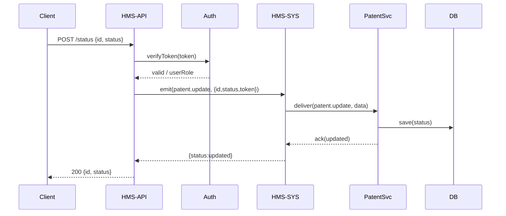

# Chapter 3: Backend API (HMS-API / HMS-MKT)

Now that you’ve seen how the [Interface Layer](02_interface_layer_.md) provides a translator between your web front end and the central bus, it’s time to build the “back-office” where official requests are processed, validated, and routed behind the scenes: the **Backend API**.

## 1. Motivation & Central Use Case

Imagine you work at the U.S. Patent Office. You need a programmatic API for:

- Retrieving patent details (for public websites or partner portals).  
- Letting examiners update a patent’s status (e.g., “Pending” → “Approved”).  
- Enforcing who can do what (only examiners can update status).  
- Coordinating all updates through our central orchestrator ([HMS-SYS](01_core_system_platform__hms_sys__.md)).

The Backend API is like the back office of a federal agency: it exposes endpoints, checks credentials, applies business rules, and then uses HMS-SYS to carry out the work.

## 2. Key Concepts

1. **Service Endpoints**  
   HTTP routes (e.g., `GET /api/v1/patents/:id`) that clients or the Interface Layer call.

2. **Authentication & Authorization**  
   Verifying tokens and user roles before any action.

3. **Request Validation**  
   Enforcing deeper domain rules (beyond basic JSON shape) before processing.

4. **Policy Coordination**  
   Emitting events or calling internal services to enforce policies and update data.

5. **Versioning & Consistent Responses**  
   Keeping a clear API version (e.g., `/v1/`) and returning uniform JSON.

## 3. Using the Backend API

Below is a minimal patent-management API:

### 3.1 Server Bootstrapping (`server.js`)

```js
// server.js
const express = require('express');
const patent  = require('./routes/patent');
const app     = express();

app.use(express.json());
app.use('/api/v1/patents', patent);

app.listen(4001, () => console.log('HMS-API on port 4001'));
```
We start Express on port 4001 and mount our patent routes at `/api/v1/patents`.

### 3.2 Patent Routes (`routes/patent.js`)

```js
// routes/patent.js
const router = require('express').Router();
const auth   = require('../middleware/auth');
const { emit } = require('../services/coreClient');

router.use(auth); // all routes require a valid token

// Fetch patent details
router.get('/:id', (req, res) => {
  // In real life, you'd fetch from a database
  res.json({ id: req.params.id, title: 'Solar Panel', status: 'Pending' });
});

// Update patent status
router.post('/:id/status', async (req, res) => {
  // Send an event to HMS-SYS for actual update
  await emit('patent.update', {
    id:     req.params.id,
    status: req.body.status,
    token:  req.headers.authorization
  });
  res.json({ id: req.params.id, status: req.body.status });
});

module.exports = router;
```

### 3.3 Example Requests & Responses

**GET** http://localhost:4001/api/v1/patents/123  
Response:
```json
{ "id": "123", "title": "Solar Panel", "status": "Pending" }
```

**POST** http://localhost:4001/api/v1/patents/123/status  
Request body:
```json
{ "status": "Approved" }
```  
Response:
```json
{ "id": "123", "status": "Approved" }
```

## 4. Under the Hood: Step-by-Step Flow



1. The API checks the token with **Auth Service**.  
2. On success, it emits a `patent.update` event to **HMS-SYS**.  
3. **HMS-SYS** forwards to the **Patent Service**, which writes to the database.  
4. Acknowledgments bubble back to the client.

## 5. Internal Implementation Details

### 5.1 Auth Middleware (`middleware/auth.js`)

```js
// middleware/auth.js
module.exports = (req, res, next) => {
  const token = req.headers.authorization;
  // Imagine we call Auth Service here…
  if (token !== 'valid-token') {
    return res.status(401).json({ error: 'Unauthorized' });
  }
  next();
};
```

Attach with `router.use(auth)` so every patent route is protected.

### 5.2 HMS-SYS Client (`services/coreClient.js`)

```js
// services/coreClient.js
const fetch = require('node-fetch');
const CORE  = 'http://localhost:4000';

exports.emit = async (event, data) => {
  const res = await fetch(`${CORE}/emit`, {
    method: 'POST',
    headers: {'Content-Type':'application/json'},
    body: JSON.stringify({ event, token: data.token, payload: data })
  });
  return res.json();
};
```

You call `emit()` in your route to coordinate with HMS-SYS.

## 6. Summary & Next Steps

In this chapter you learned how the **Backend API**:

- Exposes secure, versioned endpoints for data retrieval and updates.  
- Verifies tokens and enforces roles.  
- Coordinates domain logic through [HMS-SYS](01_core_system_platform__hms_sys__.md).  

Next up, we’ll build the user-facing experience in the [Frontend Interface (HMS-MFE / HMS-GOV)](04_frontend_interface__hms_mfe___hms_gov__.md).

---

Generated by [AI Codebase Knowledge Builder](https://github.com/The-Pocket/Tutorial-Codebase-Knowledge)