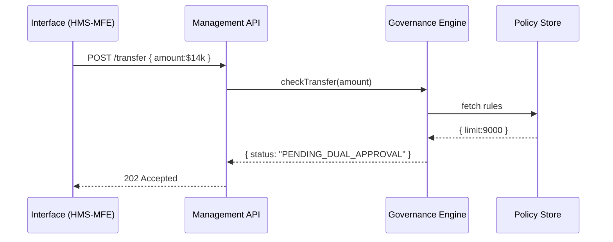

# Chapter 3: Three-Layer Domain Architecture
*[← Back to Chapter 2: Intent-Driven Navigation & AI-Guided Journeys](02_intent_driven_navigation___ai_guided_journeys_.md)*  

---

## 0. Why Another “Layer”?
Picture the **Treasury Department** discovering a spike in suspicious wire-transfers.  
Auditors must tighten money-laundering checks **today**, yet the public *payment portal* must stay open, and the *back-office screens* used by accountants should keep their familiar layout.

How can one team update audit rules without:

* touching citizen UIs,
* or breaking the case-processing workflow?

Answer: give each agency its own **three-floor courthouse** inside HMS—one floor for *rules*, one for *day-to-day work*, and one for the *public counter*.  
That is the **Three-Layer Domain Architecture**.

---

## 1. The Courthouse Analogy

| Floor | Real Courthouse | HMS Equivalent | Typical Changes |
|-------|-----------------|----------------|-----------------|
| 3. Interface | Front counter & signs | Web/mobile UX | Add chatbot, change colors |
| 2. Management | Clerks filing cases | Services & processes | Reorder workflow, add queue |
| 1. Governance | Judges interpreting law | Policy & compliance rules | New statute, stricter audits |

Because each floor has its own entrance, Treasury can renovate one floor without scaffolding the others.

---

## 2. Meet the Three Layers

### 2.1 Interface Layer (UX)
* React/Flutter micro-frontends you met in [User Interface Suite](01_user_interface_suite__hms_mfe___hms_gov__.md).  
* Talks **only** to the Management floor through HTTP or GraphQL.  
* Zero business logic—just collects data and shows status.

### 2.2 Management Layer (Services & Processes)
* Stateless micro-services running in [Backend Services Layer (HMS-SVC)](11_backend_services_layer__hms_svc__.md).  
* Orchestrates workflows, queues, and notifications.  
* Never hard-codes policy: instead it calls Governance APIs.

### 2.3 Governance Layer (Policy & Compliance)
* A rule engine + policy database.  
* Exposes `isAllowed?`, `calculateLimit()`, `nextRequiredStep()` style functions.  
* Guard-rails enforced by [AI Governance Model](06_ai_governance_model_.md).

---

## 3. Quick Start: Separating a Rule Change

Scenario: “Any ACH transfer over \$9,000 now requires dual approval.”

1. Add a rule file on the **Governance** floor:

```json
// governance/rules/treasury/ach.json
{
  "transferLimit": 9000,
  "requiresDualApproval": true
}
```

2. The **Management** API already calls:

```ts
const ok = await gov.check('transferLimit', amount);
```

3. No code change on the **Interface** floor; citizens still see the same “Transfer Funds” page.  
4. Staff console (Interface) automatically shows a “Waiting for Supervisor” badge because Management’s response status switched to `PENDING_DUAL_APPROVAL`.

*Under 20 lines of JSON + one function call—risk control upgraded with ZERO UX edits.*

---

## 4. How the Floors Talk (5-Step Walk-Through)



Notice how the UX never learns the \$9 k limit; tomorrow the limit could be \$8 k and only Governance changes.

---

## 5. A 10-Line Folder Blueprint

```
treasury/
 ├─ interface/          # React pages
 ├─ management/
 │    └─ transferSvc.js # business workflow
 └─ governance/
      ├─ rules/
      │   └─ ach.json
      └─ policyAPI.js
```

Nothing in `interface/` imports from `governance/`.  
That physical gap enforces the architectural one.

---

## 6. Peeking at the Code (≤20 lines each)

### 6.1 Interface Button

```jsx
// interface/TransferForm.jsx
<Button onClick={() =>
  api.post('/transfer', { amount })
}>Send</Button>
```

Simple, dumb, safe.

### 6.2 Management Workflow

```js
// management/transferSvc.js
export async function transfer(req, res) {
  const { amount } = req.body;
  const verdict = await gov.check('transfer', { amount });
  if (verdict.status === 'OK') moveMoney();
  res.status(202).json(verdict);
}
```

### 6.3 Governance Check

```js
// governance/policyAPI.js
import rules from './rules/ach.json';

export async function check(type, { amount }) {
  if (amount > rules.transferLimit)
    return { status: 'PENDING_DUAL_APPROVAL' };
  return { status: 'OK' };
}
```

Swap the JSON, redeploy Governance only, and you’re done.

---

## 7. Why Beginners Love This Separation

1. **One mental box at a time** – UI folks never read compliance PDFs.  
2. **Safer experiments** – Product teams A/B test a new chat widget (Interface) without fearing audit logs.  
3. **Clear ownership** – Legal owns Governance, Ops owns Management, Design owns Interface.

---

## 8. Relationship to Other HMS Chapters

* Interface components come from [Modular Component Library](04_modular_component_library_.md).  
* Governance APIs plug into the broader [Policy & Process Management API](08_policy___process_management_api_.md).  
* Audit entries generated here flow into [Role-Based Access Control & Accountability Ledger](09_role_based_access_control___accountability_ledger_.md).

---

## 9. Recap & What’s Next

You learned:

1. The courthouse metaphor for the **Three-Layer Domain Architecture**.  
2. How a simple rule change lives **only** on the Governance floor.  
3. How each floor communicates yet remains decoupled.  

Ready to beautify those top-floor screens?  
Jump to [Chapter 4: Modular Component Library](04_modular_component_library_.md).

---

Generated by [AI Codebase Knowledge Builder](https://github.com/The-Pocket/Tutorial-Codebase-Knowledge)