# Chapter 4: Backend API Layer (HMS-SVC & HMS-API)

*(If you skipped ahead, peek at the highways we just built in [Chapter 3: HMS Micro-services Backbone](03_hms_micro_services_backbone_.md) for context.)*

---

## 1. Why Yet *Another* Layer?

Think of a large city hall:

* Behind the lobby doors sit dozens of specialists (the **micro-services** from Chapter 3).  
* Citizens never talk to them directly.  
* Instead, every request is funneled through an official **service window**:  
  “Payment,” “Permits,” “Records,” etc.

Those windows are the **Backend API Layer**.  
They guarantee that:

1. Forms are filled correctly (schema validation).  
2. People show ID (authentication).  
3. Nobody hogs the queue (rate limits).  
4. Legacy systems aren’t flooded with junk (traffic shaping).

In HMS we split the job in two halves:

| Piece | Nickname | Purpose |
|-------|----------|---------|
| **HMS-SVC** | “Window Counter” | Implements business logic & talks to internal services |
| **HMS-API** | “Rule Book + Bouncer” | Publishes a stable contract, checks auth, throttles, and validates every request |

---

## 2. Mini-Story: Renewing a Driver’s License Online

1. **Jordan** uploads a new photo and pays the fee.  
2. The request hits the **License-Renewal API (HMS-API)**.  
3. The API checks Jordan’s identity token, file size, and call quota.  
4. It forwards the payload to **License-Renewal Service (HMS-SVC)**.  
5. The micro-services backbone prints the card, charges the account, and emails a receipt.  

This entire chapter shows how to build step 3 & 4.

---

## 3. Key Concepts (One-By-One)

### 3.1 API Contract (OpenAPI)

A machine-readable file that says *exactly* what you can send & receive.  
Versioned like `v1`, `v2`, so old clients don’t break.

### 3.2 Auth Plug-in

Verifies a JWT token **once**; downstream services trust the stamped request.

### 3.3 Rate Limiter

Simple counting bucket: *60 license renewals per user per hour*.

### 3.4 Schema Validator

Rejects a request before it touches code if the JSON is malformed or missing fields.

---

## 4. A 20-Line Contract

```yaml
# file: api/license/v1/openapi.yaml  (18 lines)
openapi: "3.0.0"
info:
  title: License Renewal API
  version: "v1"
paths:
  /renewal:
    post:
      summary: Renew a driver's license
      requestBody:
        required: true
        content:
          application/json:
            schema:
              $ref: "#/components/schemas/RenewalReq"
      responses:
        "202":
          description: Accepted
components:
  schemas:
    RenewalReq:
      type: object
      required: [driver_id, photo_base64]
      properties:
        driver_id: {type: string}
        photo_base64: {type: string, format: byte}
```

**Why it matters**: This single file becomes auto-docs, client SDKs, AND the validation gate.

---

## 5. Writing the Service (HMS-SVC) — 17 Lines

```python
# file: svc_license.py
from fastapi import FastAPI, HTTPException
import os, httpx

app = FastAPI()

PAY_URL = os.getenv("PAY_URL", "http://pay/charge")

@app.post("/renewal")
async def renewal(req: dict):
    # tiny sanity check – the big schema check already ran at the API layer
    if len(req["photo_base64"]) > 5_000_000:
        raise HTTPException(413, "Photo too large")
    # call internal payment service
    await httpx.post(PAY_URL, json={"driver": req["driver_id"], "amount": 35})
    # enqueue print-job (details skipped)
    return {"status": "accepted", "ticket": f"DL-{req['driver_id']}"}
```

Explanation:  
The code is blissfully small because auth, limits, and validation are handled upstream.

---

## 6. Trying It Out as a Client

```bash
# token is a short-lived JWT from HMS-ESQ (security chapter)
curl -H "Authorization: Bearer $TOKEN" \
     -X POST https://api.gov/hms/license/v1/renewal \
     -d '{"driver_id":"D123","photo_base64":"..."}'
```

Output (abbrev.):

```json
{"status":"accepted","ticket":"DL-D123"}
```

If you send malformed JSON you’ll get `400 Bad Request` **before** it touches Python.

---

## 7. What Happens Under the Hood?


Only **5 participants** keep the mental model simple.

---

## 8. Under the Hood Details

### 8.1 Gateway Plug-ins (Kong Example)

```yaml
# file: gateway/plugins/license.yml
_route: /hms/license/v1/*
plugins:
  - name: jwt
  - name: rate-limiting
    config: {minute: 60}
  - name: openapi-validator
    config: {spec: /specs/license/v1/openapi.yaml}
```

Push this YAML to Git; CI reloads the gateway.

### 8.2 Schema Registry Folder Layout

```
/specs
  └── license
      ├── v1
      │   └── openapi.yaml
      └── v2
          └── openapi.yaml
```

Adding **v2** never breaks **v1**.  
The gateway routes `/v1/*` and `/v2/*` separately.

---

## 9. Adding a New Endpoint in 3 Steps

1. Edit `openapi.yaml` — add `/renewal/status`.  
2. Re-run validator tests:

```bash
hms api test license/v1
```

3. Deploy:

```bash
hms api publish license/v1
```

CI lints the spec, auto-generates SDK stubs, and hot-loads the gateway.

---

## 10. Common Beginner Mistakes

| Mistake | Quick Fix |
|---------|-----------|
| “Why am I getting 413 errors?” | Check photo size limit in the contract. |
| “My unit test passes but API calls fail.” | Run `hms api test` to ensure the spec & service stay in sync. |
| “Clients time-out randomly.” | Likely hit the rate-limit; inspect `X-RateLimit-Remaining` header. |

---

## 11. How This Fits the Bigger HMS Picture

• Reads security tokens issued by [Security, Compliance & Legal Reasoning (HMS-ESQ)](18_security__compliance___legal_reasoning__hms_esq__.md).  
• Talks to internal services via the backbone from [Chapter 3](03_hms_micro_services_backbone_.md).  
• Gets advertised to other agencies and vendors through the [Marketplace & Discovery (HMS-MKT)](05_marketplace___discovery__hms_mkt__.md) we’ll see next.

Keep the mental map:

```mermaid
graph TD
  API["🎫 HMS-API (window)"] --> SVC["⚙️ HMS-SVC (logic)"] --> CORE["🛣️ Backbone"]
```



---

## 12. Summary & What’s Next

In this chapter you learned:

1. Why the Backend API Layer acts like **official service windows**.  
2. The split between **HMS-API** (contract + guard) and **HMS-SVC** (business logic).  
3. How to write a 20-line OpenAPI spec, a 17-line service, and watch the gateway enforce auth, limits, and validation automatically.

Ready to let others **discover** and **subscribe** to your shiny new APIs?  
Jump to [Chapter 5: Marketplace & Discovery (HMS-MKT)](05_marketplace___discovery__hms_mkt__.md).

---

Generated by [AI Codebase Knowledge Builder](https://github.com/The-Pocket/Tutorial-Codebase-Knowledge)