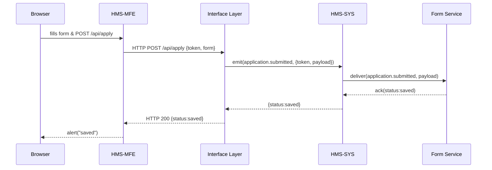

# Chapter 4: Frontend Interface (HMS-MFE / HMS-GOV)

Now that you’ve built the [Backend API (HMS-API / HMS-MKT)](03_backend_api__hms_api___hms_mkt__.md), it’s time to create the face citizens and internal staff use—the **Frontend Interface**, also known as **HMS-MFE** (Micro-Frontend for Citizens) and **HMS-GOV** (Admin Dashboard).

---

## 1. Motivation & Central Use Case

Imagine a federal benefits agency:

- **Citizens** visit a public portal to submit an application for assistance (e.g., disaster relief grants).  
- **Case workers** log into an internal dashboard to review, approve, or request more information—seeing forms, reports, and live status.

Our **Frontend Interface** is that public counter and back-office console. It lets users:

1. Fill out and submit forms.  
2. Track application status in real time.  
3. View reports or dashboards (for staff).  

It must be simple to develop, secure, and talk to your [Interface Layer](02_interface_layer_.md) and [Backend API](03_backend_api__hms_api___hms_mkt__.md).

---

## 2. Key Concepts

1. **Micro-Frontend (HMS-MFE)**  
   A self-contained React/Vue/Angular app for public users.  
2. **Admin Dashboard (HMS-GOV)**  
   A secure, role-based console for staff.  
3. **Form Rendering & Validation**  
   Show fields, validate on the client, then POST to `/api/apply`.  
4. **Reports & Tables**  
   Fetch lists of applications, filter, sort, and display.  
5. **Real-Time Updates**  
   Use WebSockets to push status changes (so a citizen sees “Approved” as soon as staff updates it).

---

## 3. Building a Citizen Application Form

Below is a minimal React component that lets a citizen submit a benefit application. It calls our Interface Layer at `POST /api/apply`.

```jsx
// src/components/ApplicationForm.js
import { useState } from 'react';

export default function ApplicationForm() {
  const [name, setName] = useState('');
  const [amount, setAmount] = useState(0);

  async function handleSubmit(e) {
    e.preventDefault();
    const res = await fetch('/api/apply', {
      method: 'POST',
      headers: { 'Content-Type': 'application/json' },
      body: JSON.stringify({ token: localStorage.token, form: { name, amount } })
    });
    const result = await res.json();
    alert(`Status: ${result.status}`);
  }

  return (
    <form onSubmit={handleSubmit}>
      <input placeholder="Name" value={name}
        onChange={e => setName(e.target.value)} required />
      <input type="number" placeholder="Amount"
        value={amount} onChange={e => setAmount(e.target.value)} required />
      <button type="submit">Submit Application</button>
    </form>
  );
}
```

Explanation:

- We collect `name` and `amount`, then POST to `/api/apply`.  
- On success, we show the returned status.

---

## 4. Admin Dashboard: Viewing & Updating Status

Staff need a table of applications and the ability to mark them “Approved” or “Rejected”:

```jsx
// src/components/AdminDashboard.js
import { useEffect, useState } from 'react';

export default function AdminDashboard() {
  const [apps, setApps] = useState([]);

  useEffect(() => {
    fetch('/api/v1/applications', {
      headers: { 'Authorization': localStorage.adminToken }
    })
      .then(r => r.json())
      .then(setApps);
  }, []);

  async function updateStatus(id, status) {
    await fetch(`/api/v1/applications/${id}/status`, {
      method: 'POST',
      headers: { 'Content-Type':'application/json', 'Authorization': localStorage.adminToken },
      body: JSON.stringify({ status })
    });
    setApps(apps.map(a => a.id === id ? { ...a, status } : a));
  }

  return (
    <ul>
      {apps.map(a => (
        <li key={a.id}>
          {a.name} – {a.status}
          <button onClick={()=>updateStatus(a.id,'Approved')}>Approve</button>
        </li>
      ))}
    </ul>
  );
}
```

Explanation:

- On mount, we fetch all applications.  
- `updateStatus` posts to our Backend API at `/status`, then updates local state.

---

## 5. Under the Hood: Step-by-Step Flow

Here’s what happens when a citizen submits a form:



1. Browser submits form to HMS-MFE.  
2. HMS-MFE calls the [Interface Layer](02_interface_layer_.md).  
3. Interface emits an event to [HMS-SYS](01_core_system_platform__hms_sys__.md).  
4. HMS-SYS routes to the Form Service, which persists data.  
5. Acknowledgments bubble back to the citizen’s browser.

---

## 6. Internal Implementation Tips

Project layout (simplified):

```
frontend/
├─ src/
│  ├─ components/
│  │  ├─ ApplicationForm.js
│  │  └─ AdminDashboard.js
│  └─ App.js
└─ package.json
```

In `App.js`, mount routes or tabs:

```jsx
// src/App.js
import ApplicationForm from './components/ApplicationForm';
import AdminDashboard from './components/AdminDashboard';

export default function App() {
  return window.isStaff
    ? <AdminDashboard />
    : <ApplicationForm />;
}
```

- `window.isStaff` could be set after login.  
- Serve this app on `http://frontend.local` and proxy `/api` to your Interface Layer.

---

## 7. Summary & Next Steps

In this chapter you learned:

- How to build a **public portal** (HMS-MFE) and **admin dashboard** (HMS-GOV).  
- Minimal React examples for forms and status updates.  
- The end-to-end flow from browser to form microservice.

Next up, we’ll extract common UI patterns into a shared library in [Modular UI Component Library](05_modular_ui_component_library_.md).

---

Generated by [AI Codebase Knowledge Builder](https://github.com/The-Pocket/Tutorial-Codebase-Knowledge)