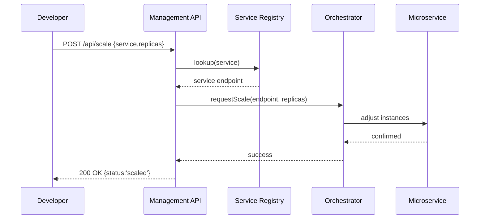

# Chapter 4: Management Layer

Welcome back! In [Chapter 3: Authentication & Authorization](03_authentication___authorization_.md) we learned how to secure our HMS UIs and APIs. Now it’s time to look “under the hood” at the **Management Layer**—our operations center that watches over microservices and AI agents, just like air traffic control at a busy airport.

---

## 1. Why a Management Layer? (Motivation)

Imagine the EPA is running a “Permit Approval” program:

1. Several microservices handle tasks like validating documents, calculating fees, and scheduling inspections.
2. Sometimes traffic spikes (e.g., hundreds of permit requests flood in).
3. We need a central “control room” to:

   - See real-time status (Are services healthy? How many requests are queued?)
   - Allocate more CPU or memory to busy services
   - Replay or inspect decision events (Who approved what, and when?)

The **Management Layer** is that control room. It provides dashboards, logs, and APIs so policy-makers and developers alike can see the big picture, tune performance, and keep everything running smoothly for end users.

---

## 2. Key Concepts

1. **Dashboard**  
   - A GUI showing service health, queue lengths, and throughput.  

2. **Logs & Metrics**  
   - Centralized storage of service logs, error rates, CPU/memory usage.  

3. **Decision Events**  
   - Auditable records: e.g., “Permit #123 approved by Agent X at 10:05.”  

4. **Resource Allocation APIs**  
   - Programmatic endpoints to scale services up/down or restart them.  

5. **Alerting & Notifications**  
   - Rules that watch for failures and notify on-call engineers or managers.

---

## 3. Using the Management Layer

Let’s say you’re a developer who notices that the permit-validation service is backloged. You can use the Management API to scale it.

### 3.1. Example: Scale a Microservice

```js
// File: managePermitService.js
import fetch from 'node-fetch';

async function scaleService(serviceName, replicas) {
  const res = await fetch('https://mgmt.example.gov/api/scale', {
    method: 'POST',
    headers: { 'Content-Type': 'application/json', Authorization: 'Bearer TOKEN' },
    body: JSON.stringify({ service: serviceName, replicas })
  });
  console.log('Scale response:', await res.json());
}

scaleService('permit-validator', 5);
// Output: { status: 'ok', service:'permit-validator', replicas:5 }
```

> This script calls the Management Layer’s `/scale` endpoint to run 5 instances of the `permit-validator` service.

### 3.2. Example: Fetch Recent Error Logs

```js
// File: fetchLogs.js
import fetch from 'node-fetch';

async function getErrorLogs(serviceName) {
  const res = await fetch(`https://mgmt.example.gov/api/logs/${serviceName}?level=error`, {
    headers: { Authorization: 'Bearer TOKEN' }
  });
  const logs = await res.json();
  console.log('Recent errors:', logs);
}

getErrorLogs('permit-validator');
// Output: [ { time:'10:00', msg:'DB timeout' }, … ]
```

> We ask the Management Layer for all error-level logs from `permit-validator`.

---

## 4. Under the Hood: What Happens Step-by-Step

Here’s a simple flow when you call `/api/scale`:



1. Developer calls the Management API.  
2. Management looks up the service in the registry.  
3. It tells the orchestration layer (e.g., Kubernetes) to adjust instances.  
4. The microservice confirms, and Management returns success.

---

## 5. Inside the Management Layer: Simplified Code

### 5.1. API Route (Express.js)

```js
// File: hms-svc/routes/management.js
import express from 'express';
import { scaleService } from '../services/managementService.js';
const router = express.Router();

router.post('/scale', async (req, res) => {
  const { service, replicas } = req.body;
  try {
    await scaleService(service, replicas);
    res.json({ status: 'scaled', service, replicas });
  } catch (e) {
    res.status(500).json({ error: e.message });
  }
});

export default router;
```

> This route accepts a service name and desired replicas, then delegates the work to `scaleService`.

### 5.2. Business Logic

```js
// File: hms-svc/services/managementService.js
import { getEndpoint } from './registryService.js';
import { orchestrateScale } from './orchestrator.js';

export async function scaleService(name, count) {
  const endpoint = await getEndpoint(name);         // Find the service
  await orchestrateScale(endpoint, count);          // Talk to cluster manager
}
```

> We break the logic into registry lookup and orchestration so it’s easy to test and extend.

---

## 6. Analogy Recap

Think of the Management Layer as:

- A **control room** in a power plant—operators watch gauges (metrics) and can throttle turbines (scale services).  
- A **traffic control tower**—managing take-offs and landings (requests) to prevent congestion.  
- A **help desk**—logging incidents and tracking who did what and when.

---

## Conclusion

In this chapter, you explored the **Management Layer**:

- Why we need a centralized control room for microservices and AI agents.  
- How to use its APIs to scale services and fetch logs.  
- What happens behind the scenes, step by step.  

Next up, we’ll add policy and compliance controls in the **[Governance Layer](05_governance_layer_.md)**. See you there!

---

Generated by [AI Codebase Knowledge Builder](https://github.com/The-Pocket/Tutorial-Codebase-Knowledge)