# Chapter 4: Modular Component Library
[← Back to Chapter 3: Three-Layer Domain Architecture](03_three_layer_domain_architecture_.md)

---

## 0. Why Bother With Yet-Another “Library”?
Imagine the National Endowment for the Arts (NEA) launching a brand-new **Artist Grant Portal**.  
NEA has **two weeks** before the press release, but must still:

* Pass Section 508 accessibility checks  
* Display the official federal header  
* Work on mobile phones AND a kiosk in the lobby

With the **Modular Component Library** they drag-and-drop the same
pre-approved “lego bricks” already running in the Treasury’s tax-refund site.
No late-night CSS fixes, no scrambling for color-contrast audits—just assemble
and ship.

---

## 1. Key Concepts (Plain English Cheatsheet)

| Concept | Think of it like… | Why beginners care |
|---------|------------------|--------------------|
| **Component** | One Lego brick (Button, Table) | You reuse, not rebuild |
| **Module** | A small bag of related bricks | Keep bundle sizes tiny |
| **Theme Token** | A paint swatch | Change palette in one file |
| **Semantic Version** | Edition number on the brick box | Guarantees safe upgrades |
| **Auto-Propagate** | Bricks delivered by conveyor belt | Every portal gets the fix overnight |

---

## 2. A 5-Minute Tour: Building a Page With Bricks

### 2.1 Installation (one command)
```bash
npm i @hms/components @hms/theme
```

### 2.2 Your First Page (14 lines)
```jsx
// src/pages/GrantStart.jsx
import { Page, Header, TextInput, Button } from '@hms/components';
import { useState } from 'react';

export default function GrantStart() {
  const [project, setProject] = useState('');

  return (
    <Page>
      <Header title="NEA Artist Grant" />
      <TextInput
        label="Project Title"
        value={project}
        onChange={e => setProject(e.target.value)}
      />
      <Button disabled={!project} onClick={()=>alert('Saved!')}>
        Save & Continue
      </Button>
    </Page>
  );
}
```

What you **did NOT** do:

* Write any CSS  
* Add ARIA labels  
* Test high-contrast mode

The brick already nailed those for you.

---

## 3. How Modules Keep Your Bundle Small

Need charts but not consent banners? Just install the chart module.

```bash
npm i @hms/components-charts
```

```jsx
import { LineChart } from '@hms/components-charts';
```

Under the hood each NPM package ships only the bricks you ask for; tree-shaking removes anything unused.

---

## 4. Tweaking Colors (Without Breaking Federal Guidelines)

### 4.1 One Token File (10 lines)
```js
// theme/nea.js
import base from '@hms/theme/federal';

export default {
  ...base,
  colorPrimary: '#712cf9',   // NEA purple
  logo: '/images/nea.svg'
};
```

### 4.2 Apply It Globally (6 lines)
```jsx
import { ThemeProvider } from '@hms/components';
import neaTheme from '../theme/nea';

root.render(
  <ThemeProvider theme={neaTheme}>
    <App />
  </ThemeProvider>
);
```

All bricks repaint themselves.  
Accessibility contrast ratios are re-checked automatically by CI.

---

## 5. What Happens When a Brick Is Updated?  
(Non-Code Walk-Through)

1. **Core Team** publishes `@hms/components@4.2.1` fixing a color-contrast bug.  
2. Your portal has `"@hms/components": "^4.2.0"` in `package.json`.  
3. Next `npm install` pulls **4.2.1** (safe minor bump).  
4. The new CSS variables cascade; no code change on your side.  
5. Lighthouse audit goes from 89 → 100. 🎉

---

## 6. Under the Hood: Life of a Button Press

```mermaid
sequenceDiagram
    participant Citizen as 👩‍🎨 User
    participant Portal as NEA Portal App
    participant Brick as Button Component
    participant SVC as HMS-SVC API

    Citizen->>Brick: Click "Save & Continue"
    Brick->>Portal: onClick callback
    Portal->>SVC: POST /grant-draft
    SVC-->>Portal: 201 Created
    Portal-->>Citizen: Navigate to next step
```



Notice the **Brick** is responsible only for UI & accessibility; business
logic lives in the portal (layer 2) and API (layer 3) per our
[Three-Layer Domain Architecture](03_three_layer_domain_architecture_.md).

---

## 7. Peeking Inside a Brick (≤18 lines)

```tsx
// components/Button/index.tsx
import React from 'react';
import styles from './Button.module.css';

export default function Button({ children, ...props }) {
  return (
    <button
      className={styles.root}
      {...props}
      aria-live="polite"       // Accessibility hook
    >
      {children}
    </button>
  );
}
```

`Button.module.css` holds tokens like `var(--colorPrimary)`—so theme files
swap colors without touching this component.

---

## 8. Folder Blueprint

```
@hms/components/
 ├─ atoms/       # tiny bricks (Button, Badge)
 ├─ molecules/   # combo bricks (FormRow)
 ├─ organisms/   # big bricks (ConsentBanner)
 └─ index.js     # exports
```

The Lego metaphor maps to **Atomic Design**—start small, compose upward.

---

## 9. Relationship to Other Chapters

* Screens assembled from these bricks become journey steps in  
  [Intent-Driven Navigation & AI-Guided Journeys](02_intent_driven_navigation___ai_guided_journeys_.md).
* Business rules that decide **when** to show a brick live in the Governance
  layer from [Policy & Process Management API](08_policy___process_management_api_.md).
* Accessibility tests run as part of the AI oversight detailed in  
  [AI Governance Model](06_ai_governance_model_.md).

---

## 10. Mini-FAQ

**Q: Can my agency add a brand-new component?**  
Yes. Publish `@agency/nea-banner`, then wrap it in the same ThemeProvider.  
Follow the contribution guide to pass automated a11y tests.

**Q: What about design changes during emergencies?**  
Push a patch release (e.g., high-visibility banner). All portals with the
caret (`^`) range will receive it on the next deploy.

**Q: Does this lock me into React?**  
No. Web Components build of the library is available as
`@hms/components-wc`, usable in Vue, Angular, or plain HTML.

---

## 11. Recap & What’s Next
Today you:

1. Built a grant page in **14 lines** using shared bricks.  
2. Learned how themes, modules, and versions keep life simple.  
3. Saw how one bug-fix ripples across every federal portal overnight.

In the next chapter we’ll meet the behind-the-scenes helpers that keep the
system smart: [Specialized AI Agents (HMS-A2A)](05_specialized_ai_agents__hms_a2a__.md).

---

Generated by [AI Codebase Knowledge Builder](https://github.com/The-Pocket/Tutorial-Codebase-Knowledge)