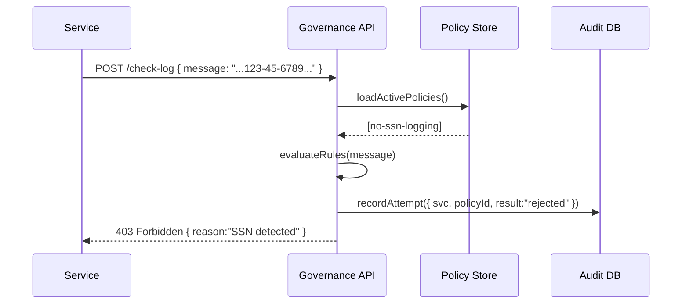

# Chapter 5: Governance Layer

Welcome back! In [Chapter 4: Management Layer](04_management_layer_.md) we saw how to monitor and control services. Now we’ll explore the **Governance Layer**—the “board of directors” of HMS that defines rules, policies, and standards for every service and AI agent.

---

## 1. Why a Governance Layer? (Motivation)

Imagine the IRS is rolling out a new e-filing service:

1. **Policy-makers** (IRS leadership) must enforce privacy rules so citizens’ Social Security numbers aren’t exposed.
2. **Program managers** need an auditable record of why certain data-sharing behaviors are allowed.
3. **End users** want the invisible comfort that their personal data is handled fairly.

Without a centralized Governance Layer:

- Services might slip past privacy requirements.
- No clear trail explains why an AI agent made a decision.
- Audits become a nightmare.

The **Governance Layer** ensures every request, every AI action, and every configuration change follows approved policies—just like a board that signs off on major company decisions.

---

## 2. Key Concepts

1. **Policy Definitions**  
   - Written rules (e.g., “No PII in logs,” “Require consent for health data”).  
2. **Compliance Enforcement**  
   - Automatic checks that services must pass before acting.  
3. **Auditing & Traceability**  
   - An immutable ledger of “what was approved, when, and by whom.”  
4. **Approval Workflow**  
   - Change requests go through a review process (e.g., DHS leadership reviews a new data-retention policy).  
5. **Policy Store**  
   - A central registry holding all current governance rules.

---

## 3. Using the Governance Layer

Let’s say an IRS policy-maker wants to add a rule forbidding external agents from logging full SSNs. We define a simple policy in JSON:

```json
// File: governance/policies/no-ssn-logging.json
{
  "id": "no-ssn-logging",
  "description": "Disallow full SSN in service logs",
  "rule": {
    "field": "logMessage",
    "pattern": "\\d{3}-\\d{2}-\\d{4}",
    "action": "reject"
  }
}
```

To register this policy, we call the Governance API:

```js
// File: registerPolicy.js
import fetch from 'node-fetch';

async function register(policy) {
  const res = await fetch('https://hms-gov/api/policies', {
    method: 'POST',
    headers: { 'Content-Type': 'application/json' },
    body: JSON.stringify(policy)
  });
  console.log('Response:', await res.json());
}

import policy from './governance/policies/no-ssn-logging.json';
register(policy);
// Output: { status: "approved", id: "no-ssn-logging" }
```

Explanation:
- We send our JSON policy to `/api/policies`.  
- The Governance Layer stores it and returns an approval status.

---

## 4. Under the Hood: What Happens Step-by-Step

When a service tries to log a message, the Governance Layer intercepts and checks the policy:



1. Service calls `/check-log` with its log message.  
2. Governance API loads all active policies.  
3. It evaluates each rule against the message.  
4. It writes an audit record of the check.  
5. It responds with success or rejection.

---

## 5. Inside the Governance Layer: Simplified Code

### 5.1. API Route

```js
// File: hms-gov/routes/policies.js
import express from 'express';
import { savePolicy, checkLog } from '../services/govService.js';
const router = express.Router();

router.post('/policies', async (req, res) => {
  const policy = await savePolicy(req.body);
  res.json({ status: policy.status, id: policy.id });
});

router.post('/check-log', async (req, res) => {
  const result = await checkLog(req.body.message);
  if (result.allowed) res.sendStatus(200);
  else res.status(403).json({ reason: result.reason });
});

export default router;
```

- The `POST /policies` endpoint saves new governance rules.  
- The `POST /check-log` endpoint enforces policies on a log entry.

### 5.2. Core Service Logic

```js
// File: hms-gov/services/govService.js
import { loadAll, save } from '../store/policyStore.js';
import { audit } from '../store/auditStore.js';

export async function savePolicy(policy) {
  policy.status = 'approved';   // In real life, add review steps
  await save(policy);
  return policy;
}

export async function checkLog(message) {
  const policies = await loadAll();
  for (const p of policies) {
    if (new RegExp(p.rule.pattern).test(message)) {
      await audit({ policyId: p.id, message, allowed: false });
      return { allowed: false, reason: p.description };
    }
  }
  await audit({ policyId: null, message, allowed: true });
  return { allowed: true };
}
```

- `savePolicy` stores and marks policies as approved.  
- `checkLog` runs each policy rule, audits the result, and returns a verdict.

---

## 6. Analogy Recap

Think of the Governance Layer as:

- A **board of directors** that sets company policy and logs every decision.  
- A **recipe book** of do’s and don’ts that every chef (service) must follow.  
- An **invisible referee** ensuring fair play (compliance, ethics, privacy).

---

## Conclusion

In this chapter you learned:

- What the **Governance Layer** is and why it matters.  
- How to define and register a simple governance policy.  
- What happens behind the scenes when policies are enforced.  

Up next, we’ll see how these governance rules are evaluated in real time by the **[Policy Engine](06_policy_engine_.md)**.

---

Generated by [AI Codebase Knowledge Builder](https://github.com/The-Pocket/Tutorial-Codebase-Knowledge)