# Chapter 5: Marketplace & Discovery (HMS-MKT)

*(Coming from [Backend API Layer (HMS-SVC & HMS-API)](04_backend_api_layer__hms_svc___hms_api__.md))*  

---

## 1. Why Do We Need a “Marketplace”?

Picture the **Foreign Agricultural Service (FAS)**.  
Tomorrow they must publish every crop-price bulletin in **Spanish** and **Mandarin**.  
Teams could:

1. Hunt for open-source models,  
2. Spend weeks clearing legal & security checks,  
3. Beg DevOps for a new server.

Or they could open **HMS-MKT**, type “translation,” and click **Install**.  
Ten minutes later a vetted model is running inside their cluster, already wired to the HMS backbone you met in Chapters 3-4.

That is the promise of Marketplace & Discovery.

---

## 2. Big Picture in One Slide

```mermaid
flowchart LR
  Search["🔍 Discovery UI"] --> MKT["🏬 HMS-MKT"]
  MKT --> ESQ["🛡️ HMS-ESQ\n(Security Scan)"]
  ESQ --> MKT
  MKT --> Deploy["🚀 One-Click Deploy"]
  Deploy --> Cluster["☁️ Agency Cluster"]
```



*   Discovery UI – citizens & agencies browse plugins  
*   HMS-MKT – central catalog + license checker  
*   HMS-ESQ – automatic policy/security vetting (see [Security, Compliance & Legal Reasoning](18_security__compliance___legal_reasoning__hms_esq__.md))  
*   One-Click Deploy – pushes container & secrets into the agency’s namespace  
*   Cluster – plugin lives among your micro-services from [Chapter 3](03_hms_micro_services_backbone_.md)

---

## 3. Key Concepts, One-by-One

| Concept | Beginner Analogy | What It Means Here |
|---------|------------------|--------------------|
| Listing | App Store page | YAML/JSON file describing the plugin |
| Plugin | Mobile app | Container image + metadata |
| Vetting Pipeline | Airport security line | Automated scans by HMS-ESQ |
| Semantic Search | “Show me free photo editors” | Filters by tags, price, agency approvals |
| One-Click Deploy | Install button | Pre-generated Helm chart applied to your cluster |
| Governance Tags | Nutrition label | Which laws/policies the plugin satisfies |

---

## 4. Publishing a Plugin (Author Side)

Below is the **entire** file needed to offer a Spanish translator:

```yaml
# file: listings/translator_es.yml  (18 lines)
id: "translator-es"
title: "Neural Spanish Translator"
version: "1.0.2"
maintainer: "OpenGov AI Labs"
description: |
  Translates English PDF/text into Spanish.
categories: [ "translation", "language", "ai-model" ]
price: 0                      # free
gov_tags:
  - FISMA-Low
  - 508-Compliant
source_image: "ghcr.io/opengov/translator-es:1.0.2"
api_contract: "https://raw.githubusercontent.com/.../openapi.yaml"
helm_chart: "https://charts.opengov.ai/translator-es-1.0.2.tgz"
```

**What happens after commit?**

1. `git push listings/translator_es.yml`  
2. CI triggers **HMS-ESQ** → static-code scan, CVE check, policy lint.  
3. If green, HMS-MKT adds the new **Listing** to the catalog.

No extra forms, no email chains.

---

## 5. Finding & Installing (Consumer Side)

### 5.1 CLI Search

```bash
hms mkt search translation spanish
```

Output:

```
NAME             VERSION  PRICE  GOV-TAGS
translator-es    1.0.2    $0     FISMA-Low,508-Compliant
```

### 5.2 One-Click (really, one command) Deploy

```bash
hms mkt install translator-es --agency=fsa
```

Console:

```
✔ Security signature verified
✔ Helm chart applied to namespace fsa
✔ Endpoint created: http://svc.fsa/translator-es
```

The plugin is now discoverable via internal DNS and the [Service Registry](03_hms_micro_services_backbone_.md#3-key-concepts-in-plain-english).

---

## 6. Using the New Plugin

```python
# file: call_translator.py  (14 lines)
import httpx, base64, sys

PDF = open("bulletin.pdf","rb").read()
b64 = base64.b64encode(PDF).decode()

resp = httpx.post(
    "http://svc.fsa/translator-es/v1/translate",
    json={"doc_base64": b64, "target_lang": "es"}
)
print(resp.json()["url_translated"])
```

Explanation:  
The **API contract** referenced in the listing was auto-validated, so you get
Swagger docs and client SDKs for free.

---

## 7. What Happens Under the Hood?


Five players, all automated. Notice that **MKT** never bypasses **ESQ**—central oversight remains intact.

---

## 8. Peeking Inside HMS-MKT (Tiny Code Tour)

### 8.1 Listing Validation (8 lines)

```python
# file: mkt/validator.py
import yaml, jsonschema, pathlib

SPEC = yaml.safe_load(open("schemas/listing.yml"))
def validate(path):
    data = yaml.safe_load(pathlib.Path(path).read_text())
    jsonschema.validate(data, SPEC)   # raises if invalid
```

Runs in CI; prevents malformed listings from ever entering the catalog.

### 8.2 Install Handler (17 lines)

```python
# file: mkt/install.py
import subprocess, requests

def install(listing_id, ns):
    lst = requests.get(f"https://mkt.gov/api/listings/{listing_id}").json()
    sig_ok = requests.post("https://esq.gov/verify", json=lst).json()["ok"]
    if not sig_ok:
        raise SystemExit("❌ signature failed")
    chart = lst["helm_chart"]
    subprocess.run(["helm","install",listing_id,chart,"-n",ns], check=True)
    print("✔ Helm applied")
```

Minimal because heavy-lifting (signature check, scanning) lives in **HMS-ESQ**.

---

## 9. Common Beginner Questions

| Question | Quick Answer |
|----------|--------------|
| “Can I list **internal-only** plugins?” | Yes. Add `visibility: private` in the YAML. |
| “How do I update a plugin?” | Push a new listing with `version: 1.0.3`; HMS-MKT shows an **Update** button to all subscribers. |
| “What if ESQ flags a CVE later?” | Marketplace auto-sends patch notices and can force an emergency disable via [Human-in-the-Loop Oversight](12_human_in_the_loop__hitl__oversight_.md). |

---

## 10. How HMS-MKT Connects to the Rest of HMS

* Relies on security scans from [HMS-ESQ](18_security__compliance___legal_reasoning__hms_esq__.md).  
* Deploys into the micro-services backbone (see [Chapter 3](03_hms_micro_services_backbone_.md)).  
* Advertises new UIs that show up in [Front-End Micro-Frontends (HMS-MFE)](06_front_end_micro_frontends__hms_mfe__.md).  
* Billing hooks flow into [Financial Clearinghouse (HMS-ACH)](17_financial_clearinghouse__hms_ach__.md) when paid plugins are used.

Keep this mental map:

```mermaid
graph TD
  ESQ["🛡️ HMS-ESQ"] --> MKT["🏬 HMS-MKT"]
  MKT --> ACT["🛠️ HMS-ACT"]
  MKT --> MFE["🎫 HMS-MFE"]
```



---

## 11. Summary & Next Steps

You learned:

1. Why HMS-MKT is the **App Store for policy-compliant plugins**.  
2. How to publish a listing, discover it, and install it with one command.  
3. The security handshake with HMS-ESQ that preserves centralized oversight.  
4. How new capabilities instantly plug into the existing HMS backbone.

Ready to see how those freshly installed plugins appear in user interfaces?  
Head over to [Front-End Micro-Frontends (HMS-MFE)](06_front_end_micro_frontends__hms_mfe__.md).

---

---

Generated by [AI Codebase Knowledge Builder](https://github.com/The-Pocket/Tutorial-Codebase-Knowledge)