# Chapter 5: Specialized AI Agents (HMS-A2A)
[↠Back to Chapter 4: Modular Component Library](04_modular_component_library_.md)

---

## 0. Why Do We Need “24/7 Policy Analysts” ?
Picture the **Department of Veterans Affairs (VA)** trying to reduce clinic wait-times.  
Every night thousands of cancelled appointments free up slots, but staff won’t see them until morning. By then the openings are gone.

Enter a Specialized AI Agent—think of it as **a tireless clerk** who:

1. Watches live scheduling data  
2. Finds slots that can be moved forward  
3. Tentatively re-books vets  
4. Asks a human supervisor for a 👍 or 👎  
5. Pushes the change if approved

That is the heart of **HMS-A2A** (“Agent-to-Anything”).

---

## 1. Key Concepts in Plain English

| Term | Real-World Analogy | What It Does |
|------|-------------------|--------------|
| **Agent** | A super-focused intern | Runs one mission (e.g., trim waitlists) |
| **Mission File** | A task brief | Declares data sources, goals & guard-rails |
| **Watcher** | Inbox filter rule | Triggers when fresh data arrives |
| **Action Recipe** | Word-for-word email draft | The concrete change the agent wants to make |
| **Oversight Hook** | Manager’s approval stamp | Lets humans cancel or edit the action |

Keep these five in mind; the rest is wiring.

---

## 2. Quick-Start: “Hello Wait-Time” Agent  
Below you’ll create the tiniest agent that:

* scans a mock `appointments` table,  
* suggests moving the earliest uncancelled records forward by one day,  
* sends the suggestion to a supervisor.

### 2.1 Create the Mission File (YAML – 12 lines)
```yaml
# va_wait_time.yaml
id: va-wait-shortener
description: Reduce veteran appointment wait-times
schedule: "every 30 minutes"
watch:
  table: appointments
  where: "status = 'CANCELLED'"
action:
  type: "MOVE_FORWARD"
  max_days: 1
governance_profile: "low_risk"
```
Explanation  
• `watch` tells the agent WHEN to wake up.  
• `action` tells it WHAT it’s allowed to propose.  
• `governance_profile` links to the rules you’ll meet in [AI Governance Model](06_ai_governance_model_.md).

### 2.2 Wire Up the Agent Logic (TypeScript – 18 lines)
```ts
// agents/vaWaitShortener.ts
import { AgentContext } from '@hms/a2a';

export default async function run(ctx: AgentContext) {
  const cancelled = await ctx.db
    .from('appointments')
    .where('status', 'CANCELLED')
    .limit(5);

  for (const appt of cancelled) {
    const newDate = ctx.date.addDays(appt.date, -1);
    await ctx.propose({
      type: 'MOVE_FORWARD',
      appointmentId: appt.id,
      newDate
    });
  }
}
```
What happens?  
1. `ctx.db` uses the **Backend Services Layer** ([Chapter 11](11_backend_services_layer__hms_svc__.md)).  
2. `ctx.propose()` sends an **Action Recipe** to the oversight queue—no change is live yet!

### 2.3 Register and Start (CLI – 6 lines)
```bash
hms a2a register va_wait_time.yaml \
               --code agents/vaWaitShortener.ts
hms a2a start va-wait-shortener
```
That’s it—the agent is now on duty, but everything still passes through humans.

---

## 3. Life of a Single Proposal

```mermaid
sequenceDiagram
    participant DB as 📊 Data Stream
    participant A as 🤖 Agent
    participant GOV as ✅ Governance Filter
    participant SUP as 🧑‍💼 Supervisor
    participant API as HMS-SVC

    DB-->>A: New CANCELLED rows
    A->>GOV: propose(MOVE_FORWARD)
    GOV-->>SUP: Needs approval
    SUP-->>API: Approve
    API-->>DB: UPDATE appointment.date
```



Key points  
• The **Governance Filter** can auto-reject if the proposal violates policy.  
• The supervisor is brought in **before** any update hits the database.

---

## 4. Under the Hood

### 4.1 Minimal Folder Blueprint
```
hms-a2a/
 ├─ missions/
 │   └─ va_wait_time.yaml
 ├─ agents/
 │   └─ vaWaitShortener.ts
 └─ index.ts          # bootstraps runtime
```

### 4.2 Runtime Bootstrap (index.ts – 16 lines)
```ts
import { loadMissions, runAgent } from '@hms/a2a';

async function main() {
  const missions = await loadMissions('./missions');
  for (const m of missions)
    setInterval(() => runAgent(m), m.everyMs);
}

main();
```
The helper `runAgent()` automatically:

1. Injects `AgentContext` (db, logger, governance hooks).  
2. Catches errors and restarts on the next tick.  
3. Streams all logs into **Real-Time Metrics** ([Chapter 10](10_real_time_metrics___monitoring_.md)).

### 4.3 Oversight Hook (server patch – 14 lines)
```ts
// svc/routes/agentActions.ts
router.post('/approve', async (req, res) => {
  const { actionId } = req.body;
  const action = await db.actions.find(actionId);

  if (await gov.allowed(action, req.user)) {
    await apply(action);              // executes SQL update
    res.sendStatus(204);
  } else {
    res.status(403).send('Denied by policy');
  }
});
```
Notice oversight is **two-layered**: governance check *and* human confirmation.

---

## 5. How Do I Debug or Stop an Agent?

```bash
# See live logs
hms a2a logs va-wait-shortener --tail

# Pause the agent
hms a2a pause va-wait-shortener
```
Paused agents keep their mission files but stop generating proposals.

---

## 6. Relationship to Other HMS Pieces

* All proposals are validated against the rules you’ll study next in  
  [AI Governance Model](06_ai_governance_model_.md).  
* Human approvals use widgets from the **User Interface Suite** ([Chapter 1](01_user_interface_suite__hms_mfe___hms_gov__.md)).  
* Every approval or rejection is immutably recorded by the  
  **Accountability Ledger** ([Chapter 9](09_role_based_access_control___accountability_ledger_.md)).  

---

## 7. Mini-FAQ

**Q:** Can an agent push changes automatically, no human?  
**A:** Yes, give it a `governance_profile: "auto_low_risk"` plus a signed exception in the ledger. But most federal missions default to HITL.

**Q:** How many agents can I run?  
**A:** Hundreds. Each mission is event-driven; idle agents consume near-zero CPU.

**Q:** What languages are supported?  
**A:** TypeScript and Python today; a WebAssembly runner is on the roadmap.

---

## 8. Recap & What’s Next
In this chapter you:

1. Met HMS-A2A: specialized, always-awake policy analysts.  
2. Built a 12-line mission file and an 18-line agent.  
3. Saw the full approval flow—from data watcher to human sign-off.  

Next we’ll zoom into the guard-rails that keep these agents honest:  
[Chapter 6: AI Governance Model](06_ai_governance_model_.md) →

---

Generated by [AI Codebase Knowledge Builder](https://github.com/The-Pocket/Tutorial-Codebase-Knowledge)