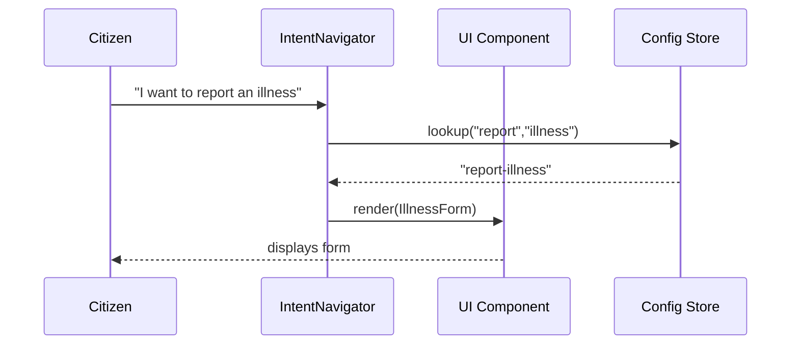

# Chapter 6: Intent-Driven Navigation

In the previous chapter, we built a shared UI library in [Modular UI Component Library](05_modular_ui_component_library_.md). Now let’s add an AI concierge that asks “What do you want to achieve?” and takes the citizen straight to the right form or dashboard—this is **Intent-Driven Navigation**.

## 1. Motivation & Central Use Case

Imagine you’re building a public portal for the Food and Drug Administration (FDA). Citizens come looking for everything from “Report a food recall” to “Apply for a new drug trial permit.” Instead of forcing them to hunt through menus, we add an AI-driven concierge—like a front-desk clerk in a government office:

- It greets visitors: “How can I help you today?”  
- Recognizes their goal: “I want to report a foodborne illness.”  
- Guides them directly to the “Illness Report” form, pre-loading any relevant data.

This reduces confusion, improves completion rates, and mimics a real-world service center.

## 2. Key Concepts

1. **Intent Discovery**  
   Understanding, via keywords or a simple chat, what the user wants to accomplish.

2. **Navigation Graph**  
   A map of “intents” → “tools or pages” (e.g., `report-illness` → `IllnessReportForm`).

3. **Dynamic Tool Surfacing**  
   Showing the right form/component automatically, no manual menu clicks.

4. **Concierge Dialog**  
   A friendly prompt (“What are you here to do?”) to kick off the intent engine.

## 3. Using Intent-Driven Navigation

Below is a minimal example showing how to wire up our intent engine in a React app:

```jsx
// App.jsx
import React from 'react';
import IntentNavigator from './navigation/IntentNavigator';
import IllnessForm from './forms/IllnessForm';
import PermitForm from './forms/PermitForm';

// Map intent keys to components
const tools = {
  'report-illness': IllnessForm,
  'apply-permit':    PermitForm
};

export default function App() {
  return <IntentNavigator tools={tools} />;
}
```

Explanation:
- We import `IntentNavigator` and pass a `tools` map.  
- Keys like `'report-illness'` represent recognized intents.  
- Values are the form components to render once the intent is matched.

### What Happens When the User Arrives?

1. `IntentNavigator` asks, “What do you want to achieve?”  
2. User types “Report a foodborne illness.”  
3. The engine matches that phrase to the key `report-illness`.  
4. `IllnessForm` is rendered automatically.

## 4. Example Interaction

**User Input:** “I need to apply for a drug trial permit.”  
**Detected Intent:** `apply-permit`  
**UI Outcome:** The `PermitForm` component shows up, ready to fill out.

## 5. Under the Hood: Step-by-Step Flow



1. **Citizen** enters a goal phrase.  
2. **IntentNavigator** queries its internal map for a matching intent key.  
3. It finds `report-illness` and renders the `IllnessForm` component.  
4. The form loads on screen, no menus needed.

## 6. Internal Implementation Details

### 6.1 IntentNavigator (navigation/IntentNavigator.jsx)

```jsx
import React, { useState } from 'react';
import IntentEngine from './intentEngine';

export default function IntentNavigator({ tools }) {
  const [Intent, setIntent] = useState(null);

  if (!Intent) {
    return (
      <ChatPrompt onSubmit={phrase => {
        const key = IntentEngine.matchIntent(phrase);
        setIntent(() => tools[key] || NotFound);
      }} />
    );
  }
  return <Intent />;
}
```

Explanation:
- We show a simple `ChatPrompt` until an intent is chosen.  
- On submit, we call `IntentEngine.matchIntent()`.  
- We then render the matched tool (or a `NotFound` fallback).

### 6.2 Intent Engine (navigation/intentEngine.js)

```js
// A very simple keyword matcher
const intentMap = {
  'report-illness': ['report','illness','foodborne'],
  'apply-permit':    ['apply','permit','trial']
};

export default {
  matchIntent(phrase = '') {
    const words = phrase.toLowerCase().split(/\W+/);
    for (const key in intentMap) {
      if (intentMap[key].some(w => words.includes(w))) {
        return key;
      }
    }
    return null;
  }
};
```

Explanation:
- We define `intentMap`: each intent has associated keywords.  
- We split the user’s phrase into words and look for a match.  
- Returns the intent key or `null` if none match.

## 7. Summary & Next Steps

In this chapter you learned:

- **Why** Intent-Driven Navigation is like having a government concierge desk online.  
- **How** to wire up `IntentNavigator` with a simple `tools` map.  
- **Under the hood**, a keyword-based `IntentEngine` matches user goals to the right form.

Next, we’ll see how to hook into third-party APIs and external data in [Integrated External System](07_integrated_external_system_.md).

---

Generated by [AI Codebase Knowledge Builder](https://github.com/The-Pocket/Tutorial-Codebase-Knowledge)