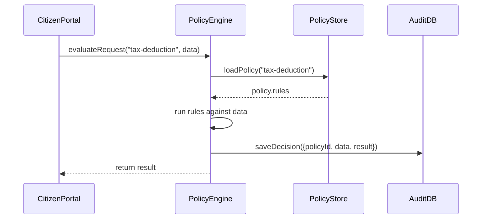

# Chapter 6: Policy Engine

Welcome back! In [Chapter 5: Governance Layer](05_governance_layer_.md) we defined and stored rules for compliance and privacy. Now it’s time for our **Policy Engine**—the referee that applies those rules to real requests.

---

## 1. Why a Policy Engine? (Motivation)

Imagine the IRS needs to decide which tax deductions apply to a small‐business owner’s return:

1. The business owner submits income, expenses, and credits.
2. The Policy Engine evaluates each configurable policy (eligibility, security, compliance).
3. It returns a consistent, transparent decision: “Home office deduction allowed,” “Quarterly filing penalty applies,” and so on.

This keeps decisions fast, repeatable, and audit‐ready—just like a traffic cop applying road rules at every intersection.

---

## 2. Key Concepts

1. **Policy Evaluation**  
   - The engine takes incoming data (a citizen request, a permit application) and a policy ID, then returns `allowed` or `denied` plus explanations.

2. **Policy Definition & Storage**  
   - Policies live in the **Policy Store** (a database or in-memory registry). Each policy has an ID, description, and a set of rules.

3. **Decision Logging & Auditing**  
   - Every evaluation is recorded in an **Audit DB** with who asked, which policy ran, and the result—ensuring transparency.

4. **Policy Testing & Simulation**  
   - Program managers can simulate scenarios (e.g., “What if income > $100K?”) before putting rules into production.

5. **AI Suggestions**  
   - AI agents may propose new or modified rules based on historical data and edge cases.

---

## 3. Using the Policy Engine

Here’s a tiny example: deciding a simple “home-office” deduction policy.

```js
// File: src/deciders/deduction.js
import { evaluateRequest } from '../services/policyEngine.js';

async function decideDeduction(data) {
  // data = { income, expenses, hasHomeOffice }
  const result = await evaluateRequest('tax-deduction', data);
  console.log('Allowed:', result.allowed);
  console.log('Reasons:', result.reasons);
}

decideDeduction({ income: 50000, expenses: 8000, hasHomeOffice: true });
// Output:
// Allowed: true
// Reasons: ["Home office qualifies after expenses"]
```

Explanation:
- We call `evaluateRequest` with a policy ID (`tax-deduction`) and the request data.
- The engine returns `{ allowed: boolean, reasons: string[] }`.

---

## 4. Under the Hood: Step-by-Step Flow

When your code calls `evaluateRequest`, here’s what happens:



1. **Load** the policy rules from the store.  
2. **Apply** each rule to the input data.  
3. **Audit** the decision for traceability.  
4. **Return** the final verdict to the caller.

---

## 5. Inside the Policy Engine: Simplified Code

### 5.1. Core Service (`policyEngine.js`)

```js
// File: hms-svc/services/policyEngine.js
import { loadPolicy } from '../store/policyStore.js';
import { saveDecision } from '../store/auditStore.js';

export async function evaluateRequest(policyId, data) {
  const policy = await loadPolicy(policyId);
  // Very simple rule runner: all rules must pass
  const reasons = [];
  const allowed = policy.rules.every(rule => {
    const ok = rule.check(data);
    if (!ok) reasons.push(rule.message);
    return ok;
  });

  await saveDecision({ policyId, data, allowed, reasons });
  return { allowed, reasons };
}
```

Explanation:
- `loadPolicy` fetches the policy object (`{ id, rules: [ { check, message } ] }`).
- We loop through each rule, collecting failure messages.
- We save the decision and return it.

### 5.2. Policy Store (`policyStore.js`)

```js
// File: hms-svc/store/policyStore.js
const policies = [
  {
    id: 'tax-deduction',
    rules: [
      { 
        check: d => d.hasHomeOffice && d.expenses < d.income,
        message: 'Home office qualifies after expenses'
      },
      { 
        check: d => d.income <= 100000,
        message: 'Income must be ≤ $100K'
      }
    ]
  }
];

export async function loadPolicy(id) {
  return policies.find(p => p.id === id);
}
```

Explanation:
- We keep an in-memory array of policies for simplicity.
- In real life, you’d fetch from a database or external API.

### 5.3. Audit Store (`auditStore.js`)

```js
// File: hms-svc/store/auditStore.js
export async function saveDecision(decision) {
  // Pretend we insert into a database with timestamp
  console.log('Audit log:', { ...decision, time: new Date() });
}
```

Explanation:
- Every call to `evaluateRequest` logs who asked, what data, and the outcome.

---

## 6. Analogy Recap

Think of the Policy Engine as a **sports referee**:

- **Rulebook**: Policies defined by administrators.  
- **Referee**: Checks each play (incoming request) against the rulebook.  
- **Scorekeeper**: Records calls and highlights any fouls for post-game review (auditing).

---

## Conclusion

You’ve learned how the **Policy Engine**:

- Loads and evaluates configurable rules at runtime.  
- Audits every decision for consistency and transparency.  
- Integrates with the [Governance Layer](05_governance_layer_.md) and other HMS components.

Next up, we’ll see how to tie these decisions into end-to-end processes with **[Chapter 7: Workflow Orchestration](07_workflow_orchestration_.md)**.

---

Generated by [AI Codebase Knowledge Builder](https://github.com/The-Pocket/Tutorial-Codebase-Knowledge)