# Chapter 7: Human-in-the-Loop (HITL) Oversight
[← Back to Chapter&nbsp;6: AI Governance Model](06_ai_governance_model_.md)

---

## 0. Why Do We Still Need People If We Have AI?

Picture the Social Security Administration (SSA) using an **AI Eligibility Agent** to pre-screen disability applications.  
The model flags **Alex**, a war veteran, as “likely ineligible.”  
If that prediction were applied automatically, Alex could lose vital benefits because:

* a medical record was scanned poorly, or  
* the model was never trained on rare combat injuries.

HITL Oversight is the **off-ramp** that guarantees a *human*—not a black-box—has the final say when lives or livelihoods are on the line.

---

## 1. Key Ideas in Plain English

| Concept | Imagine It Like… | Why It Matters |
|---------|-----------------|----------------|
| Confidence Score | Traffic-light color on a dashboard | Green means ✅ auto; red means 🤔 human check |
| Override Button | Congressional veto stamp | Lets staff cancel or adjust an AI proposal |
| Audit Trail | A checkbook register | Every click is recorded for auditors |
| Rollback | Undo in a word-processor | Reverts changes if a mistake slips through |
| Signature & Reason | Digital John Hancock | Captures *who* overrode and *why* |
| Data Lineage | “Chain of custody” envelope | Shows which files or facts the AI used |

Keep these six in mind; together they build trust.

---

## 2. A 3-Minute Demo: Overriding an AI Decision

Below is the tiniest possible React page living inside **HMS-GOV**.  
It shows the AI’s recommendation plus two buttons:

```jsx
// pages/EligibilityReview.jsx  (17 lines)
import { Card, Button, Badge } from '@hms/components';
import api from '../util/api';

export default function EligibilityReview({ proposal }) {
  const approve = () => api.post('/hitl/approve', { id: proposal.id });
  const override = () =>
    api.post('/hitl/override', { id: proposal.id, reason: 'Combat injury docs missing' });

  return (
    <Card>
      <h3>AI Suggests: <Badge tone={proposal.confidence > 0.85 ? 'success' : 'warning'}>
        {proposal.suggestedDecision}
      </Badge></h3>

      <p>Confidence: {(proposal.confidence * 100).toFixed(1)}%</p>
      <Button onClick={approve}>Accept</Button>
      <Button tone="critical" onClick={override}>Override</Button>
    </Card>
  );
}
```

What happens?

1. The **Accept** button records agreement.  
2. The **Override** button requires a reason; both are logged in the Accountability Ledger.  
3. No decision is final until one of these endpoints is hit.

---

## 3. Life of a Decision (Step-by-Step)

```mermaid
sequenceDiagram
    participant AG as 🤖 Eligibility Agent
    participant GOV as 🛡️ Policy Filter
    participant HITL as 🧑‍💼 Case Manager (HMS-GOV)
    participant SVC as HMS-SVC API
    participant LED as 📜 Ledger

    AG->>GOV: propose(denial, 0.62)
    GOV-->>HITL: show on dashboard
    HITL->>SVC: POST /hitl/override
    SVC->>LED: record {decision:"override",user,reason}
    SVC-->>AG: "Denied override applied"
```



1. The **AI Agent** submits a proposal.  
2. Policy says confidence < 0.85 → send to HITL.  
3. Case manager overrides.  
4. API writes an immutable entry to the ledger (for auditors).  
5. Agent receives the final verdict and stops.

---

## 4. Under the Hood (Server-Side Code ≤ 20 Lines)

```ts
// routes/hitl.ts  (19 lines)
import express from 'express';
import { ledger } from '../util/ledger';
import { rbac } from '../util/rbac';

const router = express.Router();

router.post('/:action(approve|override)', async (req, res) => {
  const { id, reason } = req.body;
  const user = req.user;                       // set by auth middleware

  if (!rbac.can(user, 'HITL_DECIDE')) return res.sendStatus(403);

  await ledger.append({
    proposalId: id,
    decision: req.params.action,
    by: user.id,
    reason: reason || null,
    at: new Date()
  });

  // notify downstream services (SMS, WebSocket, etc.)
  res.sendStatus(204);
});

export default router;
```

Explanation  
• `rbac.can()` uses rules from [Role-Based Access Control & Accountability Ledger](09_role_based_access_control___accountability_ledger_.md).  
• `ledger.append()` writes to the append-only store discussed in that same chapter.  
• The route works for both *approve* and *override* to stay tiny.

---

## 5. Quick Glance at the Dashboard Widget

```jsx
// components/ConfidenceMeter.jsx  (10 lines)
export default function Meter({ score }) {
  const tone = score > 0.85 ? 'success' : score > 0.6 ? 'warning' : 'critical';
  return (
    <div aria-label="confidence meter" className={`bar ${tone}`}>
      {Math.round(score * 100)}%
    </div>
  );
}
```

The widget paints green / amber / red—helping newcomers spot risky cases at a glance.

---

## 6. Folder Blueprint

```
hms-gov/
 ├─ pages/
 │   └─ EligibilityReview.jsx
 ├─ components/
 │   └─ ConfidenceMeter.jsx
 └─ api/
     └─ hitl.ts                # server route above
```

Simple, isolated; you can bolt HITL onto *any* AI proposal stream.

---

## 7. How Does HITL Connect to Other HMS Pieces?

* Proposals originate from [Specialized AI Agents (HMS-A2A)](05_specialized_ai_agents__hms_a2a__.md).  
* Each proposal is pre-screened by the [AI Governance Model](06_ai_governance_model_.md) before landing in the dashboard.  
* Final clicks feed the immutable log in  
  [Role-Based Access Control & Accountability Ledger](09_role_based_access_control___accountability_ledger_.md).  
* Real-time counts of “overrides vs. accepts” appear in the monitoring graphs covered in [Real-Time Metrics & Monitoring](10_real_time_metrics___monitoring_.md).

---

## 8. Mini-FAQ

**Q: Can overrides be limited to supervisors?**  
Absolutely—`rbac.can(user, 'HITL_DECIDE')` checks role *and* clearance.

**Q: What if two managers disagree?**  
First decision wins; the second must file an *appeal* entry, triggering a higher-level review queue.

**Q: Can the system auto-rollback after an override?**  
Yes. Each proposal stores the SQL diff or API payload; `rollback(id)` simply applies the inverse.

---

## 9. Recap & What’s Next

In this chapter you learned:

1. Why every AI decision needs an **off-ramp** for humans.  
2. Six key HITL concepts: confidence, override, audit trail, rollback, signature, lineage.  
3. A 17-line React page and a 19-line Express route that deliver full HITL functionality.  
4. How HITL stitches together AI agents, governance filters, and the accountability ledger.

Next we’ll see how policy makers **codify** the business rules those AI agents—and humans—must follow:  
[Chapter 8: Policy & Process Management API](08_policy___process_management_api_.md) →

---

---

Generated by [AI Codebase Knowledge Builder](https://github.com/The-Pocket/Tutorial-Codebase-Knowledge)