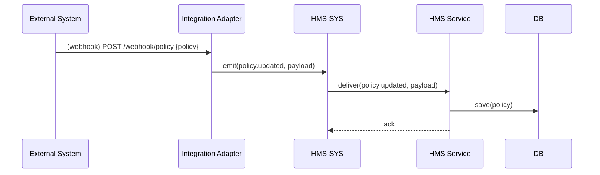

# Chapter 7: Integrated External System

In [Chapter 6: Intent-Driven Navigation](06_intent_driven_navigation_.md), we learned how to guide users to the right form by understanding their intent. Now it’s time to connect HMS to the wider world—bringing in data from third-party or legacy platforms like scheduling tools or policy repositories. This is the **Integrated External System** chapter.

---

## 1. Motivation & Central Use Case

Imagine the U.S. Department of Health runs both:

- A modern HMS platform for citizens’ vaccine appointments,  
- And a legacy scheduling system built years ago.

Whenever a clinic updates its time slots in the old system, the new HMS portal must show those changes immediately—just like inter-agency data sharing: when one ministry updates a policy, others see it right away.

Without integration, you’d resort to manual exports or stale data. With an **Integrated External System**, HMS connects automatically, keeping everyone in sync.

---

## 2. Key Concepts

1. **Connector/Adapter**  
   A small service that knows how to talk to the external API or listen to webhooks.

2. **Data Mapping**  
   Translating fields (e.g., `slot_time` → `appointmentTime`) so HMS and the external system agree.

3. **Sync Patterns**  
   - **Webhooks (push):** External system notifies HMS when data changes.  
   - **Polling (pull):** HMS asks the external system regularly for updates.

4. **Authentication & Security**  
   Using API keys, OAuth tokens, or certificates to secure each connection.

5. **Error Handling & Retry**  
   If the external system is down, the adapter should wait and retry, avoiding data loss.

---

## 3. Using the Integrated External System

### 3.1 Configure Your External Systems

Create a simple config file listing each system:

```yaml
# config/external-systems.yml
scheduling:
  url: 'https://legacy.gov/schedule/api'
  type: 'poll'
  intervalMs: 60000      # poll every 60 seconds
policyRepo:
  webhookUrl: '/webhook/policy'
  url: 'https://legacy.gov/policy-service'
  type: 'webhook'
```

Explanation:  
- We define two systems: one we poll, one we listen to via a webhook.  
- `intervalMs` controls polling frequency.

### 3.2 Write a Webhook Adapter

```js
// adapters/policyAdapter.js
const express     = require('express');
const bodyParser  = require('body-parser');
const CoreClient  = require('../hms-sys/client');

const app    = express();
app.use(bodyParser.json());

const core = new CoreClient('http://localhost:4000');
// Listen for policy updates from the legacy system
app.post('/webhook/policy', (req, res) => {
  const policy = req.body;
  core.emit('policy.updated', {
    token:   'system-token',
    payload: policy
  });
  res.sendStatus(200);
});

app.listen(5005, () => console.log('Policy adapter on port 5005'));
```

Explanation:  
- An Express server handles incoming webhooks at `/webhook/policy`.  
- It wraps the data in an HMS event `policy.updated` and sends it to HMS-SYS.

### 3.3 Write a Polling Adapter

```js
// adapters/schedulePoller.js
const fetch      = require('node-fetch');
const CoreClient = require('../hms-sys/client');
const config     = require('../config/external-systems.yml');

const core = new CoreClient('http://localhost:4000');

async function poll() {
  const res  = await fetch(config.scheduling.url);
  const data = await res.json();
  data.slots.forEach(slot => {
    core.emit('schedule.updated', {
      token:   'system-token',
      payload: { appointmentTime: slot.slot_time }
    });
  });
}

setInterval(poll, config.scheduling.intervalMs);
```

Explanation:  
- We fetch new slots every minute, map `slot_time` to `appointmentTime`, and emit `schedule.updated` events.

---

## 4. Under the Hood: Step-by-Step Flow



1. The **External System** sends a webhook with new policy data.  
2. The **Adapter** transforms and emits an `policy.updated` event to **HMS-SYS**.  
3. **HMS-SYS** routes the event to the appropriate **Service**.  
4. The Service persists the update in its database.

---

## 5. Internal Implementation Details

### 5.1 File Structure

```
external-integration/
├─ adapters/
│  ├─ policyAdapter.js
│  └─ schedulePoller.js
├─ config/
│  └─ external-systems.yml
└─ README.md
```

### 5.2 Data Mapping Helper

```js
// adapters/mapper.js
function mapSchedule(slot) {
  return {
    appointmentTime: slot.slot_time,
    location:        slot.room_name
  };
}
module.exports = { mapSchedule };
```

Explanation: Keeps your mapping logic in one place, making adapters simpler.

---

## 6. Summary & Next Steps

In this chapter you learned how to:

- Define **external systems** in a config file.  
- Write **webhook** and **polling adapters** that translate data into HMS events.  
- Understand the **event flow** from external system to HMS services.

Next, we’ll build a dedicated engine to manage syncing schedules, policies, and more in [Chapter 8: Synchronization Engine](08_synchronization_engine_.md).

---

Generated by [AI Codebase Knowledge Builder](https://github.com/The-Pocket/Tutorial-Codebase-Knowledge)