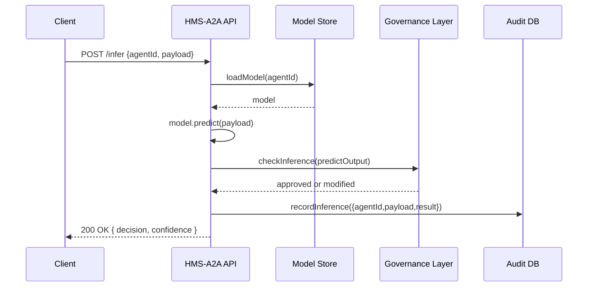

# Chapter 8: AI Agent Framework (HMS-A2A)

In the previous chapter, we learned how to stitch tasks into end-to-end processes with [Workflow Orchestration](07_workflow_orchestration_.md). Now it’s time to add a smart assistant—our **AI Agent Framework**—that can review case files, suggest optimizations, and plug into those workflows.

---

## 1. Why an AI Agent Framework? (Motivation)

Imagine USCIS is overwhelmed by visa applications. A virtual analyst could:

1. Scan each case file for missing documents.
2. Recommend faster adjudication paths when criteria are met.
3. Alert managers when edge cases need human review.

The **AI Agent Framework** (HMS-A2A) gives you a standardized way to:

- Train domain-specific models (program experts tune visa rules).
- Run inference during workflows to generate recommendations.
- Insert policy-governance hooks (so privacy rules and audit logs are enforced).
- Let admins configure oversight thresholds (e.g., only 90% confidence suggestions go live).

Citizens and staff see AI-driven notifications in their usual portal, while experts and admins control the system behind the scenes.

---

## 2. Key Concepts

1. **Agent Manager**  
   A service to register, configure, train, and run AI agents.

2. **Training**  
   Upload historical cases and labels so the model learns domain logic.

3. **Inference**  
   Run the trained model on new inputs to get suggestions or flags.

4. **Policy-Governance Hooks**  
   Every inference passes through governance checks (e.g., no PII leaks, bias detection).

5. **User Roles**  
   - **Administrators** set behavior and oversight thresholds.  
   - **Program Experts** supply training data and fine-tune models.  
   - **End Users** receive AI recommendations in their workflows.

---

## 3. Using the AI Agent Framework

Below is a minimal JavaScript example showing how an admin might set up a “VisaAdjudicator” agent, train it, and run inference on a new case.

```js
// File: setupVisaAgent.js
import { AgentManager } from 'hms-a2a-sdk'

// 1. Create and configure the agent
const mgr = new AgentManager({ baseUrl: '/api/agents' })
const agent = await mgr.createAgent({
  name: 'VisaAdjudicator',
  modelType: 'text-classifier',
  policyHooks: ['no-ssn-logging']
})

// 2. Train the model with labeled case files
const trainingData = [ /* { caseText, label: 'approve' } */ ]
await mgr.trainAgent(agent.id, trainingData)

// 3. Run inference on a new visa case
const suggestion = await mgr.runInference(agent.id, {
  caseText: 'Applicant has valid job offer and property…'
})
console.log('AI Suggests:', suggestion.decision)
// → AI Suggests: { decision: 'expedite', confidence: 0.92 }
```

Explanation:

- `createAgent` registers your agent and its governance hooks.
- `trainAgent` feeds historical cases so the model learns patterns.
- `runInference` returns a structured suggestion, with confidence.

---

## 4. Under the Hood: What Happens Step-by-Step

When you call `runInference`, the framework:



1. **LoadModel:** Retrieves the trained model artifact.  
2. **Predict:** Runs the model on input data.  
3. **Policy Check:** Ensures output meets governance policies.  
4. **Audit:** Logs the call for traceability.  
5. **Respond:** Returns a vetted suggestion to the caller.

---

## 5. Inside the Framework: Simplified Code

### 5.1. API Routes (`hms-a2a-service/routes/agents.js`)

```js
import express from 'express'
import { createAgent, trainAgent, infer } from '../services/agentService.js'
const router = express.Router()

router.post('/', (req, res) =>
  res.json(createAgent(req.body))
)

router.post('/:id/train', async (req, res) =>
  res.json(await trainAgent(req.params.id, req.body))
)

router.post('/:id/infer', async (req, res) =>
  res.json(await infer(req.params.id, req.body))
)

export default router
```

Explanation:

- `POST /api/agents` registers a new agent.
- `POST /api/agents/:id/train` accepts training data.
- `POST /api/agents/:id/infer` runs inference.

### 5.2. Core Service Logic (`services/agentService.js`)

```js
import { saveAgent, getAgent } from '../store/agentStore.js'
import { triggerTraining, loadModel, runModel } from './modelOps.js'
import { checkInference } from '../governance/policyClient.js'
import { logInference } from '../store/auditStore.js'

// Register a new agent
export function createAgent(config) {
  config.status = 'created'
  return saveAgent(config)
}

// Train the agent
export async function trainAgent(id, data) {
  const agent = await getAgent(id)
  await triggerTraining(agent.modelPath, data)
  return { status: 'trained' }
}

// Run inference
export async function infer(id, payload) {
  const agent = await getAgent(id)
  const model = await loadModel(agent.modelPath)
  const raw = await runModel(model, payload)
  const vetted = await checkInference(raw)
  await logInference(id, payload, vetted)
  return vetted
}
```

Explanation:

- `triggerTraining` invokes model build jobs.
- `runModel` calls the AI library for predictions.
- `checkInference` applies governance policies (via the Governance Layer).
- `logInference` writes audit records.

---

## 6. Analogy Recap

Think of the AI Agent Framework as:

- A **virtual analyst** sitting beside a human clerk, reviewing each file and whispering “Here’s how to speed things up.”  
- A **training ground** where domain experts feed the AI examples until it “gets” agency rules.  
- A **compliance officer** that vets every suggestion before it reaches end users.

---

## Conclusion

In this chapter, you discovered:

- What the **AI Agent Framework (HMS-A2A)** is and why it’s useful.  
- How to configure, train, and run inference with a simple SDK example.  
- What happens under the hood—from model loading to governance checks.

Next up, we’ll learn how to let humans step in and override AI suggestions when needed in **[Human-in-the-Loop (HITL) Override](09_human_in_the_loop__hitl__override_.md)**.

---

Generated by [AI Codebase Knowledge Builder](https://github.com/The-Pocket/Tutorial-Codebase-Knowledge)