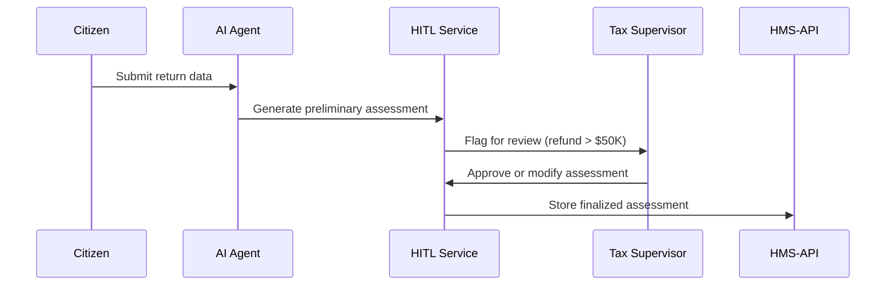

# Chapter 9: Human-in-the-Loop (HITL) Override

Building on our AI suggestions from [AI Agent Framework (HMS-A2A)](08_ai_agent_framework__hms_a2a__.md), we now add a **safety brake** so real people can review or tweak those recommendations before they’re final.

---

## 1. Why HITL Override? (Motivation)

Imagine the IRS uses an AI model to calculate an automated tax assessment. Most returns are routine, but high-value cases—say refunds over \$50,000—need extra scrutiny. Instead of “push to production,” we:

1. Let the AI propose a preliminary score.  
2. Trigger a **HITL Override** when thresholds are exceeded.  
3. A tax supervisor reviews, adjusts if needed, and signs off.  

This ensures accuracy, accountability, and public trust—citizens know real people back every critical decision.

---

## 2. Key Concepts

- **Review Thresholds**  
  Administrators set rules (e.g., refund > \$50K → manual review).  
- **Approval Workflows**  
  Program experts define who reviews and in what order.  
- **Override Actions**  
  Humans can accept, modify, or reject AI suggestions.  
- **Audit Trail**  
  Every override logs who reviewed, when, and why.  
- **Confidence & Accountability**  
  Users gain trust knowing someone signed off on each decision.

---

## 3. How to Use HITL Override

Here’s a minimal React component that:

1. Loads the pending AI assessment.  
2. Displays the suggested score.  
3. Lets a human adjust it and submit the final decision.

```jsx
// File: src/components/AssessmentReview.jsx
import React, { useState, useEffect } from 'react';

export default function AssessmentReview({ id }) {
  const [data, setData] = useState({ suggestion: '', notes: '' });

  // 1. Fetch pending assessment
  useEffect(() => {
    fetch(`/api/assessments/${id}/pending`)
      .then(res => res.json())
      .then(setData);
  }, [id]);

  // 2. Submit override
  function handleSubmit(e) {
    e.preventDefault();
    fetch(`/api/assessments/${id}/review`, {
      method: 'POST',
      headers: { 'Content-Type': 'application/json' },
      body: JSON.stringify(data)
    }).then(() => alert('Assessment finalized!'));
  }

  return (
    <form onSubmit={handleSubmit}>
      <label>Suggested Score</label>
      <input
        value={data.suggestion}
        onChange={e => setData({ ...data, suggestion: e.target.value })}
      />

      <label>Reviewer Notes</label>
      <textarea
        value={data.notes}
        onChange={e => setData({ ...data, notes: e.target.value })}
      />

      <button type="submit">Approve & Submit</button>
    </form>
  );
}
```

Explanation:
- We fetch the AI’s suggestion via `/pending`.
- The reviewer edits `suggestion` or adds `notes`.
- On submit, we send the final values to `/review`.

---

## 4. Under the Hood: Step-by-Step Flow

Here’s a simple sequence showing how HITL Override ties together:



1. **Data arrives**: Citizen files a return.  
2. **AI suggests**: Model computes an assessment.  
3. **HITL flags**: Service checks thresholds and routes high-value cases.  
4. **Human reviews**: Supervisor approves or edits the suggestion.  
5. **Finalize**: System records the approved score.

---

## 5. Internal Implementation

### 5.1. API Route

```js
// File: hms-api/routes/hitl.js
import express from 'express';
import { saveOverride } from '../services/hitlService.js';
const router = express.Router();

router.post('/assessments/:id/review', async (req, res) => {
  const { suggestion, notes } = req.body;
  await saveOverride(req.params.id, suggestion, notes, req.user.id);
  res.json({ status: 'finalized' });
});

export default router;
```

Explanation:
- The review endpoint accepts the human’s final values.  
- `req.user.id` ties the action to a specific reviewer.

### 5.2. Service Logic

```js
// File: hms-api/services/hitlService.js
import { getPending, finalize } from '../store/assessmentStore.js';

export async function saveOverride(id, score, notes, reviewer) {
  const pending = await getPending(id);             // load AI result
  await finalize(id, {                              
    finalScore: score, 
    notes, 
    reviewer, 
    timestamp: new Date() 
  });
}
```

Explanation:
- We fetch the pending AI result (optional checks).  
- We write a final record with `finalScore`, `notes`, `reviewer`, and timestamp.

---

## 6. Analogy Recap

Think of HITL Override as a **supervisor’s stamp**:

- The **AI** is the junior analyst doing bulk work.  
- The **HITL Service** is the inbox that flags tricky files.  
- The **Human** is the senior reviewer who stamps “Approved” or “Adjust.”  
- The **Audit Trail** is the signed form stored in the file cabinet.

---

## Conclusion

In this chapter, you learned how **Human-in-the-Loop (HITL) Override**:

- Applies review thresholds to AI suggestions.  
- Offers a simple UI for supervisors to approve or modify results.  
- Records every action for accountability.

Up next, we’ll synchronize these finalized decisions with external systems in  
[External System Synchronization](10_external_system_synchronization_.md).

---

Generated by [AI Codebase Knowledge Builder](https://github.com/The-Pocket/Tutorial-Codebase-Knowledge)