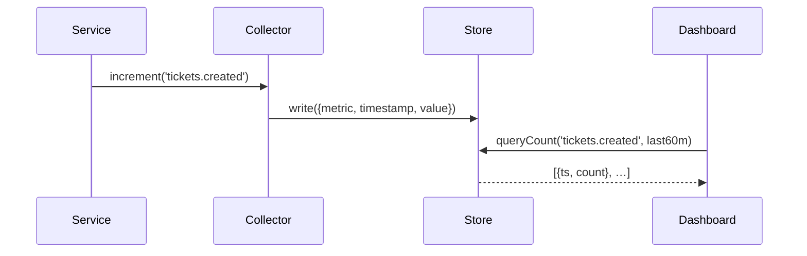

# Chapter 9: Monitoring & Metrics Module

In the last chapter you saw how the [Synchronization Engine](08_synchronization_engine_.md) keeps HMS in sync with external systems. Now we’ll add the “control room” of our platform: the **Monitoring & Metrics Module**.

## 1. Motivation & Central Use Case

Imagine the Federal Highway Administration (FHWA) wants to see, in real time:

- How many citizen maintenance requests come in each hour  
- Average time to close a road‐repair ticket  
- Which region’s backlog is growing  
- When a sudden spike indicates a major incident  

Without a dashboard, teams fire off email reports and scramble when something breaks. Our **Monitoring & Metrics Module** is like the power‐grid control room: it collects key indicators, shows them on a dashboard, and alerts managers to problems or improvements.

In this chapter you’ll learn how to:

1. Send simple “metrics events” from your services  
2. Store and query those metrics  
3. Build a basic web dashboard  
4. Trigger an alert when thresholds are crossed  

All in minimal, beginner-friendly steps.

## 2. Key Concepts

1. **Metrics Collector**  
   A small client library you include in your services to send counts, timings, or statuses.  

2. **Metrics Store**  
   A lightweight database (e.g., InfluxDB or even a JSON file for demos) where metrics land.  

3. **Dashboard Server**  
   A web app that queries the Metrics Store and renders charts or tables.  

4. **Alerting Rules**  
   Simple checks (e.g., “if openTickets > 100 for 5 minutes”) that send an email or log a warning.

## 3. Using the Monitoring & Metrics Module

### 3.1 Send a Metric from a Service

In your “ticket service” you can count each new request:

```js
// services/ticketService.js
const metrics = require('../monitoring/collector');

async function createTicket(data) {
  // ... save ticket to database ...
  metrics.increment('tickets.created');  // count one more
}
```

Explanation:  
- We import our `metrics` client.  
- After a new ticket is saved, we call `metrics.increment()` with a metric name.

### 3.2 Query Metrics in the Dashboard

Our dashboard server exposes an HTTP route:

```js
// monitoring/dashboardServer.js
const express = require('express');
const store   = require('./store');
const app     = express();

// Returns { timestamp: count } for the last hour
app.get('/api/metrics/tickets.created', async (req, res) => {
  const data = await store.queryCount('tickets.created', { lastMinutes: 60 });
  res.json(data);
});

app.listen(7000, () => console.log('Dashboard on port 7000'));
```

Explanation:  
- The dashboard calls `store.queryCount()` to get time‐series data.  
- It returns JSON you can plot in a chart.

### 3.3 Define a Simple Alert Rule

```js
// monitoring/alertRules.js
const store = require('./store');

setInterval(async () => {
  const recent = await store.queryCount('tickets.created', { lastMinutes: 5 });
  const sum = recent.reduce((a,r)=>a + r.count, 0);
  if (sum > 100) {
    console.warn('High volume alert: over 100 tickets in 5 minutes');
  }
}, 60000);
```

Explanation:  
- Every minute we sum the last 5-minute count.  
- If over 100, we log a warning (could be an email).

## 4. Under the Hood: Step-by-Step Flow



1. A microservice calls `metrics.increment()`.  
2. The Metrics Collector writes a record into the Store.  
3. The Dashboard queries the Store for time‐series data.  
4. The Store returns data for plotting.

## 5. Internal Implementation Details

### 5.1 File Structure

```
monitoring/
├─ collector.js
├─ store.js
├─ dashboardServer.js
└─ alertRules.js
```

### 5.2 collector.js

```js
// monitoring/collector.js
const fs = require('fs');
const path = require('path');

function increment(name) {
  const entry = { metric: name, time: Date.now(), value: 1 };
  fs.appendFileSync(
    path.join(__dirname, 'data.log'),
    JSON.stringify(entry) + '\n'
  );
}

module.exports = { increment };
```

Explanation:  
- For simplicity, we append each metric as a JSON line in `data.log`.  
- In production you’d push to InfluxDB, Prometheus, or another TSDB.

### 5.3 store.js

```js
// monitoring/store.js
const fs = require('fs');
const lines = () => fs.readFileSync('monitoring/data.log','utf8').split('\n');

async function queryCount(name, { lastMinutes }) {
  const cutoff = Date.now() - lastMinutes * 60e3;
  return lines()
    .map(l => { try { return JSON.parse(l); } catch {}} )
    .filter(e => e && e.metric === name && e.time >= cutoff)
    .reduce((agg,e) => {
      const bucket = Math.floor((e.time - cutoff)/60000);
      agg[bucket] = (agg[bucket] || 0) + e.value;
      return agg;
    }, [])
    .map((count, i) => ({ ts: cutoff + i*60000, count }));
}

module.exports = { queryCount };
```

Explanation:  
- We read `data.log`, parse each line, filter by metric name and time window.  
- We group counts into one-minute buckets for the past `lastMinutes`.

## 6. Summary & Next Steps

You’ve learned how to:

- Emit simple metrics from any service with `collector.increment()`.  
- Store and query those metrics in a minimal TSDB (`store.js`).  
- Build a tiny dashboard to fetch and visualize counts.  
- Define alert rules that warn when thresholds are exceeded.

Next up, we’ll see how to build administrative controls and policies in the [Management Layer](10_management_layer_.md).

---

Generated by [AI Codebase Knowledge Builder](https://github.com/The-Pocket/Tutorial-Codebase-Knowledge)