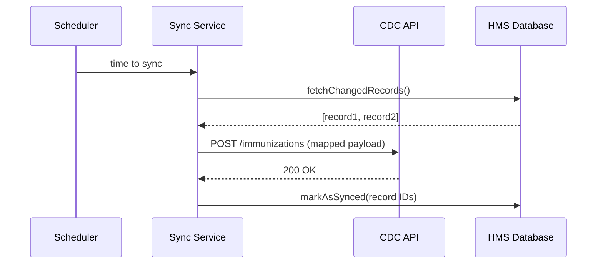

# Chapter 10: External System Synchronization

In the last chapter we added human review to AI suggestions with [Human-in-the-Loop (HITL) Override](09_human_in_the_loop__hitl__override_.md). Now we’ll connect HMS to outside systems—like a state health department syncing its immunization registry with the federal CDC platform—in real time. 

---

## 1. Why External System Synchronization? (Motivation)

Imagine a state immunization registry needs to share new vaccine records with the CDC as soon as they’re entered:

1. A county clinic uploads immunization data into the state portal.
2. The state registry pushes that data to the CDC’s API within seconds.
3. If the CDC makes updates (e.g., corrections), the state pulls them back.
4. Citizens and public-health officials always see the same up-to-date information.

By using **External System Synchronization**, administrators set up connectors and mapping rules, developers build lightweight adapters, and everyone benefits from consistent data across agencies.

---

## 2. Key Concepts

1. **Sync Connector**  
   A logical link in HMS that knows “how” and “when” to talk to an external API.

2. **Endpoint Configuration**  
   The external API’s URL, authentication (API key, OAuth), and protocol details.

3. **Mapping Rules**  
   Defines how fields in HMS (e.g., `patientId`) map to fields in the external system (e.g., `ssn`).

4. **Adapter**  
   A small piece of code that transforms HMS data into the external system’s format (and vice versa).

5. **Sync Strategies**  
   - **Push**: HMS sends new or changed records.  
   - **Pull**: HMS polls the external system for updates.  
   - **Bidirectional**: Both push and pull.

6. **Error Handling & Retry**  
   Automatic retries for transient failures, plus alerts for human intervention.

7. **Security**  
   Encrypt data in-transit, use secure credentials, and enforce least-privilege access.

8. **Monitoring & Alerts**  
   Tracks sync status, throughput, failures, and sends notifications if something goes wrong.

---

## 3. Using External System Synchronization

Below is a minimal JSON configuration to register a “CDC-Immunization” sync connector in HMS.

```json
// File: sync-config/cdc-immunization.json
{
  "name": "CDC-Immunization",
  "endpoint": {
    "url": "https://api.cdc.gov/v1/immunizations",
    "authType": "OAuth2",
    "credentialsId": "cdc-oauth-key"
  },
  "mapping": {
    "hms.patientId": "cdc.ssn",
    "hms.vaccineCode": "cdc.cvxcvxc",
    "hms.dateAdministered": "cdc.date"
  },
  "strategy": "push",
  "schedule": "*/5 * * * *",    // Every 5 minutes
  "retryPolicy": { "maxAttempts": 3, "backoff": "2m" }
}
```

Explanation:
- **name**: Your connector’s friendly name.  
- **endpoint**: Where and how to authenticate.  
- **mapping**: Field-to-field translations.  
- **strategy**: Push new state records.  
- **schedule**: A cron expression for regular sync.  
- **retryPolicy**: What to do on failures.

To start the sync service after loading this config:

```js
// File: src/startSync.js
import { SyncService } from './syncService.js';

async function start() {
  const service = new SyncService();
  await service.loadConfig('sync-config/cdc-immunization.json');
  service.on('error', e => console.error('Sync error:', e));
  service.start();            // Runs every 5 minutes
}

start();
```

Explanation:
- We load our JSON.  
- We listen for errors.  
- We call `start()` to kick off scheduled syncs.

---

## 4. Under the Hood: Step-by-Step Flow

When the scheduler fires, here’s a simple sequence:



1. **Scheduler** tells Sync Service it’s time.  
2. Service fetches changed records from the HMS **DB**.  
3. Service maps fields and calls the external **API**.  
4. On success, it marks those records as synced.

---

## 5. Internal Implementation

### 5.1. API Route to Trigger a Manual Sync

```js
// File: hms-svc/routes/sync.js
import express from 'express';
import { runSync } from '../services/syncService.js';
const router = express.Router();

router.post('/connectors/:name/sync', async (req, res) => {
  await runSync(req.params.name);
  res.json({ status: 'sync started', connector: req.params.name });
});

export default router;
```

Explanation:
- **POST /connectors/:name/sync** lets an admin trigger a connector on demand.

### 5.2. Core Service Logic

```js
// File: hms-svc/services/syncService.js
import { loadConnectorConfig, fetchChanges, markSynced } from '../store/syncStore.js';
import { mapFields, callExternal } from './syncAdapter.js';

export async function runSync(name) {
  const cfg = await loadConnectorConfig(name);
  const records = await fetchChanges(cfg);
  for (const rec of records) {
    const payload = mapFields(rec, cfg.mapping);
    await callExternal(cfg.endpoint, payload);
    await markSynced(rec.id);
  }
}
```

Explanation:
- **loadConnectorConfig** reads our JSON.  
- **fetchChanges** gets new or updated records.  
- **mapFields** transforms data per mapping rules.  
- **callExternal** invokes the third-party API (with auth).  
- **markSynced** updates our HMS database.

---

## 6. Analogy Recap

Think of External System Synchronization as a **postal mail sorter**:

- **Sync Connector** = a mail chute labeled for “CDC Headquarters.”  
- **Adapter** = a clerk who repackages letters into the CDC’s required envelope.  
- **Scheduler** = the mail truck making runs every 5 minutes.  
- **Retry Policy** = what happens if a street is closed—try again later.  
- **Monitoring** = the tracking number you check online.

---

## Conclusion

In this chapter, you learned how to:

- Configure a **Sync Connector** for real-time data sharing.  
- Understand key pieces: endpoints, mappings, adapters, strategies, and retries.  
- See what happens under the hood with a sequence diagram and simple code.

Up next, we’ll dive into the heart of HMS in the [Core System Platform (HMS-SYS)](11_core_system_platform__hms_sys__.md).

---

Generated by [AI Codebase Knowledge Builder](https://github.com/The-Pocket/Tutorial-Codebase-Knowledge)