# Chapter 10: HMS-AGX  (Agent Extensions)

*[Jumped in here first? Peek at the “HR desk for bots” in  
[Chapter 9 – HMS-AGT  (Core Agent Framework)](09_hms_agt___core_agent_framework__.md) to learn how agents get hired and badged.)*

---

## 1. Why Do Agents Need “Gear”?

Use-case story:

> A new wildfire erupts near a national forest.  
>  • DOI (Interior) owns the land maps.  
>  • USDA Forest Service flies drones for live images.  
>  • FEMA controls public-safety alerts.  
>   
>  A single **Response-Planner agent** must:  
>  1. read plain-English incident reports,  
>  2. label hot spots on drone photos,  
>  3. update FEMA’s alert feed in real time.  

The agent already has a **badge** (HMS-AGT) but still lacks the *gear* to read images or post to FEMA.  
Enter **HMS-AGX**—a backpack of optional toolkits that instantly upgrade any certified agent.

Think of HMS-AGT as “basic training” and HMS-AGX as the **special-forces supply room**.

---

## 2. High-Level Picture

```mermaid
flowchart LR
  AGT["🤖 Agent (core)"] -->|plugs in| AGX["🎒 AGX Gear Pack"]
  AGX --> DOI["🗺️ Map API (DOI)"]
  AGX --> USDA["📷 Drone Image Feed (USDA)"]
  AGX --> FEMA["📢 Alert Channel (FEMA)"]
```



The same agent code stays tiny; the pack handles every exotic skill.

---

## 3. Key Concepts (one-by-one)

| AGX Term           | Beginner Analogy                  | Meaning in HMS-AGX                                   |
|--------------------|-----------------------------------|------------------------------------------------------|
| **Extension Pack** | Add-on lens for a camera          | A container + manifest providing one new capability  |
| **Load-out**       | Soldier’s backpack list           | Set of packs an agent must load before a mission     |
| **Capability**     | “Night-vision”, “Snow tires”      | Named function (e.g., `image.detect_hotspots`)       |
| **Scope Token**    | Rental key for one room           | Limited JWT each pack uses to reach external APIs    |
| **AGX Registry**   | Weapon locker inventory           | Catalog where packs are published & versioned        |

---

## 4. Installing Gear – 3 Micro-Steps

We’ll give **Response-Planner** two packs:

1. `vision-kit` – labels fire in images.  
2. `fema-sync` – pushes JSON alerts to FEMA.

### 4.1 Pick Packs From the Registry (CLI, 1 line)

```bash
hms agx search wildfire   # shows vision-kit 1.2, fema-sync 2.0 …
```

### 4.2 Declare a Load-out in the Agent Manifest (≤ 10 lines)

```yaml
# snippet added to response_planner.manifest.yml
loadout:
  - vision-kit@1.2
  - fema-sync@2.0
```

### 4.3 Re-register the Agent

```bash
hms agt update response_planner.manifest.yml
# AGT output:
# ✔ Fetched packs (vision-kit, fema-sync)
# ✔ Issued scope tokens for DOI/USDA/FEMA
```

The agent may start its next job **unchanged**; packs inject themselves at runtime.

---

## 5. Using a Capability – Tiny Code Example (18 lines)

```python
# file: response_planner.py
from agx import load_capability   # AGX helper SDK ≤ 20 lines internally

detect = load_capability("image.detect_hotspots")   # from vision-kit
push   = load_capability("fema.alert.push")         # from fema-sync

def handle_drone_frame(frame_jpg: bytes):
    hotspots = detect(frame_jpg)        # returns list[(lat,lon)]
    if hotspots:
        push({"type":"wildfire", "points":hotspots})
```

Explanation:  
• `load_capability()` looks up the pack, verifies scope, and returns a function pointer.  
• The agent code stays as short as a postcard.

---

## 6. What Happens Under the Hood?


Only 4 extra steps—automated & logged.

---

## 7. Peeking Inside AGX (Code-Light)

### 7.1 Extension Manifest (vision-kit, 12 lines)

```yaml
id: vision-kit
version: 1.2.0
capabilities:
  image.detect_hotspots:
    entry: detect.py
    scopes: [ "s3://usda-drone/*" ]
runtime: "python3.11"
```

### 7.2 AGX Loader (abbrev., 15 lines)

```python
# file: agx/loader.py
import importlib, json, pathlib

def load_capability(name):
    pkg, cap = name.split(".",1)
    path = pathlib.Path(f"/packs/{pkg}/cap_{cap}.py")
    mod  = importlib.machinery.SourceFileLoader(cap, path).load_module()
    return getattr(mod, "handler")       # every cap exposes handler()
```

### 7.3 Scope Token Injector (pseudo, 10 lines)

```python
def sandbox(fn, scopes):
    token = agt.issue_scope(scopes)      # short-lived JWT
    def wrapped(*a, **kw):
        os.environ["SCOPE_JWT"] = token
        return fn(*a, **kw)
    return wrapped
```

The caller never handles tokens directly; security is invisible.

---

## 8. Common Beginner Questions

| Question | Quick Fix |
|----------|-----------|
| “My agent crashes: ‘capability not found’” | Run `hms agx list agent-id` to verify the pack version is loaded. |
| “Can two packs collide?” | AGX mounts each pack in its own namespace; use fully-qualified names. |
| “How do I publish my own pack?” | `hms agx publish my-pack/manifest.yml` (scans go through HMS-ESQ). |

---

## 9. How AGX Fits With Other HMS Pieces

```mermaid
graph TD
  AGX["🎒 HMS-AGX"] --> AGT["🤖 HMS-AGT"]
  AGX --> OMS["🛫 HMS-OMS"]
  AGX --> MKT["🏬 HMS-MKT"]
  AGX --> ESQ["🛡️ HMS-ESQ"]
```



• Packs are **listed** in the Marketplace (HMS-MKT).  
• Security & license scans run in **HMS-ESQ**.  
• When OMS assigns work, AGT injects the required load-out through AGX.  

---

## 10. Hands-On Recap

You learned how to:

1. **Search & install** ready-made gear packs.  
2. Add a **10-line load-out** to an agent manifest.  
3. Call new capabilities with a **one-line helper**.  
4. Peeked inside AGX’s tiny loader and sandbox.  

Your agents are now battle-ready for advanced missions!

---

## 11. What’s Next?

Gear is powerful, but agents still need a **shared language** to describe the real-world context they work in—prompts, provenance, and safety rails.  
That language is the **Model Context Protocol** covered in  
[HMS-MCP  (Model Context Protocol)](11_hms_mcp___model_context_protocol__.md).

---

Generated by [AI Codebase Knowledge Builder](https://github.com/The-Pocket/Tutorial-Codebase-Knowledge)