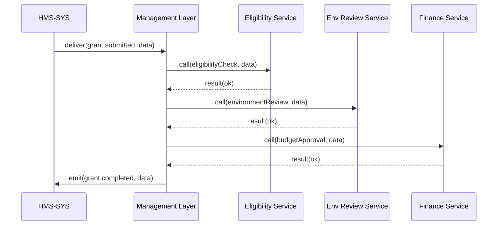

# Chapter 10: Management Layer

In [Chapter 9: Monitoring & Metrics Module](09_monitoring___metrics_module_.md), you learned how to collect logs and metrics to keep an eye on your system’s health. Now we turn to the **Management Layer**, our “administrative division” that orchestrates business logic, workflows, and resource allocation across services.

## 1. Motivation & Central Use Case

Imagine you work for a federal grants program. A citizen submits an application, but behind the scenes:

1. The application needs an eligibility check.
2. Then an environmental review.
3. Then budget approval.
4. Finally, award disbursement.

Each step may involve different teams or microservices. The **Management Layer** coordinates these tasks:

- Assigns each step to the right service or team.
- Tracks progress and retries failures.
- Allocates resources (e.g., compute slots or human reviewers).
- Emits final “completed” events when the workflow finishes.

Just like a department’s admin office, this layer ensures every piece of the process happens in order and on time.

## 2. Key Concepts

- **Business Logic**  
  Central rules that define how and when tasks run (e.g., “skip environmental review for applications under \$10,000”).

- **Workflow Orchestration**  
  A sequence of named steps (tasks), each with an owner (service or team) and a trigger condition.

- **Resource Allocation**  
  Granting CPU time, database connections, or human reviewer slots so tasks can run.

- **Task Assignment & Roles**  
  Mapping workflow steps to roles or microservices (e.g., “eligibilityCheck → Auth Service”).

- **Progress Tracking**  
  Recording each step’s status (pending, running, succeeded, failed) and reporting on overall workflow health.

## 3. Using the Management Layer

Below is a minimal Node.js example. We define a “grant application” workflow, then start it when an event arrives.

### 3.1 Define a Workflow

```js
// management/workflows/grantWorkflow.js
module.exports = {
  name: 'grantApplication',
  steps: [
    { name: 'eligibilityCheck', service: 'eligibility' },
    { name: 'environmentReview', service: 'env-service' },
    { name: 'budgetApproval',    service: 'finance' },
    { name: 'awardDisbursement', service: 'payments' }
  ]
};
```

> We list each step by name and which microservice will handle it.

### 3.2 Start the Workflow on Event

```js
// management/service.js
const CoreClient = require('../hms-sys/client');
const Engine     = require('./engine');
const grantFlow  = require('./workflows/grantWorkflow');

const core   = new CoreClient('http://localhost:4000');
const engine = new Engine(core);

// Register our workflow definition
engine.registerWorkflow(grantFlow);

// Listen for a new grant event from HMS-SYS
core.on('grant.submitted', payload => {
  engine.start('grantApplication', payload);
});
```

> When HMS-SYS emits `grant.submitted`, we kick off our grant workflow with the applicant’s data.

## 4. Under the Hood: Step-by-Step Flow



1. **HMS-SYS** routes the submission event to **Management**.  
2. **Management** calls each service in order.  
3. On success, it emits a final `grant.completed` event.

## 5. Internal Implementation Details

### 5.1 File Structure

```
management/
├─ engine.js
├─ service.js
└─ workflows/
   └─ grantWorkflow.js
```

### 5.2 engine.js

```js
// management/engine.js
class Engine {
  constructor(core) {
    this.core       = core;
    this.workflows  = {};
  }

  registerWorkflow(def) {
    this.workflows[def.name] = def.steps;
  }

  async start(name, payload) {
    const steps = this.workflows[name] || [];
    for (const step of steps) {
      // Call each service via HMS-SYS
      await this.core.emit(`${step.service}.execute`, { payload });
    }
    // All done: notify completion
    await this.core.emit(`${name}.completed`, { payload });
  }
}

module.exports = Engine;
```

> We store workflows by name, then loop through each step—emitting an event that routes via HMS-SYS to the correct service. Finally, we emit a “completed” event.

## 6. Summary & Next Steps

In this chapter you learned how the **Management Layer**:

- Encapsulates **business logic** and **workflows** as ordered steps.  
- Uses **HMS-SYS** to route task requests to different services.  
- Tracks progress and emits a final completion event.

Next up, we’ll build rule enforcement and policy checks in the [Chapter 11: Policy Module](11_policy_module_.md).

---

Generated by [AI Codebase Knowledge Builder](https://github.com/The-Pocket/Tutorial-Codebase-Knowledge)