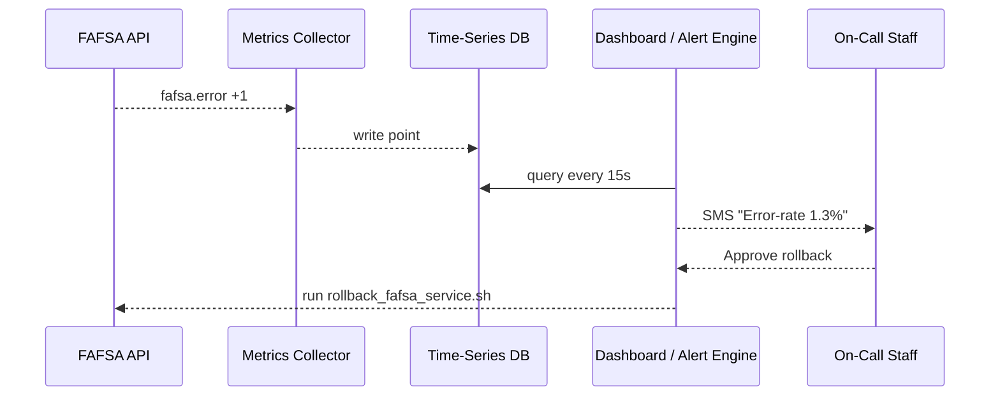

# Chapter 10: Real-Time Metrics & Monitoring
[← Back to Chapter 9: Role-Based Access Control & Accountability Ledger](09_role_based_access_control___accountability_ledger_.md)

---

## 0. Why Does HMS Need “Mission Control”?

Picture the U.S. Department of Education right after the **FAFSA** deadline.  
Suddenly thousands of submissions start failing with error **`RULE-X15`**.  
If staff discover this *tomorrow morning*, students lose a day of aid processing.

Instead we want a **NORAD-style command center** that:

1. Notices the spike within seconds  
2. Flashes a red tile on a shared screen  
3. Pages the on-call engineer  
4. (If safe) runs an *auto-remediation* script to roll back yesterday’s code

That all lives in **Real-Time Metrics & Monitoring**.

---

## 1. Key Concepts in Plain English

| Term | Think of it like… | Why Beginners Care |
|------|------------------|--------------------|
| **Metric** | A heart-rate reading | Single number (e.g., 98 % success) |
| **Dashboard Tile** | Gauge on a car | Shows the latest value at a glance |
| **SLO (Target)** | Speed-limit sign | “Stay above 99 % success” |
| **Alert** | Seatbelt chime | Notifies when you cross the SLO |
| **Telemetry Stream** | IV drip | Continuous flow of tiny measurements |
| **Auto-Remediation** | Self-parking car | Script that fixes common issues |

Keep these six in mind—everything else is wiring!

---

## 2. A 3-Minute Demo: Counting Failed FAFSA Submissions

Below we’ll instrument a single API route, stream the data, and show it on a mini-dashboard.

### 2.1 Emit a Metric (Node/Express – 11 lines)

```js
// routes/submitFafsa.js
import { metrics } from '@hms/telemetry';     // tiny helper

router.post('/fafsa', async (req, res) => {
  try {
    await saveToDB(req.body);
    res.sendStatus(201);
    metrics.inc('fafsa.success');            // +1 success
  } catch (e) {
    res.sendStatus(400);
    metrics.inc('fafsa.error');              // +1 error
  }
});
```

What happened?  
• `metrics.inc()` just pushes `{name,value,timestamp}` onto a **Telemetry Stream** (Kafka/WebSocket—doesn’t matter to you).

### 2.2 Auto-Create a Dashboard Tile (YAML – 8 lines)

```yaml
# dashboards/fafsa.yaml
tile: "FAFSA Success Rate"
metric: "fafsa.success / (fafsa.success + fafsa.error)"
slo: 0.99          # alert if < 99 %
color: green->red
```

Drop this file in the dashboards folder. The monitoring UI hot-reloads it and starts charting.

### 2.3 See It Live

Open `https://hms.gov/metrics` → a big green “FAFSA Success 99.4 %”.  
Force a few failures and watch it turn amber, then red, and finally fire an alert.

---

## 3. How Alerts Find Humans *and* Robots

### 3.1 Routing Rule (YAML – 10 lines)

```yaml
# alerts/fafsa_rule.yaml
if: "metric('fafsa.error_rate') > 0.01 for 5m"
notify:
  - ops_team_sms
  - slack:#ed-fin-aid
run:
  - script: rollback_fafsa_service.sh
    guarded_by: [ "HITL_REQUIRED" ]
```

Explanation  
1. If the error-rate stays above 1 % for 5 minutes…  
2. Send SMS + Slack **and** queue a rollback script.  
3. The script executes only after a human gives the 👍 in the [HITL console](07_human_in_the_loop__hitl__oversight_.md).

---

## 4. Under the Hood (Step-By-Step View)



Five actors, one loop—easy to reason about.

---

## 5. Tiny Internal Pieces of Code

### 5.1 Collector (TypeScript – 18 lines)

```ts
// telemetry/collector.ts
import WebSocket from 'ws';
const ws = new WebSocket('wss://metrics.hms.gov/ingest');

export const metrics = {
  inc: (name: string) => send(name, 1),
  gauge: (name: string, val: number) => send(name, val)
};

function send(name, value) {
  ws.send(JSON.stringify({ name, value, ts: Date.now() }));
}
```

Every service imports this helper; **no ops knowledge required**.

### 5.2 Alert Engine Snippet (Go – 12 lines)

```go
// alert/rules.go
for _, r := range rules {
  val := db.Query(r.Expr)      // prometheus-style expression
  if r.Tripped(val) {
     notify(r.Notify, val)
     if r.Script != "" && r.Guarded && hitlApproved(r) {
        exec(r.Script)
     }
  }
}
```

Code trimmed, but the idea is clear: evaluate → notify → (optionally) fix.

---

## 6. Where Do Metrics Show Up?

```
hms-monitor/
 ├─ dashboards/
 │   └─ fafsa.yaml
 ├─ alerts/
 │   └─ fafsa_rule.yaml
 ├─ ui/                 # React widgets (reuse HMS component library)
 └─ collector/          # helper you imported above
```

Drag-and-drop YAML files—no redeploys needed. Perfect for beginners.

---

## 7. How This Connects to Other HMS Pieces

* Services instrumented here live in the [Backend Services Layer (HMS-SVC)](11_backend_services_layer__hms_svc_.md).  
* Auto-Remediation scripts may call **AI Agents** from [Specialized AI Agents (HMS-A2A)](05_specialized_ai_agents__hms_a2a__.md).  
* Alert approvals run through the same **HITL** dashboard (Chapter 7).  
* All alert decisions are written to the **Accountability Ledger** (Chapter 9).  
* RBAC rules (Chapter 9) decide *who* can silence an alert.

---

## 8. Mini-FAQ

**Q: Do I need Prometheus or Grafana knowledge?**  
No. The collector hides protocol details; YAML tiles auto-render.

**Q: Can I track front-end metrics (e.g., page load time)?**  
Yes—`@hms/telemetry-web` sends `mfe.page_load_ms` the same way.

**Q: What about personally identifiable information (PII)?**  
The collector strips payloads; only counts & latencies leave the service, satisfying [AI Governance Model](06_ai_governance_model_.md) privacy rules.

---

## 9. Recap & Next Steps

In this chapter you:

1. Turned a NASA-like control room into **11 lines of code + 8 lines of YAML**.  
2. Learned six must-know terms (Metric, Dashboard Tile, SLO, Alert, Telemetry Stream, Auto-Remediation).  
3. Saw a full life-cycle: emit → store → display → alert → (optionally) fix.  
4. Discovered how monitoring threads through agents, HITL, RBAC, and governance.

Up next we’ll zoom into the **services** that actually emit most of these metrics:  
[Chapter 11: Backend Services Layer (HMS-SVC)](11_backend_services_layer__hms_svc_.md)

---

---

Generated by [AI Codebase Knowledge Builder](https://github.com/The-Pocket/Tutorial-Codebase-Knowledge)