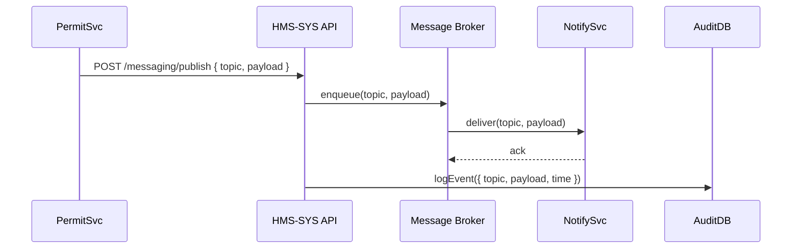

# Chapter 11: Core System Platform (HMS-SYS)

In the previous chapter we saw how to keep data in sync with outside systems using [External System Synchronization](10_external_system_synchronization_.md). Now let’s dig into the hidden backbone that makes everything work smoothly: the **Core System Platform (HMS-SYS)**.

---

## 1. Why a Core System Platform? (Motivation)

Imagine the federal government’s IT is like Washington, D.C.:

- The **911 dispatch network**, the **IRS e-filing system**, and the **EPA enforcement portal** all need a secure, stable highway to send and receive data.
- Each agency builds its own “vehicle” (microservice, AI agent, user portal), but they all drive on the same roads.

**HMS-SYS** is that central highway and traffic control:

1. **Security**: It checks every vehicle for proper credentials.  
2. **Messaging**: It routes calls and events between services.  
3. **Orchestration**: It helps services find each other and coordinate tasks.  
4. **Audit & Compliance**: It logs who did what, when, and why, for policy-makers and auditors.  

Users never see HMS-SYS, but every citizen transaction—whether filing taxes or calling 911—rides on its reliability and compliance safeguards.

---

## 2. Key Concepts

1. **Service Registry**  
   - A catalog where every module “registers” its name and endpoint.  
   - Allows dynamic discovery: no hard-coded URLs.

2. **Message Broker**  
   - A secure bus for events and commands (built on Kafka, RabbitMQ, etc.).  
   - Supports publish/subscribe and request/response patterns.

3. **Orchestration API**  
   - Lightweight endpoints to coordinate multi-service workflows (complementing [Workflow Orchestration](07_workflow_orchestration_.md)).  

4. **Security Middleware**  
   - Enforces authentication & authorization on every call (hooks into [Authentication & Authorization](03_authentication___authorization_.md)).  

5. **Audit Logger**  
   - Captures every registry change, message sent, and orchestration step.  
   - Stores immutable records for compliance reviews.

6. **Plugin Interface**  
   - Simple hooks so new services can “plug and play” without code changes in the core.

---

## 3. Using HMS-SYS

Let’s walk through a minimal example: Service **PermitSvc** registers itself, publishes an event, and another service **NotifySvc** consumes it.

### 3.1 Registering a Service

```js
// File: permit-service/register.js
import fetch from 'node-fetch';

async function registerService() {
  await fetch('https://hms-sys.gov/api/registry/register', {
    method: 'POST',
    headers: { 'Content-Type': 'application/json' },
    body: JSON.stringify({
      name: 'PermitSvc',
      endpoint: 'https://permit.example.gov'
    })
  });
  console.log('PermitSvc registered!');
}

registerService();
```
This tells HMS-SYS the `PermitSvc` exists at that URL.

### 3.2 Publishing an Event

```js
// File: permit-service/event.js
import { messaging } from 'hms-sys-client';

async function sendPermitCreated(permitId) {
  await messaging.publish('permit.created', { id: permitId });
  console.log('Event sent: permit.created');
}

sendPermitCreated(123);
```
Any service subscribed to `permit.created` will receive the payload.

### 3.3 Subscribing to Events

```js
// File: notify-service/subscribe.js
import { messaging } from 'hms-sys-client';

messaging.subscribe('permit.created', payload => {
  // Send email or dashboard update
  console.log('NotifySvc got permit:', payload.id);
});
```
The core platform handles delivery, retries, and security checks.

---

## 4. Under the Hood: Step-by-Step Flow

When **PermitSvc** publishes `permit.created`:



1. **PermitSvc** calls the core `/publish` endpoint.  
2. **HMS-SYS** enqueues the event in the broker.  
3. **Broker** delivers to subscribers like **NotifySvc**.  
4. **HMS-SYS** logs the entire sequence for auditing.

---

## 5. Inside HMS-SYS: Simplified Code

### 5.1. Registry Route

```js
// File: hms-sys/routes/registry.js
import express from 'express';
import { registry, audit } from '../services/core.js';
const router = express.Router();

router.post('/register', (req, res) => {
  const { name, endpoint } = req.body;
  registry[name] = endpoint;          // save in memory or DB
  audit.log('register', { name });    // audit the action
  res.json({ status: 'ok' });
});

export default router;
```
- Stores the service entry.  
- Logs the registration for compliance.

### 5.2. Messaging Service

```js
// File: hms-sys/services/messaging.js
import { broker } from './brokerClient.js';
import { audit } from './audit.js';

export async function publish(topic, msg) {
  await broker.send(topic, msg);             // send to Kafka/Rabbit
  await audit.log('publish', { topic, msg });// record the event
}

export function subscribe(topic, handler) {
  broker.on(topic, async data => {
    await audit.log('deliver', { topic, data });
    handler(data);
  });
}
```
- Uses an external broker client.  
- Audits publish and delivery actions.

---

## 6. Analogy Recap

Think of HMS-SYS as a **federal telecommunications network**:

- **Service Registry** = the phone book of all extensions.  
- **Message Broker** = a secure switchboard operator.  
- **Orchestration API** = conference call coordinator.  
- **Audit Logger** = call detail records for every ring and transfer.  
- **Security Middleware** = the badge check before you dial.

---

## Conclusion

In this chapter you learned:

- What the **Core System Platform (HMS-SYS)** is and why it’s critical.  
- How to register services, publish and subscribe to events.  
- What happens under the hood in the registry and messaging layers.

Next up, we’ll dive deeper into the business-facing endpoints in **[Backend Services (HMS-SVC / HMS-API)](12_backend_services__hms_svc___hms_api__.md)**.

---

Generated by [AI Codebase Knowledge Builder](https://github.com/The-Pocket/Tutorial-Codebase-Knowledge)