# Chapter 11: HMS-MCP  (Model Context Protocol)

*(Coming from [HMS-AGX  (Agent Extensions)](10_hms_agx___agent_extensions__.md). If you just jumped in, peek there to see how agents gain new super-powers before they start “speaking” MCP.)*

---

## 1. Why Do Bots Need a Diplomatic Protocol?

Story time – “The Tax & Health Tango”  

1. **Jordan** files federal taxes online.  
2. To pre-fill medical deductions, the **IRS-Bot** wants to peek at Jordan’s **NIH-Bot** record of out-of-pocket drug expenses.  
3. Health data is ultra-sensitive (*HIPAA!*). NIH-Bot will only comply if it sees:  
   • who is asking,  
   • why the data is needed,  
   • proof Jordan agreed,  
   • and a way to revoke the share later.

Without a standard envelope, every pair of bots would invent its own headers. That quickly becomes the Tower of Babel.

**HMS-MCP** is the shared language—all HMS agents must speak it when they borrow each other’s tools or data. Think of it as the **Vienna Convention for AI micro-services**.

---

## 2. The 30-Second Elevator Pitch

```mermaid
flowchart LR
  IRS["🤖 IRS-Bot"] -- MCP Envelope --> NIH["🤖 NIH-Bot"]
  NIH --> Ledger["🗄️ MCP Ledger (prov., consent)"]
```



• IRS-Bot wraps the request in an **MCP envelope**.  
• NIH-Bot validates the envelope—authority, consent, expiry.  
• All exchanges are notarized in the **MCP ledger** for later audits.

---

## 3. Key Concepts (one-by-one)

| Term | Beginner Analogy | What It Really Is |
|------|------------------|-------------------|
| Context Envelope | Diplomatic pouch | The JSON wrapper every MCP call rides in |
| Delegation Token | Embassy passport | JWT proving “I may act on Jordan’s behalf” |
| Provenance Chain | FedEx tracking sticker | List of every agent that handled the data |
| Consent Receipt | Signed permission slip | Hash pointing to Jordan’s “Yes, share” |
| Revocation Record | Visa cancellation | Log entry that instantly voids a token |
| MCP Ledger | National archive | Append-only table storing all of the above |

---

## 4. The Envelope – Small Enough to Read

Below is **the entire MCP envelope schema** (14 lines).

```json
{
  "mcp_ver": "1.0",
  "caller":  "irs-bot",
  "callee":  "nih-bot",
  "purpose": "tax-deduction-prefill",
  "delegation_token": "eyJhbGciOi...",
  "consent_id": "CONS-9912",
  "expires_at": "2025-04-15T23:59:59Z",
  "data_refs": ["s3://nih/patients/E123/op_drug_receipts.json"],
  "provenance": [
     {"hop":1,"agent":"irs-bot","ts":"2025-03-01T10:02Z"}
  ],
  "signature": "0xABCD..."
}
```

*Every MCP-capable agent only needs to parse these fields—no surprises.*

---

## 5. Step-By-Step Walk-Through

### 5.1 Creating the Envelope (IRS-Bot, 16 lines)

```python
# file: create_envelope.py
import jwt, datetime, json, hashlib, os

def build_envelope(patient_id:str):
    deleg = jwt.encode(
        {"sub": patient_id, "iss":"irs-bot",
         "scope":"read-drug-expense", 
         "exp": datetime.datetime(2025,4,15)},
        os.getenv("IRS_PRIVATE_KEY"), algorithm="RS256")

    env = {
      "mcp_ver":"1.0",
      "caller":"irs-bot",
      "callee":"nih-bot",
      "purpose":"tax-deduction-prefill",
      "delegation_token": deleg,
      "consent_id":"CONS-9912",
      "expires_at":"2025-04-15T23:59:59Z",
      "data_refs":[f"s3://nih/patients/{patient_id}/op_drug_receipts.json"],
      "provenance":[{"hop":1,"agent":"irs-bot","ts":datetime.datetime.utcnow().isoformat()}]
    }
    env["signature"] = hashlib.sha256(json.dumps(env,sort_keys=True).encode()).hexdigest()
    return env
```

**Explanation**:  
1. Create a *delegation JWT* valid until Tax Day.  
2. Fill envelope fields.  
3. Sign the whole JSON for tamper detection.

### 5.2 Sending & Receiving (18 lines total)

```python
# sender.py  (IRS side)
env = build_envelope("E123")
resp = httpx.post("https://nih.api/mcp", json=env)
print(resp.json())          # → {"status":"accepted","trace":"MCP-447"}
```

```python
# receiver.py  (NIH side, simplified 18 lines)
from fastapi import FastAPI, HTTPException
import jwt, datetime, hashlib, os

app = FastAPI()

def valid(env):
    # ① check signature
    body = env.copy(); sig = body.pop("signature")
    if hashlib.sha256(json.dumps(body,sort_keys=True).encode()).hexdigest()!=sig:
        return False
    # ② check expiry
    if datetime.datetime.fromisoformat(env["expires_at"]) < datetime.datetime.utcnow():
        return False
    # ③ verify delegation token
    jwt.decode(env["delegation_token"], os.getenv("IRS_PUBKEY"),
               algorithms=["RS256"], audience=None)
    return True

@app.post("/mcp")
def handle(env:dict):
    if not valid(env): raise HTTPException(403,"MCP validation failed")
    ledger.log(env)                        # store provenance & consent
    return {"status":"accepted","trace":"MCP-447"}
```

**Explanation**:  
① Verify no one tampered with the JSON.  
② Respect the time limit.  
③ Cryptographically prove IRS-Bot indeed has Jordan’s delegation.  
Finally log the call.

---

## 6. What Happens Under the Hood?


Only **three agents** and one post. Validation-and-log happen in milliseconds.

---

## 7. Inside the MCP Ledger (Code-Light)

### 7.1 Table Schema (SQL, 9 lines)

```sql
CREATE TABLE mcp_ledger (
  id         INTEGER PRIMARY KEY AUTOINCREMENT,
  consent_id TEXT,
  caller     TEXT,
  callee     TEXT,
  expires_at DATETIME,
  envelope   JSON,
  revoked    BOOLEAN DEFAULT 0
);
```

### 7.2 Revocation Endpoint (12 lines)

```python
# file: ledger/revoke.py
from fastapi import FastAPI

app = FastAPI()

@app.post("/revoke/{consent_id}")
def revoke(consent_id:str):
    db.execute("UPDATE mcp_ledger SET revoked=1 WHERE consent_id=?", (consent_id,))
    return {"revoked":True}
```

Any service can call `/revoke/CONS-9912`; future validations will fail.

---

## 8. How MCP Hooks Into the Wider HMS

```mermaid
graph TD
  MCP["🤝 HMS-MCP"] --> AGT["🤖 HMS-AGT"]
  MCP --> OMS["🛫 HMS-OMS"]
  MCP --> ESQ["🛡️ HMS-ESQ"]
  MCP --> OPS["🔭 HMS-OPS"]
```



• **Agents (AGT)** embed envelopes automatically when they call cross-service tools.  
• **Workflows (OMS)** attach provenance hops to the chain.  
• **Security & Legal (ESQ)** run auditors on the ledger to prove compliance.  
• **Observability (OPS)** shows live dashboards of delegation usage.

---

## 9. Common Beginner Questions

| Question | Quick Fix |
|----------|-----------|
| “My envelope fails signature check.” | Ensure the `signature` is computed **after** all other fields are set. |
| “How do I attach multiple data refs?” | Use a JSON array in `data_refs`; MCP has no hard limit. |
| “Citizen withdrew consent—now what?” | Call the revocation endpoint; every agent will reject that `consent_id` going forward. |

---

## 10. Hands-On Recap

You learned:

1. **Why** HMS-MCP is needed: safer data sharing between sovereign agents.  
2. The 5 core parts: context envelope, delegation token, provenance chain, consent receipt, revocation record.  
3. How to build & validate a real envelope in < 20 lines of Python.  
4. How the ledger gives airtight audit trails for regulators.  
5. Where MCP plugs into AGT, OMS, ESQ, and OPS.

---

## 11. What’s Next?

Sometimes machines must still tap a human on the shoulder—*“Is it OK to proceed?”*  
The next chapter introduces those guardrails:  
[Human-in-the-Loop (HITL) Oversight](12_human_in_the_loop__hitl__oversight_.md)

---

---

Generated by [AI Codebase Knowledge Builder](https://github.com/The-Pocket/Tutorial-Codebase-Knowledge)