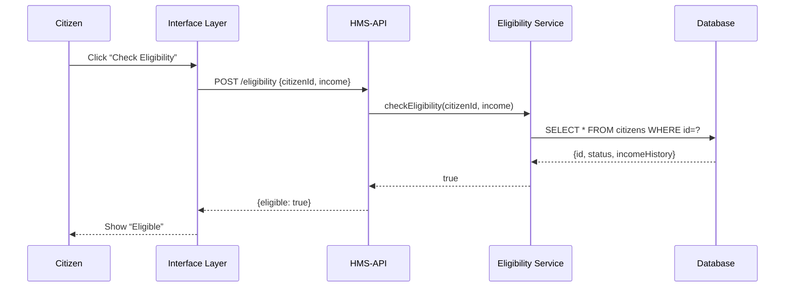

# Chapter 12: Backend Services (HMS-SVC / HMS-API)

In [Chapter 11: Core System Platform (HMS-SYS)](11_core_system_platform__hms_sys__.md) we saw how services register and communicate on the HMS highway. Now we’ll explore the **Backend Services** layer—our factories where data is processed, business rules run, and records get stored.

---

## 1. Motivation: Why Backend Services?

Imagine a citizen applies online for unemployment benefits at the Department of Labor:

1. They fill out their income and work-history details in the portal.  
2. They click **Check Eligibility**.  
3. Behind the scenes, HMS calls an **Eligibility Service** that:
   - Validates the data  
   - Applies benefit-calculation rules  
   - Stores the application record  
   - Returns a “yes/no” answer  

These services are like clerks at an SSA office: they follow service contracts, run the calculations, and keep authoritative records. Program managers define the contracts, developers build and version each microservice, and policy-makers ensure the rules match current regulations.

---

## 2. Key Concepts

1. **Service Contract**  
   A clear API definition (e.g., `POST /eligibility`) describing inputs and outputs.

2. **Business Logic**  
   Code that enforces rules—eligibility checks, fee calculations, report generation.

3. **API Endpoint**  
   HTTP routes that the UI or other services call to trigger processing.

4. **Versioning**  
   Multiple API versions (v1, v2) let you update rules without breaking clients.

5. **Policy Enforcement**  
   Hooks into the [Governance Layer](05_governance_layer_.md) or [Policy Engine](06_policy_engine_.md) to ensure compliance.

---

## 3. Using Backend Services: A Simple Example

### 3.1. Defining an Eligibility Route

```js
// File: hms-api/routes/eligibility.js
import express from 'express';
import { checkEligibility } from '../services/eligibilityService.js';

const router = express.Router();

router.post('/eligibility', async (req, res) => {
  const { citizenId, income } = req.body;
  const eligible = await checkEligibility(citizenId, income);
  res.json({ eligible });
});

export default router;
```
This route accepts a JSON body, calls our service logic, and returns `{ eligible: true/false }`.

### 3.2. Calling the API from the UI

```js
// In an HMS-MFE component
const response = await fetch('/api/eligibility', {
  method: 'POST',
  headers: { 'Content-Type': 'application/json' },
  body: JSON.stringify({ citizenId: 'ABC123', income: 30000 })
});
const data = await response.json();
alert('You are eligible: ' + data.eligible);
```
The UI sends a POST to HMS-API, then shows the result to the citizen.

---

## 4. Under the Hood: Step-by-Step Flow



1. The UI calls `/eligibility`.  
2. HMS-API routes to our service layer.  
3. The service fetches data, applies rules, and returns the answer.  
4. The API sends JSON back to the UI.

---

## 5. Inside Backend Services: Core Code

### 5.1. Business Logic

```js
// File: hms-svc/services/eligibilityService.js
import { getCitizenRecord } from '../store/citizenStore.js';

export async function checkEligibility(id, income) {
  const record = await getCitizenRecord(id);
  // Simple rule: must be active and income below threshold
  return record.status === 'active' && income < 50000;
}
```

- `getCitizenRecord` reads the DB.  
- We apply a basic active-status and income rule.

### 5.2. Data Access

```js
// File: hms-svc/store/citizenStore.js
import db from '../db.js';

export async function getCitizenRecord(id) {
  const rows = await db.query('SELECT * FROM citizens WHERE id = ?', [id]);
  return rows[0];
}
```

- A thin layer over the database.  
- Returns the citizen’s record for our service logic.

---

## 6. Analogy Recap

Think of **Backend Services** as government office “factories”:

- **Service Contract** = the official form you submit (what goes in, what you get back).  
- **Business Logic** = the clerk’s checklist of policy rules.  
- **Data Store** = the file cabinet where case records are kept.  
- **API Versioning** = updated forms that don’t break old ones.

---

## Conclusion

In this chapter you learned:

- What **Backend Services (HMS-SVC / HMS-API)** are and why they matter.  
- How to define an Express route, call it from the UI, and run simple business logic.  
- The step-by-step flow from user click to database lookup and back.

Up next, we’ll break these services into independently deployable pieces with **[Modular Microservices](13_modular_microservices_.md)**.

---

Generated by [AI Codebase Knowledge Builder](https://github.com/The-Pocket/Tutorial-Codebase-Knowledge)