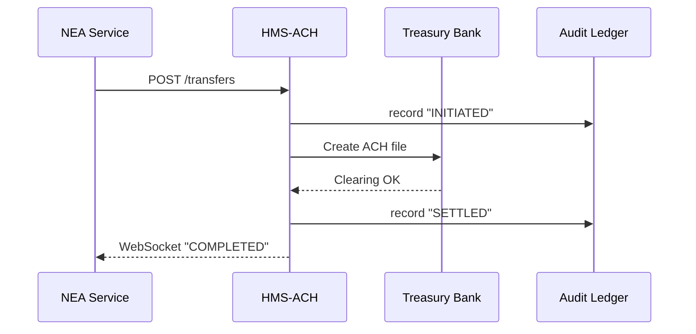

# Chapter 12: Financial Transaction Hub (HMS-ACH)
[← Back to Chapter 11: Backend Services Layer (HMS-SVC)](11_backend_services_layer__hms_svc__.md)

---

## 0. Why Do We Need a “Treasury-Grade Bank Teller” Inside HMS?

Imagine the National Endowment for the Arts just **approved 1,250 mini-grants** for after-school music programs.  
By law, each school must receive the first \$1,000 **within 48 hours**.

Without a shared payment hub every agency would scramble to:

* open its own bank account  
* learn NACHA file formats  
* handle failed transfers & refunds  
* produce audit logs for the Treasury Inspector General  

HMS-ACH is the **one teller window** that every program trusts:

| For… | It guarantees… |
|------|----------------|
| Citizens | Money lands *exactly* when promised |
| Developers | **Idempotent** `/transfers` endpoint (safe to retry) |
| Policy makers & auditors | Immutable clearing & settlement ledger |

---

## 1. Key Concepts in Plain English

| Term | Think of it like… | Why it matters |
|------|------------------|----------------|
| Funding Rail | A train track (ACH, FedNow, Wire) | Chooses the right speed & cost |
| Transfer Request | Deposit slip | One movement of funds |
| Idempotency Key | “Do Not Deposit Twice” stamp | Re-posting the same request is harmless |
| Clearing | Nightly bookkeeping | Ensures money is *available* |
| Settlement | Final cash hand-off | Marks the transfer **DONE** |
| Reconciliation | Bank statement match | Finds and fixes any gaps |

Keep this table open while coding!

---

## 2. Quick-Start: Disbursing a Grant in 12 Lines

Below the NEA service calls HMS-ACH to send \$1,000 to “Jazz Kids Inc.”

```js
// services/grants/pay.js   (≤12 lines)
import api from '../util/api.js';
import { v4 as uuid } from 'uuid';

export async function pay(grant) {
  const res = await api.post(
    '/ach/transfers',
    {
      amount: 1000_00,               // cents
      toRouting: '044000037',
      toAccount: '987654321',
      memo: `NEA Mini-Grant ${grant.id}`
    },
    { headers: { 'Idempotency-Key': uuid() } }
  );
  return res.data;                  // { transferId, status:"PENDING" }
}
```

What you did:

1. Sent a JSON body—**no** NACHA formatting.  
2. Added an `Idempotency-Key`; if your service retries, HMS-ACH simply returns the same `transferId`.  
3. Received a `PENDING` status; you can poll `/ach/transfers/{id}` or subscribe to WebSocket events.

---

## 3. Life of a Transfer (Step-By-Step)



Only four hops, yet you get an end-to-end paper trail.

---

## 4. Under the Hood (Code-Light Tour)

### 4.1 Transfer Endpoint (Express – 19 lines)

```js
// services/ach/create.js
import { ledger } from '../util/ledger.js';
import { queue } from '../util/clearingQueue.js';

export async function create(req, res) {
  const id = req.idempotency();          // helper reads the header
  const body = req.body;

  // 1️⃣  Basic validation
  if (!body.amount || !body.toRouting)  return res.status(400).send('Bad payload');

  // 2️⃣  Record INITIATED
  await ledger.append({ id, stage: 'INITIATED', body });

  // 3️⃣  Queue for clearing
  await queue.add({ id, body });

  res.status(202).json({ transferId: id, status: 'PENDING' });
}
```

Explanation  
* Idempotency is handled by `req.idempotency()`; repeated calls return the same `id`.  
* The `ledger.append()` call reuses the immutable store from  
  [Role-Based Access Control & Accountability Ledger](09_role_based_access_control___accountability_ledger_.md).

### 4.2 Nightly Clearing Worker (8 lines)

```js
// workers/clearing.js
queue.process(async job => {
  const { id, body } = job.data;
  const nacha = toNacha(body);          // convert JSON → NACHA
  const ok = await bank.send(nacha);    // call treasury API

  await ledger.append({ id, stage: ok ? 'SETTLED' : 'FAILED' });
  events.publish('transfer.' + (ok ? 'completed' : 'failed'), { id });
});
```

Runs in a background worker; keeps API responsive.

---

## 5. Minimal Folder Blueprint

```
hms-ach/
 ├─ services/
 │   └─ ach/
 │       ├─ create.js
 │       └─ index.js
 ├─ workers/
 │   └─ clearing.js
 ├─ util/
 │   ├─ ledger.js        # reused ledger helper
 │   ├─ clearingQueue.js # wraps BullMQ / SQS
 │   └─ bank.js          # HTTPS to treasury
```

Add a new rail (e.g., FedNow)?  Drop a `fednow.js` file in `util/` and update `clearing.js`.

---

## 6. How HMS-ACH Connects to Other HMS Pieces

* Called from **HMS-SVC** endpoints you built in  
  [Backend Services Layer (HMS-SVC)](11_backend_services_layer__hms_svc__.md).  
* Each ledger write feeds live charts in  
  [Real-Time Metrics & Monitoring](10_real_time_metrics___monitoring_.md) (e.g., “settlement lag”).  
* Permissions (`ACH_CREATE`) are checked by the RBAC middleware (Chapter 9).  
* Policy limits (e.g., “max \$9 K per day”) are enforced by calls to the  
  [Policy & Process Management API](08_policy___process_management_api_.md).

---

## 7. Mini-FAQ

**Q: What happens if the bank is down?**  
Transfers stay in the `clearingQueue`. A retry worker bumps back-off intervals and sends alerts after 3 failures.

**Q: How do refunds work?**  
POST `/ach/refunds` with the original `transferId`; HMS-ACH flips the `to` and `from` accounts and appends a **REVERSAL** record.

**Q: Is HMS-ACH only for ACH rails?**  
No. The abstraction supports **any** rail; the name nods to its first (and most used) implementation.

---

## 8. Recap & Next Steps

You now know:

1. Why HMS-ACH is the single, Treasury-grade “bank teller” for every program.  
2. Six key ideas: rail, transfer, idempotency key, clearing, settlement, reconciliation.  
3. How to push a grant payment in **12 lines of code**.  
4. What happens internally—from queueing to ledger entries.

Next we’ll learn how HMS keeps **external systems** (like state accounting or legacy COBOL ledgers) perfectly in sync:  
[Chapter 13: External System Synchronization](13_external_system_synchronization_.md) →

---

Happy transferring! 🎉

---

Generated by [AI Codebase Knowledge Builder](https://github.com/The-Pocket/Tutorial-Codebase-Knowledge)