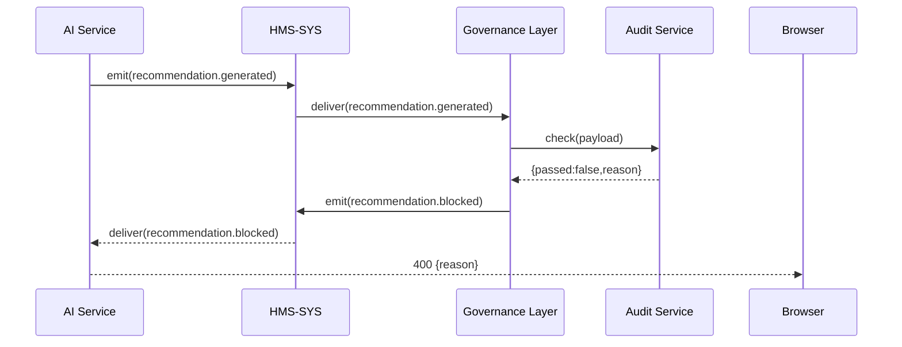

# Chapter 12: Governance Layer

Now that you’ve seen how policies drive approvals in the [Policy Module](11_policy_module_.md), let’s build the “Inspector General’s Office” for your algorithms and workflows: the **Governance Layer**.

## 1. Motivation & Central Use Case

Imagine the U.S. Department of Health uses an AI to recommend hospital resource allocation during an epidemic. How do you ensure:

- Every recommendation is safe and unbiased?  
- Actions are fully transparent if audited by Congress?  
- Regulatory rules (e.g., HIPAA, FOIA) are enforced?

The **Governance Layer** acts like an inspector general for your system:

1. It **logs** every action and data change.  
2. It **audits** AI decisions against ethical and legal standards.  
3. It **blocks** or **flags** any recommendation that violates rules.  

This chapter shows you how to plug in governance checks so your AI-driven public-sector apps stay transparent, ethical, and compliant.

## 2. Key Concepts

1. **Action Logging**  
   Record who did what, when, and why—so auditors can reconstruct any decision.

2. **Decision Auditing**  
   Compare AI outputs against a rulebook (e.g., “no patient under 18 gets this drug”).

3. **Compliance Enforcement**  
   Automatically reject or require human review for risky decisions.

4. **Transparency Interface**  
   Expose a read-only endpoint for oversight bodies to inspect logs and audit trails.

5. **Inspector Service**  
   A centralized microservice that collects logs and audit reports from all parts of the platform.

## 3. Using the Governance Layer

Below is a minimal setup. When an AI module emits a `recommendation.generated` event, the Governance Layer:

- Logs the action  
- Audits it against rules  
- Rejects unsafe recommendations  

### 3.1 Registering Governance Hooks

```js
// governance/index.js
const CoreClient   = require('../hms-sys/client');
const logger       = require('./logService');
const auditor      = require('./auditService');

const core = new CoreClient('http://localhost:4000');

// Hook into every recommendation
core.on('recommendation.generated', async ({ payload, token }) => {
  await logger.logAction('recommendation.generated', payload, token);
  const audit = auditor.check(payload);
  if (!audit.passed) {
    return core.emit('recommendation.blocked', {
      token, payload: { reason: audit.reason }
    });
  }
  await core.emit('recommendation.approved', { token, payload });
});
```

Explanation:
- We subscribe to `recommendation.generated`.  
- We log the event, run an audit check, then either block or approve.

### 3.2 Example Flow

**Input Event**  
```json
{ 
  "event": "recommendation.generated", 
  "token": "eyJ…", 
  "payload": { patientAge: 16, drug: "X" } 
}
```

**Outcome**  
- **Log** entry: who, what, when  
- **Audit** fails because `patientAge < 18`  
- **Emit** `recommendation.blocked` with reason `"Underage patient"`

## 4. Under the Hood: Step-by-Step Flow



1. **AI Service** emits a recommendation event.  
2. **HMS-SYS** routes it to **Governance Layer**.  
3. **Governance** logs the action and calls **Audit Service**.  
4. If audit fails, it emits `recommendation.blocked`.  
5. The client sees the block reason.

## 5. Internal Implementation Details

### 5.1 File Structure

```
governance/
├─ index.js
├─ logService.js
└─ auditService.js
```

### 5.2 logService.js

```js
// governance/logService.js
const fs = require('fs');
module.exports.logAction = async (event, payload, token) => {
  const entry = { event, payload, token, time: Date.now() };
  fs.appendFileSync('governance/actions.log',
    JSON.stringify(entry) + '\n'
  );
};
```

Explanation:
- Appends each action to a log file for later inspection.

### 5.3 auditService.js

```js
// governance/auditService.js
const rules = [
  req => req.patientAge >= 18 || { passed:false, reason:'Underage' },
  req => req.drug !== 'X'      || { passed:false, reason:'Drug X restricted' }
];

module.exports.check = payload => {
  for (const rule of rules) {
    const res = rule(payload);
    if (res.passed === false) return res;
  }
  return { passed:true };
};
```

Explanation:
- Runs each rule in order.  
- Returns the first failure or a pass result.

## 6. Summary & Next Steps

You’ve learned how the **Governance Layer** acts as the system’s inspector general:

- **Logs** every sensitive action.  
- **Audits** AI decisions against ethical and legal rules.  
- **Blocks or approves** recommendations to enforce compliance.

Up next, we’ll introduce human oversight in the [Human-in-the-Loop (HITL) Mechanism](13_human_in_the_loop__hitl__mechanism_.md).

---

Generated by [AI Codebase Knowledge Builder](https://github.com/The-Pocket/Tutorial-Codebase-Knowledge)