# Chapter 12: Human-in-the-Loop (HITL) Oversight

*(If you just landed here, see how agents talk in [HMS-MCP  (Model Context Protocol)](11_hms_mcp___model_context_protocol__.md) for context.)*

---

## 1. Why Do We Need a Human Guard-Rail?

Mini-story — “SNAP Benefit Denial”

1. **SNAP-Bot** (an HMS agent) analyses Alice’s food-stamp renewal and *recommends* “DENY – income too high.” 
2. Before the letter is mailed, the case must appear on **Caseworker Carla’s** screen.  
3. Carla notices the AI mis-read a pay-stub and **vetoes** the denial.  
4. SNAP-Bot learns from the correction; Alice keeps her groceries.

Without a formal check-point, the AI’s mistake would have become agency policy.  
**HITL Oversight** adds that check-point and measures how well it is being used.

---

## 2. Key Concepts (One-by-One)

| Term | Beginner Analogy | What It Means in HMS |
|------|------------------|----------------------|
| HITL Gate | Congressional committee vote | A queue where every AI recommendation waits for sign-off |
| Reviewer | Committee member | Human with authority to `approve`, `amend`, or `veto` |
| Decision Token | Rubber stamp | JWT proving *who* made the decision |
| SLA Timer | Filibuster clock | How long a reviewer can hold the item |
| Audit Trail | C-SPAN transcript | Immutable log of every gate action |

---

## 3. Building a Gate in 3 Tiny Files

We’ll add a HITL gate to the **SNAP Eligibility** workflow.

### 3.1 Declare the Gate in the Workflow Plan (10 lines)

```yaml
# file: snap.plan.yaml  (snippet)
sequence:
  - ai_eligibility_check
  - hitl_review        # 👈 new step
  - notify_citizen
lanes:
  - ai_eligibility_check
  - hitl_review: human   # lane type = human
  - notify_citizen
```

*OMS now knows a human must act before moving on.*

### 3.2 Submit a Recommendation (AI side, 14 lines)

```python
# file: snap_bot.py
import httpx, os, json
rec = {
  "app_id": "A-2024-55",
  "action": "DENY",
  "reason": "income > threshold"
}
httpx.post("http://hitl/submit", json=rec, headers={"Authorization":"Bearer "+os.environ["BADGE"]})
```

**What happens?**  
The record is pushed to the **HITL queue** and paused.

### 3.3 Human Decision Endpoint (Clerk UI, 18 lines)

```python
# file: clerk_ui.py
import httpx, getpass
item = httpx.get("http://hitl/pull?lane=hitl_review").json()
print(item["app_id"], item["action"], item["reason"])
choice = input("Approve (a), Amend (m), Veto (v)? ")
payload = {
  "item_id": item["id"],
  "decision": {"type": choice, "comment": input("Comment: ")}
}
token = getpass.getpass("Your decision token: ")
httpx.post("http://hitl/decide", json=payload,
           headers={"Authorization": "Bearer "+token})
```

*`token` is a short-lived **Decision Token** issued by HMS-AGT to the clerk.*

---

## 4. End-to-End Flight Path


Only **4 participants** keep the mental model simple.

---

## 5. What’s Under the Hood?

### 5.1 Gate Tables (SQLite, 8 lines)

```sql
CREATE TABLE hitl_items (
  id        TEXT PRIMARY KEY,
  payload   JSON,
  status    TEXT,      -- queued/approved/vetoed
  reviewer  TEXT,
  decided_at DATETIME
);
```

### 5.2 Minimal Gate API (16 lines)

```python
# file: hitl_gate.py
from fastapi import FastAPI, HTTPException, Depends
app = FastAPI()

@app.post("/submit")
def submit(item:dict):
    db.execute("INSERT INTO hitl_items VALUES (?,?,?,'',NULL)",
               (uuid4(), json.dumps(item), "queued"))
    return {"queued":True}

@app.get("/pull")
def pull():
    row = db.execute("SELECT * FROM hitl_items WHERE status='queued' LIMIT 1").fetchone()
    return dict(row) if row else {}

@app.post("/decide")
def decide(decision:dict, user=Depends(validate_decision_token)):
    db.execute("UPDATE hitl_items SET status=?, reviewer=?, decided_at=CURRENT_TIMESTAMP WHERE id=?",
               (decision["decision"]["type"], user.name, decision["item_id"]))
    return {"recorded":True}
```

*Less than 20 lines: validation & auth helpers are imported.*

---

## 6. Measuring Reviewers (Tiny Metrics Job)

```python
# file: metrics.py  (15 lines)
import pandas as pd, sqlite3
df = pd.read_sql("SELECT reviewer, status, decided_at, id FROM hitl_items", sqlite3.connect("gate.db"))
stats = df.groupby("reviewer")["id"].agg(total="count",
                                         vetoes=lambda s: (df.status=="v").sum(),
                                         avg_time=lambda s: (pd.to_datetime(df.decided_at)-pd.to_datetime(df.decided_at.shift())).mean())
print(stats)
```

Managers can spot chronic blockers or rubber-stamps at a glance.

---

## 7. How HITL Connects to the Rest of HMS

```mermaid
graph TD
  GATE["🙋‍♀️ HITL Gate"] --> ACT["📒 HMS-ACT"]
  GATE --> OMS["🛫 HMS-OMS"]
  GATE --> OPS["🔭 HMS-OPS"]
  GATE --> ESQ["🛡️ HMS-ESQ"]
  GATE --> MCP["🤝 HMS-MCP"]
```



* OMS inserts the **hitl_review** step (see [Activity Orchestration](08_activity_orchestration__hms_act___hms_oms__.md)).  
* Decisions are added to the MCP provenance chain (Chapter 11).  
* OPS graphs reviewer SLAs; ESQ audits bias (excess vetoes on certain demographics).

---

## 8. Common Beginner Questions

| Question | Quick Answer |
|----------|--------------|
| “What if no one reviews in time?” | Configure an **SLA Timer**; OMS escalates to a supervisor lane. |
| “Can multiple reviewers vote?” | Yes—`status` can stay `multi_pending` until quorum is reached. |
| “How do I stop a clerk who blocks everything?” | Use the metrics job; high veto % triggers HR workflow via OMS. |

---

## 9. Recap

You learned:

1. Why HITL gates prevent AI autopilot mistakes.  
2. Five core pieces: Gate, Reviewer, Decision Token, SLA Timer, Audit Trail.  
3. How to add a gate with a **10-line** plan edit and **<20-line** APIs.  
4. How metrics spotlight over-zealous or absent reviewers.  
5. Where HITL plugs into OMS, MCP, OPS, and ESQ.

---

### Up Next

Now that humans can steer AI decisions, we need to **measure** whether the whole loop (AI → Human → Outcome) actually improves over time.  
That feedback engine is covered in [AI Performance & Accountability Loop](13_ai_performance___accountability_loop_.md).

---

Generated by [AI Codebase Knowledge Builder](https://github.com/The-Pocket/Tutorial-Codebase-Knowledge)