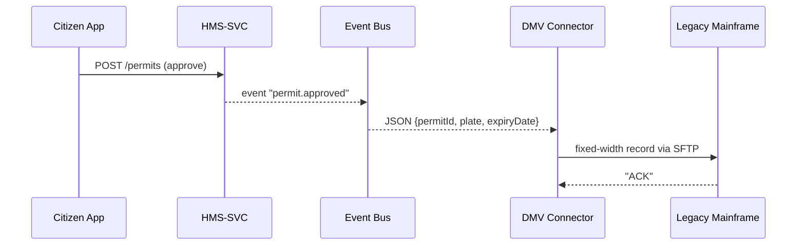

# Chapter 13: External System Synchronization
[← Back to Chapter&nbsp;12: Financial Transaction Hub (HMS-ACH)](12_financial_transaction_hub__hms_ach__.md)

---

## 0. Why Do We Need “Digital Diplomats”?

Picture the **Department of Motor Vehicles (DMV)** in a mid-Atlantic state.  
They still run a **COBOL** mainframe built in 1988.  

Yesterday your agency—using shiny **HMS** screens—started an AI-powered
*“One-Click Renew Vehicle Permit”* journey.  
By lunchtime 500 permits were approved, **but the DMV mainframe still thinks those cars are unregistered**.  
Clerks must re-type every permit number—slow, error-prone, soul-crushing.

**External System Synchronization** is HMS’s answer.  
Think of it as a **team of professional interpreters** that:

1. Hear HMS shout “Permit #123 APPROVED!”  
2. Translate that sentence into the DMV’s ancient dialect (fixed-width file).  
3. Whisper it into a secure mainframe socket **within seconds**.

Citizens see one seamless government; staff never do double data entry.

---

## 1. Key Concepts (Plain-English Cheat-Sheet)

| Concept             | Real-World Analogy                   | Quick Purpose                               |
|---------------------|--------------------------------------|---------------------------------------------|
| Source Event        | HMS sending a postcard               | “Permit Approved” emitted by HMS-SVC        |
| Connector           | Diplomat/Interpreter                 | Knows both HMS talk **and** legacy dialect  |
| Mapping File        | Bilingual dictionary                 | Field-by-field translation rules            |
| Delivery Channel    | Mail truck vs. Fax                   | Webhook, SFTP drop, message bus, etc.       |
| Acknowledgement     | Return-receipt card                  | Legacy system says “got it!”                |
| Replay Window       | Time-travel mailbox                  | Resend missed messages safely               |

Keep this table open—90 % of the magic lives here.

---

## 2. Quick-Start: Sync a “Permit Approval” to a DMV Mainframe

Below we’ll build the **tiniest** connector:

1. Subscribe to the HMS event bus topic `permit.approved`.  
2. Re-shape the JSON into the DMV’s fixed-width **80-char** record.  
3. Upload it via secure FTP.

### 2.1 Declare the Connector (YAML – 11 lines)

```yaml
# connectors/dmv.yaml
id: dmv-permit-sync
listen: "permit.approved"
channel:
  type: "sftp"
  host: "sftp.dmv.state.gov"
  path: "/inbox/permits.txt"
mapping:
  - hms: "permitId"   dmv: "1-10"   pad: "left"  width: 10
  - hms: "plate"      dmv: "11-18"  pad: "right" width: 8
  - hms: "expiryDate" dmv: "19-26"  format: "YYYYMMDD"
```

What this means:

* Listen for events named `permit.approved`.  
* For every event, produce one **fixed-width line**: `permitId` in columns 1-10, `plate` in 11-18, `expiryDate` in 19-26.  
* Drop the line in `/inbox/permits.txt` over SFTP.

### 2.2 Connector Worker (TypeScript – 18 lines)

```ts
// workers/dmvSync.ts
import { bus } from '@hms/event-bus';
import { sftp } from '@hms/connectors';
import map from './connectors/dmv.yaml';

bus.subscribe(map.listen, async evt => {
  const line = buildLine(evt, map.mapping);      // ← helper formats 80 chars
  await sftp.put({
    host: map.channel.host,
    remotePath: map.channel.path,
    content: line + '\n'
  });
  console.log('✅ DMV synced', evt.permitId);
});
```

Explanation:

1. `bus.subscribe` gives real-time events from [Backend Services Layer (HMS-SVC)](11_backend_services_layer__hms_svc__.md).  
2. `buildLine()` applies the mapping rules—**no custom code per field**.  
3. `sftp.put()` sends the line; retries & SSH keys handled by the helper.  

Total setup: **29 lines of YAML + TypeScript**. 🎉

---

## 3. Life of a Permit (Step-By-Step)



Only **5 actors**; each does one job.

---

## 4. What Happens Under the Hood?

1. **Event Emitted** – HMS-SVC publishes `permit.approved` after validation (see [Chapter 11](11_backend_services_layer__hms_svc__.md)).  
2. **Connector Picks It Up** – Each connector is a tiny worker subscribed to one or more topics.  
3. **Mapping Engine** – A generic function reads the YAML mapping; no new code for each field.  
4. **Delivery Handler** – Library modules implement `webhook`, `sftp`, `kafka`, etc.  
5. **Acknowledgement & Retry** – If the DMV’s SFTP replies anything besides `226 Transfer complete`, the worker retries with exponential back-off.  
6. **Replay** – Missed events are fetched from the bus for the last 48 hours (configurable **replay window**).

---

### 4.1 Minimal Mapping Helper (≤ 15 lines)

```ts
// util/buildLine.ts
export function buildLine(evt, rules) {
  return rules.map(r => {
    let val = evt[r.hms] || '';
    if (r.format === 'YYYYMMDD') val = val.replaceAll('-', '');
    val = r.pad === 'left'
      ? val.toString().padStart(r.width, '0')
      : val.toString().padEnd(r.width, ' ');
    return val;
  }).join('').padEnd(80, ' ');
}
```

Beginners can tweak padding rules without touching protocols.

---

## 5. Folder Blueprint

```
hms-sync/
 ├─ connectors/
 │   └─ dmv.yaml
 ├─ workers/
 │   └─ dmvSync.ts
 ├─ util/
 │   └─ buildLine.ts
 └─ package.json
```

Add a new legacy target?  
Drop another YAML + worker file—done.

---

## 6. How Synchronization Hooks Into Other HMS Pieces

* **Events originate** in [Backend Services Layer (HMS-SVC)](11_backend_services_layer__hms_svc__.md) or from **AI Agents** in [Specialized AI Agents (HMS-A2A)](05_specialized_ai_agents__hms_a2a__.md).  
* Delivery success/failure metrics flow into [Real-Time Metrics & Monitoring](10_real_time_metrics___monitoring_.md) as `sync.success` & `sync.error`.  
* Connectors run under service accounts whose permissions are governed by [Role-Based Access Control & Accountability Ledger](09_role_based_access_control___accountability_ledger_.md).  
* Any field mapping changes should be versioned through the [Policy & Process Management API](08_policy___process_management_api_.md).

---

## 7. Mini-FAQ

**Q: What if the legacy system needs a SOAP call, not SFTP?**  
Add `channel: { type:"soap", wsdl:"…" }`—library handlers cover SOAP, REST, Kafka, email, even **printer queues**.

**Q: Can I bulk-replay a month of events?**  
Yes, run `hms sync replay --connector dmv-permit-sync --from 2024-05-01`.

**Q: Is it safe if two connectors listen to the same topic?**  
Absolutely—each maintains its own offset; HMS’s event bus is **fan-out** by default.

**Q: How do I test against a mainframe I can’t touch?**  
Use `channel.type: "file"` and inspect the output file locally; swap to SFTP in prod.

---

## 8. Recap & Next Steps

In this chapter you learned:

1. **Why** HMS needs “digital diplomats” to speak to legacy systems.  
2. Six core ideas: Source Event, Connector, Mapping File, Delivery Channel, Acknowledgement, Replay Window.  
3. How to build a full DMV sync in **under 30 lines**.  
4. The internal flow—event → mapping → delivery → ACK → metrics.  
5. How synchronization meshes with monitoring, policy, and RBAC.

Ready to see how all these layers scale across dozens of micro-services?  
Head over to [Chapter 14: Multi-Layered Microservices Architecture](14_multi_layered_microservices_architecture_.md) →

---

---

Generated by [AI Codebase Knowledge Builder](https://github.com/The-Pocket/Tutorial-Codebase-Knowledge)