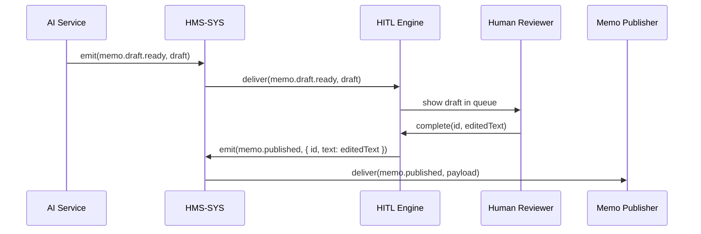

# Chapter 13: Human-in-the-Loop (HITL) Mechanism

Continuing from [Chapter 12: Governance Layer](12_governance_layer_.md), we now introduce a safety checkpoint where real people review or adjust AI-generated proposals before they go live. Think of it like a senior civil servant signing off on a memo drafted by an intern: it ensures accountability, ethical compliance, and prevents unintended consequences.

---

## 1. Motivation & Central Use Case

Imagine the Department of Education uses an AI service to draft policy memos recommending changes to student-loan forgiveness. Instead of publishing them automatically, every draft must be reviewed:

1. AI emits a “memo.draft.ready” proposal.
2. A human reviewer sees the draft in a queue.
3. The reviewer edits or approves it.
4. The final memo goes live.

This **Human-in-the-Loop (HITL) Mechanism** prevents unchecked AI decisions from affecting citizens or running afoul of regulations.

---

## 2. Key Concepts

1. **Review Queue**  
   A list of AI proposals waiting for human action (approve, edit, reject).

2. **Checkpoint Event**  
   An AI-generated event is held until a reviewer completes their step.

3. **Reviewer Role**  
   Defines who can see and act on proposals (e.g., “Senior Policy Officer”).

4. **Timeout & Escalation**  
   If no one reviews in time, notify a supervisor or divert the proposal.

5. **Final Emission**  
   After approval, the system emits a “memo.published” event for downstream services.

---

## 3. Using the HITL Mechanism

Below is a minimal example showing how to pause an event for human review.

```js
// hitl/index.js
const CoreClient   = require('../hms-sys/client');
const reviewQueue  = require('./reviewQueue');

const core = new CoreClient('http://localhost:4000');

// 1. AI drafts a memo
core.on('memo.draft.ready', async ({ payload, token }) => {
  // 2. Add draft to human review queue
  await reviewQueue.add({ id: payload.id, content: payload.text, token });
});
```

Explanation:  
- We subscribe to the AI’s draft event.  
- We add it to our `reviewQueue` instead of emitting it live.

```js
// hitl/adminInterface.js
const express      = require('express');
const reviewQueue  = require('./reviewQueue');

const app = express();
app.use(express.json());

// List pending drafts for reviewers
app.get('/review', async (req, res) => {
  res.json(await reviewQueue.list());
});

// Approve or edit a draft
app.post('/review/:id', async (req, res) => {
  const { id }   = req.params;
  const { text } = req.body;
  await reviewQueue.complete(id, text);
  res.sendStatus(200);
});

app.listen(5100, () => console.log('HITL UI on 5100'));
```

Explanation:  
- Reviewers fetch all pending drafts.  
- They POST their edits or approval back to complete the review.

---

## 4. Under the Hood: Step-by-Step Flow



1. The AI Service emits a draft-ready event.  
2. HMS-SYS forwards it to the HITL Engine.  
3. The draft appears in the human reviewer’s UI.  
4. Upon completion, HITL Engine emits the final “memo.published” event.

---

## 5. Internal Implementation Details

### File Structure

```
hitl/
├─ index.js
├─ reviewQueue.js
└─ adminInterface.js
```

### 5.1 reviewQueue.js

```js
// hitl/reviewQueue.js
const fs = require('fs');
const queueFile = 'hitl/queue.json';

function load() {
  return JSON.parse(fs.readFileSync(queueFile,'utf8') || '[]');
}
function save(q) {
  fs.writeFileSync(queueFile, JSON.stringify(q,null,2));
}

module.exports = {
  async add(item) {
    const q = load();
    q.push({ ...item, status: 'pending' });
    save(q);
  },
  async list() {
    return load().filter(i => i.status === 'pending');
  },
  async complete(id, newText) {
    const q = load();
    const item = q.find(i => i.id === id);
    if (item) {
      item.status = 'done';
      item.text   = newText;
      save(q);
      // emit final event
      const CoreClient = require('../hms-sys/client');
      const core = new CoreClient('http://localhost:4000');
      await core.emit('memo.published', {
        token: item.token,
        payload: { id, text: newText }
      });
    }
  }
};
```

Explanation:  
- We store the queue in a simple JSON file.  
- `add()` pushes new drafts, `list()` returns pending items, `complete()` marks items done and emits the final event.

---

## 6. Summary & Next Steps

In this chapter you learned how to implement a **Human-in-the-Loop (HITL) Mechanism**:

- How AI drafts are paused for review in a **Review Queue**.  
- A minimal **admin interface** for human reviewers.  
- The step-by-step flow from draft to final publication.  

Next up, we’ll build on this by letting AI act on behalf of users in [Chapter 14: AI Representative Agent](14_ai_representative_agent_.md).

---

Generated by [AI Codebase Knowledge Builder](https://github.com/The-Pocket/Tutorial-Codebase-Knowledge)