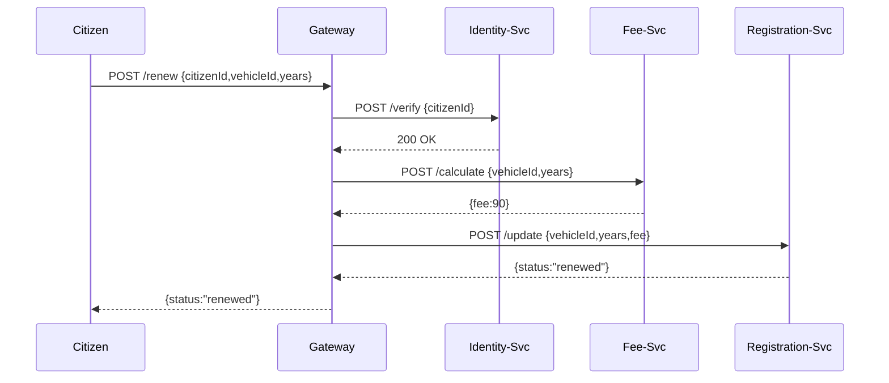

# Chapter 13: Modular Microservices

In the last chapter you saw how to build business-facing endpoints with **[Backend Services (HMS-SVC / HMS-API)](12_backend_services__hms_svc___hms_api__.md)**. Now we’ll learn how to break those endpoints into **Modular Microservices**—just like splitting government work into specialized offices that talk to each other.

---

## 1. Why Modular Microservices? (Motivation)

Imagine the Department of Motor Vehicles (DMV) wants an online **Vehicle Registration Renewal**:

1. First, they **verify** your driver’s license.
2. Then they **calculate** your renewal fee.
3. Finally, they **update** your vehicle’s registration record.

In a monolithic app, all these steps live in one big codebase. A small change can force a full redeploy and risks taking down the whole system. With **Modular Microservices**:

- An **Identity Service** handles license checks.
- A **Fee Service** handles fee calculations.
- A **Registration Service** updates records.

Each service:

- Has a single focus (one “office,” one job).  
- Communicates through simple APIs.  
- Can scale up independently (e.g., more fee calculators on busy days).  
- Be updated or restarted without affecting other services—improving resilience.

---

## 2. Key Concepts

1. **Service Boundary**  
   Each microservice owns its own data and logic—no shared code or databases.

2. **API Communication**  
   Services talk over HTTP/HTTPS or messaging (see **[Core System Platform](11_core_system_platform__hms_sys__.md)**).

3. **Independent Deployment & Scaling**  
   Teams deploy services on their own schedule and scale them separately.

4. **Polyglot Stacks**  
   One service can be Node.js, another Python—each team picks the best tool.

5. **Fault Isolation**  
   If the Fee Service crashes, the Identity and Registration services keep running.

---

## 3. Putting It to Work: Renewal Use Case

Here’s how a Gateway coordinates three microservices for a renewal request.

### 3.1. API Gateway Snippet

```js
// File: gateway.js
import express from 'express';
import fetch from 'node-fetch';
const app = express();
app.use(express.json());

app.post('/renew', async (req, res) => {
  const { citizenId, vehicleId, years } = req.body;

  // 1. Verify identity
  const idResp = await fetch('http://identity-svc/verify', {
    method:'POST', body:JSON.stringify({ citizenId }), headers:{'Content-Type':'application/json'}
  });
  if (!idResp.ok) return res.status(401).send('Unauthorized');

  // 2. Calculate fee
  const feeResp = await fetch('http://fee-svc/calculate', {
    method:'POST', body:JSON.stringify({ vehicleId, years }), headers:{'Content-Type':'application/json'}
  });
  const { fee } = await feeResp.json();

  // 3. Update registration
  const regResp = await fetch('http://registration-svc/update', {
    method:'POST', body:JSON.stringify({ vehicleId, years, fee }), headers:{'Content-Type':'application/json'}
  });
  const result = await regResp.json();

  res.json(result);
});

app.listen(3000, ()=>console.log('Gateway listening on 3000'));
```

Explanation:
- The gateway calls three services in order.  
- Each service lives in its own container or server.  
- Failures in one step return errors without touching the others.

### 3.2. A Simple Fee Service

```js
// File: fee-svc/index.js
import express from 'express';
const app = express();
app.use(express.json());

app.post('/calculate', (req, res) => {
  const { vehicleId, years } = req.body;
  // Minimal logic: $30/year, $50 if heavy vehicle
  const rate = vehicleId.startsWith('TRK') ? 50 : 30;
  res.json({ fee: rate * years });
});

app.listen(4000, ()=>console.log('Fee Service on 4000'));
```

Explanation:
- This microservice only knows about fees.  
- It runs on port 4000 and has its own code and data store (if needed).

---

## 4. Under the Hood: Step-by-Step Flow

When a citizen submits a renewal:



1. Citizen → Gateway → Identity Service  
2. Gateway → Fee Service  
3. Gateway → Registration Service  
4. Response flows back to the citizen

---

## 5. Inside a Microservice: A Closer Look

Each microservice is its own project and can include:

- A **Dockerfile** for containerization  
- A **CI/CD pipeline** for automated testing and deployment  
- A **README** with API specs  

### 5.1. Example Dockerfile for Fee Service

```dockerfile
# File: fee-svc/Dockerfile
FROM node:18-alpine
WORKDIR /app
COPY package*.json ./
RUN npm install --production
COPY . .
EXPOSE 4000
CMD ["node", "index.js"]
```

Explanation:
- Packages and starts the service in its own container.  
- Changes to this Dockerfile don’t affect other services.

### 5.2. Service Discovery via Environment

```js
// File: gateway/config.js
export default {
  IDENTITY_URL: process.env.IDENTITY_URL || 'http://identity-svc',
  FEE_URL:      process.env.FEE_URL      || 'http://fee-svc',
  REG_URL:      process.env.REG_URL      || 'http://registration-svc'
};
```

Explanation:
- Use environment variables or **[HMS-SYS Service Registry](11_core_system_platform__hms_sys__.md)** for production.

---

## 6. Analogy Recap

Think of **Modular Microservices** like:

- **Specialized government offices**: Tax, Licensing, Health each have clear missions.  
- **Citizens** go to one window at a time, and each office handles only its own forms.  
- **Headquarters** (the API Gateway) routes you to the right office and collects the results.

---

## Conclusion

You’ve learned how to:

- Split a backend into focused microservices with clear boundaries.  
- Coordinate them through an API Gateway and HTTP calls.  
- Package, deploy, and scale each service independently.

Next up: we’ll add observability so you can monitor and analyze these microservices in production. See **[Monitoring & Analytics](14_monitoring___analytics_.md)**!

---

Generated by [AI Codebase Knowledge Builder](https://github.com/The-Pocket/Tutorial-Codebase-Knowledge)