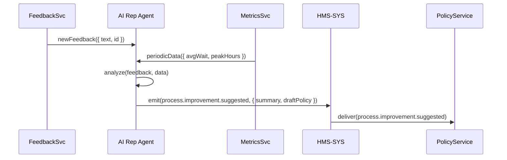

# Chapter 14: AI Representative Agent

Building on our [Human-in-the-Loop (HITL) Mechanism](13_human_in_the_loop__hitl__mechanism_.md), we now introduce the **AI Representative Agent**—a digital consultant living on the Gov/Admin Platform that reads citizen feedback and system data to suggest smarter policies and streamlined procedures.

## 1. Motivation & Central Use Case

Imagine the Department of Motor Vehicles (DMV) is flooded with complaints about long line times.  
An **AI Representative Agent** can:

1. Ingest citizen feedback (complaints, survey responses).  
2. Analyze operational metrics (average wait, staff utilization).  
3. Propose process improvements (e.g., staggered appointment slots).  
4. Generate draft policy updates (e.g., “All offices must offer 15-min intervals”).  
5. Escalate serious issues automatically or pass them to a human supervisor.

This agent acts like a seasoned consultant in a government office—spotting inefficiencies and drafting recommended fixes so administrators can review or approve them.

## 2. Key Concepts

1. **Feedback Ingestion**  
   Continuously pull in user comments or complaint tickets.

2. **Operational Data Analysis**  
   Summarize metrics (average wait time, peak hours).

3. **Suggestion Generation**  
   Use simple rules or ML models to draft recommendations.

4. **Policy Emission**  
   Emit events like `process.improvement.suggested` or `policy.update.draft`.

5. **Escalation Mechanism**  
   If a suggestion crosses a confidence threshold, the agent can auto-escalate to human oversight.

## 3. Using the AI Representative Agent

### 3.1 Configure the Agent

```yaml
# config/agent-config.yml
agent:
  name: ProcessImprover
  feedbackSource: 'feedback-service'
  dataSource:     'metrics-service'
  suggestionEvent:'process.improvement.suggested'
  escalationThreshold: 0.8
  autoEscalate: false
```
This YAML tells our agent where to read feedback, where to get metrics, what event to emit, and when to escalate.

### 3.2 Bootstrapping in Code

```js
// agent/index.js
const { CoreClient }          = require('../hms-sys/client');
const { AIRepresentativeAgent } = require('./agent');

const core   = new CoreClient('http://localhost:4000');
const config = require('../config/agent-config.yml').agent;

const agent = new AIRepresentativeAgent(core, config);
agent.start();  // begins polling and suggestion cycle
```
Here, we create an agent instance and call `start()`. It will now listen, analyze, and emit improvement proposals.

## 4. Under the Hood: Step-by-Step Flow



1. **FeedbackSvc** pushes new comments.  
2. **MetricsSvc** supplies operational stats.  
3. **Agent** analyzes both inputs.  
4. **Agent** emits a suggestion event to **HMS-SYS**.  
5. **PolicyService** receives the suggestion for review or auto-apply.

## 5. Internal Implementation Details

### 5.1 agent/agent.js

```js
// agent/agent.js
class AIRepresentativeAgent {
  constructor(core, cfg) {
    this.core   = core;
    this.cfg    = cfg;
  }

  start() {
    // Poll feedback every minute
    setInterval(() => this.fetchAndSuggest(), 60000);
  }

  async fetchAndSuggest() {
    const fb = await this._getFeedback();
    const dm = await this._getMetrics();
    const suggestion = this._analyze(fb, dm);
    await this.core.emit(this.cfg.suggestionEvent, { payload: suggestion });
  }

  // ... simplified helper methods below ...
}
module.exports = { AIRepresentativeAgent };
```

This code shows how the agent periodically fetches data, runs analysis, and emits suggestions.

### 5.2 agent/helpers.js

```js
// agent/helpers.js
async function _getFeedback() {
  // pretend to call feedback-service API
  return [{ id:1, text:'Lines take 2h at noon' }];
}
async function _getMetrics() {
  // pretend to call metrics-service API
  return { avgWait: 120, peakHours: ['12:00','13:00'] };
}
function _analyze(feedback, data) {
  // Very simple rule-based suggestion
  if (data.avgWait > 60) {
    return {
      summary: 'High wait times at lunch',
      draftPolicy: 'Offer 15-minute appointments between 11–14h'
    };
  }
  return { summary:'All good', draftPolicy:'' };
}
module.exports = { _getFeedback, _getMetrics, _analyze };
```

Here, our “analysis” is just a basic rule. In real life, you might call an ML model or more advanced logic.

## 6. Summary & Next Steps

In this chapter you learned how the **AI Representative Agent**:

- Acts like a **digital consultant**, reading feedback and metrics.  
- Generates **process improvement** suggestions and **draft policy** updates.  
- Emits events to your central bus ([HMS-SYS](01_core_system_platform__hms_sys__.md)) for review or automatic application.  

Next up, we’ll see how to build **specialized AI agents** tailored to distinct tasks in [Specialized AI Agents (HMS-A2A)](15_specialized_ai_agents__hms_a2a__.md).

---

Generated by [AI Codebase Knowledge Builder](https://github.com/The-Pocket/Tutorial-Codebase-Knowledge)