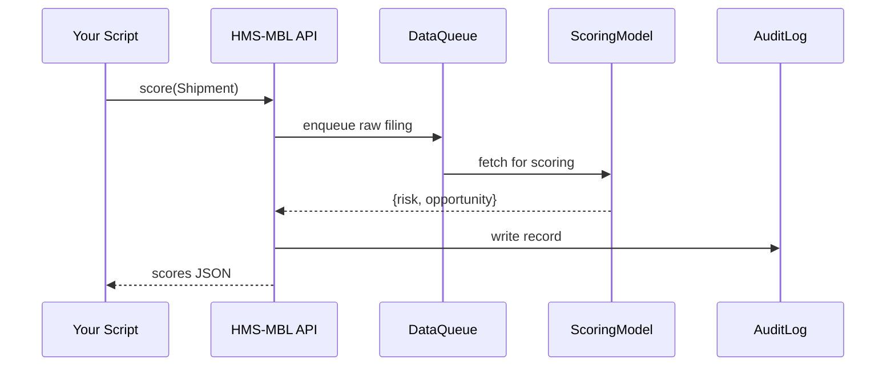

# Chapter 14: International Micro-Trade Analytics (HMS-MBL)

*(coming from [Universal Health Care Integration (HMS-UHC / HMS-MED)](13_universal_health_care_integration__hms_uhc___hms_med__.md))*  

---

## 1 · Why Do We Need a “Radar” for Small-Scale Trade?

> Scenario — **“Garage-to-Global”**  
> 1. A two-person startup in Austin sells specialty drone motors and files an **AES export** for a \$9 600 shipment to Chile.  
> 2. One hour later a BIS analyst sees a **yellow flag**: the end-buyer’s address also appears on a shell-company list tied to sanctioned Venezuela.  
> 3. The analyst blocks the shipment and alerts the startup to re-route through a licensed distributor.  
> 4. Simultaneously, a Commerce economist notes a **green opportunity score** for Latin-American demand on drone parts — used to update the *Small-Business Export Grant* playbook.

That instant visibility exists because **HMS-MBL** watches millions of *import/export filings, tariffs, and vessel manifests* in real-time, then:

* Scores each deal for **risk** (*sanctions, dual-use goods, under-pricing*)  
* Scores each deal for **opportunity** (*new markets, tariff arbitrage, subsidy fits*)  
* Surfaces both signals in dashboards used by **Commerce, Treasury, and BIS**  

Without HMS-MBL, red flags appear **weeks** later (customs audit) and green ones appear **never**.

---

## 2 · Key Concepts (Plain Words)

| Term | Beginner Analogy | Why It Matters |
|------|------------------|----------------|
| Filing Stream | News ticker | Live feed of AES, ACE, and customs entries |
| Harmonized Code (HS) | Library call-number | Locates the exact product in tariff tables |
| Risk Score | Weather alert | 0–100 gauge of sanctions or fraud risk |
| Opportunity Score | Yelp star rating | 0–100 gauge of market potential for SMEs |
| Alert Rule | Smoke detector | Triggers email/Slack when a score crosses a threshold |
| Lens | Instagram filter | Pre-built view (e.g., “LatAm Drone Parts”, “Steel Dumping”) |

---

## 3 · Five-Minute Quick-Start  
Let’s score one shipment **and** subscribe to an alert in <20 lines.

```python
# quick_start_mbl.py   (💻 19 lines)
from hms_mbl import Shipment, Alert

# 1️⃣ describe the export we just filed
s = Shipment(
    doc_id      = "AES2024-3811",
    hs_code     = "8501.10",            # Electric motors <= 37.5 W
    value_usd   = 9600,
    dest_country= "CL",                 # Chile
    consignee   = "Andes Gear Ltd."
)

# 2️⃣ Get scores (risk + opportunity)
score = s.score()                       # network call <500 ms
print(score)                            # {'risk': 38, 'opportunity': 77}

# 3️⃣ Subscribe: alert if risk ≥ 70
Alert.watch(
    filter = {"dest_country":"*", "risk":">=70"},
    notify = "bis_alerts@commerce.gov"
)
```

**What you see**

```
{'risk': 38, 'opportunity': 77}
✅ Alert registered (id = rule_57a)
```

Beginners’ takeaway:  
• One object, one method `.score()`.  
• No SQL, HS lookup, or sanctions list juggling required.  

---

## 4 · What Happens Behind the Curtain?



Only **five** actors; every hop is TLS-encrypted and hashed for audits.

---

## 5 · Peeking Inside the Scoring Model (Super Simplified)

### 5.1  HS & Tariff Lookup (≤ 15 lines)

```python
# mbl/tariff.py
TARIFF = {"8501.10": {"duty": 0.0, "sensitive": False},
          "8803.30": {"duty": 5.5, "sensitive": True}}

def duty_rate(code):
    info = TARIFF.get(code, {})
    return info.get("duty", 0.0), info.get("sensitive", False)
```

### 5.2  Risk + Opportunity (≤ 18 lines)

```python
# mbl/score.py
SANCTIONS = {"VE": 80, "IR": 95}          # country risk base
MIN_VAL   = 5000                          # under-value floor

def score(ship):
    duty, sensitive = duty_rate(ship.hs_code)
    risk  = SANCTIONS.get(ship.dest_country, 20)
    if sensitive: risk += 30
    if ship.value_usd < MIN_VAL: risk += 10  # undervaluation?
    opportunity = 100 - risk + int((1-duty)*10)
    return {"risk": min(risk,100), "opportunity": max(opportunity,0)}
```

Not magic — just dictionary lookups and a few if-statements.  
Real life swaps in ML models, but the _shape_ is identical.

---

## 6 · Building & Using a “Lens” (Saved Dashboard View)

```python
from hms_mbl import Lens

Lens.save(
    name   = "LatAm Drone Parts",
    query  = {"hs_code":"85*", "dest_country":["CL","PE","CO"]},
    fields = ["doc_id","value_usd","risk","opportunity"],
    sort   = "-opportunity"
)
print("📊 Lens ready at /mbl/lens/latam-drone-parts")
```

Open the URL in any browser; HMS-MBL renders a table & heat-map **without** extra code.

---

## 7 · Hands-On Exercise

1. `pip install hms-mbl`.  
2. Copy `quick_start_mbl.py`; run it.  
3. Change `hs_code` to `"8803.30"` (aircraft parts, sensitive) and rerun.  
   Watch risk jump > 60.  
4. Visit the **LatAm Drone Parts** lens in the web UI; apply a filter `risk ≥ 50` and export CSV for your economist teammate.

---

## 8 · FAQ for Absolute Beginners

**Q: Do I need to understand HS codes?**  
A: No. Pass the 6-digit code you already filed. HMS-MBL handles tariff tables and synonyms.

**Q: Where do sanctions lists come from?**  
A: Nightly pull from OFAC SDN + BIS Entity List; urgent updates can be pushed in minutes.

**Q: Can I upload historical CSVs?**  
A: Yes — drag-and-drop in the web UI or call `Shipment.bulk_import("file.csv")`.

**Q: Is my data shared with other companies?**  
A: No. Each account sees only its own filings plus aggregated, de-identified benchmarks.

---

## 9 · How HMS-MBL Connects to Other HMS Modules

| Interaction | Uses Which Chapter? | Example |
|-------------|--------------------|---------|
| **Alert emails** | [Human-in-the-Loop Oversight (HITL)](07_human_in_the_loop_oversight__hitl__.md) | Red-flagged shipment pauses until officer clicks **Approve / Block** |
| **Tariff & sanctions rules** | [Legal Reasoning & Compliance Engine](03_legal_reasoning___compliance_engine__hms_esq__.md) | Confirms scoring logic matches CFR §746 |
| **Batch scoring jobs** | [Activity & Workflow Orchestrator](08_activity___workflow_orchestrator__hms_act___hms_oms__.md) | Nightly re-score of all open filings |
| **Data lake storage** | [Central Data Repository](19_central_data_repository__hms_dta__.md) | Columnar store for 10-year manifest history |
| **Marketplace listing** | [Marketplace & Discovery Service](15_marketplace___discovery_service__hms_mkt__.md) | SMEs browse top “low-risk, high-opportunity” goods |

---

## 10 · Summary & What’s Next

You learned that **HMS-MBL** acts like a **radar** for micro-trade:

1. Live import/export feed → simple `.score()` call.  
2. Risk & opportunity computed in < 500 ms.  
3. Alerts, lenses, and audits all out-of-the-box.  
4. Tight integrations with legal checks, oversight, and data warehouses.

Up next we’ll see how these scored insights (and everything else in HMS-NFO) are **published and monetised** for agencies, researchers, and small businesses via a plug-and-play app store:  
[Marketplace & Discovery Service (HMS-MKT)](15_marketplace___discovery_service__hms_mkt__.md) 🚀

---

Generated by [AI Codebase Knowledge Builder](https://github.com/The-Pocket/Tutorial-Codebase-Knowledge)