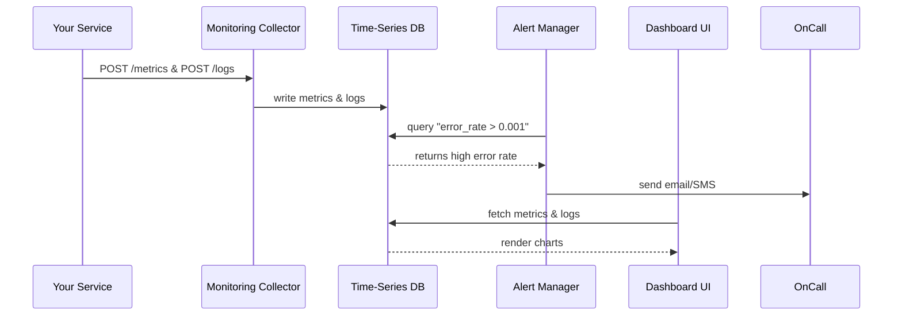

# Chapter 14: Monitoring & Analytics

Welcome back! In [Modular Microservices](13_modular_microservices_.md) we broke our backend into independent services. Now it’s time to watch them in action with **Monitoring & Analytics**—our government performance dashboard that keeps everything running smoothly and transparently.

---

## 1. Motivation: Why Monitoring & Analytics?

Imagine the **Environmental Protection Agency** (EPA) has just launched a new “Water Safety Alerts” microservice. Policy-makers need to ensure:

- Requests stay under a **200 ms** response-time SLA.  
- Error rates never exceed **0.1%**.  
- Any incident (e.g., DB outage) sends an immediate alert to on-call engineers.  
- Program managers can review weekly compliance reports.  
- Developers drill into logs to troubleshoot failures.

Without monitoring and analytics, outages go unnoticed, dashboards lie stale, and citizens lose trust. With a central performance dashboard, everyone—from policy-makers to front-line developers—sees real-time metrics, logs, and alerts, ensuring a continuously improving service.

---

## 2. Key Concepts

1. **Metrics**  
   Numerical measurements over time: response times, request counts, CPU usage.  

2. **Logs & Events**  
   Structured messages recording what happened: user actions, errors, warnings.  

3. **Dashboards**  
   Visual panels (charts, gauges, tables) that display metrics and logs for various audiences.  

4. **Alerts**  
   Automated rules that trigger notifications (email, SMS, Slack) when metrics cross thresholds.  

5. **Analytics Queries**  
   Ad hoc or scheduled queries on historical data to find bottlenecks or usage trends.

---

## 3. How to Use Monitoring & Analytics

Below is a minimal example showing how a Node.js microservice instruments metrics, logs events, and defines an alert.

### 3.1. Instrumenting Metrics & Logs

```js
// File: src/app.js
import express from 'express';
import { metrics, logger } from 'hms-monitor';

const app = express();

app.get('/health', (req, res) => {
  const start = Date.now();
  // ... your logic ...
  const duration = Date.now() - start;

  metrics.increment('requests.total');             // count all requests
  metrics.timing('requests.duration_ms', duration); // record latency
  logger.info('health.check', { duration });        // structured log entry

  res.sendStatus(200);
});

app.listen(3000);
```

Explanation:
- `metrics.increment` and `metrics.timing` send counters and timing samples.  
- `logger.info` writes a JSON-structured log, making it easier to search and analyze.

### 3.2. Defining an Alert

```js
// File: alerts/alerts-config.json
{
  "name": "High Error Rate",
  "metric": "responses.error_rate",
  "condition": "> 0.001",     // >0.1% errors
  "interval": "1m",           // check every minute
  "notification": "on-call@epa.gov"
}
```

Once loaded into the alerting system, this rule will:

1. Query `responses.error_rate` each minute.  
2. If the error rate exceeds 0.1%, send an email to the on-call team.  

---

## 4. Under the Hood: What Happens Step-by-Step

When your service emits metrics and logs, and an alert fires, here’s the flow:



1. **Your Service** pushes metrics and logs to the **Collector**.  
2. The **Collector** writes data into a **Time-Series Database**.  
3. The **Alert Manager** runs periodic checks and notifies on-call staff.  
4. The **Dashboard UI** queries the DB to show real-time panels to users.

---

## 5. Internal Implementation

Let’s look at a simplified implementation of the metrics ingestion endpoint and the alert checker.

### 5.1. Metrics Endpoint

```js
// File: monitoring-service/routes/metrics.js
import express from 'express';
import { recordMetric } from '../services/metricsService.js';
const router = express.Router();

router.post('/', (req, res) => {
  recordMetric(req.body);    // write to TSDB
  res.sendStatus(200);
});

export default router;
```

```js
// File: monitoring-service/services/metricsService.js
import tsdbClient from '../clients/tsdbClient.js';

export function recordMetric(metric) {
  // e.g., { name, value, tags, timestamp }
  tsdbClient.write(metric);  // send to InfluxDB, Prometheus, etc.
}
```

### 5.2. Alert Checker

```js
// File: monitoring-service/alertService.js
import tsdbClient from '../clients/tsdbClient.js';
import notifier from '../clients/notifier.js';
import alertsConfig from '../alerts/alerts-config.json';

export async function checkAlerts() {
  for (const alert of alertsConfig) {
    const result = await tsdbClient.query(
      `SELECT last(value) FROM "${alert.metric}"`
    );
    if (eval(`${result} ${alert.condition}`)) {
      notifier.send(alert.notification, `${alert.name} triggered`);
    }
  }
}
```

A scheduler calls `checkAlerts()` every `interval` defined in the config.

---

## 6. Analogy Recap

Think of **Monitoring & Analytics** as:

- A **traffic CCTV system** on federal highways—cameras and sensors (metrics) feed a central hub.  
- A **911 dispatch center**—automated alerts ring bells (error spikes) and notify responders.  
- A **performance dashboard** in a government control room, where program managers review KPI charts and audit logs.

---

## Conclusion

In this chapter, you learned how to:

- Instrument microservices with **metrics** and **logs**.  
- Define **dashboards** and **alerts** for SLA and anomaly detection.  
- Understand the end-to-end flow from code instrumentation to notifications.  
- Peek under the hood at ingestion endpoints and alert logic.

Monitoring & Analytics closes the loop on reliability and continuous improvement. Congratulations on completing the core of HMS!

---

Generated by [AI Codebase Knowledge Builder](https://github.com/The-Pocket/Tutorial-Codebase-Knowledge)