# Chapter 15: Core Infrastructure (HMS-SYS)
[↠Back to Chapter 14: Multi-Layered Microservices Architecture](14_multi_layered_microservices_architecture_.md)

---

## 0. Why Do We Need “Power & Plumbing” for Software?

Picture April 14 th—tax-season peak:

* 1.8 million citizens hit the refund portal every hour.  
* 700 micro-services submit SQL, ACH, and SFTP jobs.  
* Auditors stream logs looking for fraud spikes.

If **one** server tips over or a disk fills up, refunds stall and the nightly news erupts.  
HMS-SYS is the unseen **utility company** that keeps every light on:

| For whom? | It quietly guarantees… |
|-----------|-----------------------|
| Admins    | 99.95 % uptime and auto-healing nodes |
| Developers| One-line logging & metrics, zero YAML maze |
| Citizens  | Pages load even when traffic triples |

---

## 1. Key Concepts (Plain-English Cheat-Sheet)

| Concept              | Think of it like…            | Why Beginners Care |
|----------------------|------------------------------|--------------------|
| Compute Cluster      | Federal data-center floor    | Runs your containers |
| Storage Bucket       | Government filing cabinet    | Durable file/blob storage |
| Log Pipeline         | CCTV feed to HQ              | All stdout lines end up in one viewer |
| Identity Provider    | Passport office              | Issuer of service & human tokens |
| SLA Monitor          | Electric-meter reader        | Checks uptime & pages ops |

Memorize these five; HMS-SYS wiring mostly revolves around them.

---

## 2. A 3-Minute Demo: Shipping a Service with Zero Ops

### 2.1 Create `hms.yaml` (12 lines)

```yaml
# hms.yaml
service: nea-grants
image: nea/grants:1.2
replicas: 2
env:
  DATABASE_URL: ${hms.secret.db_url}
routes:
  - path: /grants
    port: 3000       # container port
logs: ship           # auto-pipe to HMS dashboard
```

What this means:

1. **service** – give the workload a name.  
2. **image** – any OCI image (Docker, Podman, etc.).  
3. **replicas** – HMS-SYS keeps two copies running.  
4. **routes** – expose `/grants` on the shared API Gateway you met in [Chapter 14](14_multi_layered_microservices_architecture_.md).  
5. **logs: ship** – forward `stdout` into the central Log Pipeline—no extra code.

### 2.2 Deploy in One Command (1 line)

```bash
hms deploy -f hms.yaml
```

CLI output:

```
✓ image pulled
✓ route registered  /grants → nea-grants:3000
✓ replicas healthy 2/2
✓ logs streaming → https://hms.gov/logs/nea-grants
```

That’s it—no Kubernetes YAML or load-balancer tickets.

---

## 3. Adding Built-In Logging (8 lines)

```js
// grants/app.js   (Node ≤ 8 lines)
import { log } from '@hms/log';

log.info('server starting…');

app.post('/grants', (req, res) => {
  log.debug('new submission', { user: req.user.id });
  res.sendStatus(201);
});
```

Every `log.*` call lands in the **Log Pipeline**.  
Searchable in one dashboard with RBAC filters from  
[Role-Based Access Control & Accountability Ledger](09_role_based_access_control___accountability_ledger_.md).

---

## 4. What Happens Under the Hood? (Step-By-Step)

```mermaid
sequenceDiagram
    participant Dev as 👩‍💻 Developer
    participant CLI as HMS-CLI
    participant SYS as HMS-SYS
    participant Cloud as ☁️ Cloud Provider
    participant MON as 📈 SLA Monitor

    Dev->>CLI: hms deploy hms.yaml
    CLI->>SYS: API /deploy (manifest)
    SYS->>Cloud: create pods + LB
    Cloud-->>SYS: status healthy
    SYS-->>MON: start uptime probe
    MON-->>Dev: "live at https://api.hms.gov/grants"
```



Only **five actors**; the developer never touches low-level cloud APIs.

---

## 5. Peeking Inside HMS-SYS (Code-Light Tour)

### 5.1 Scheduler Stub (≤ 18 lines, Go)

```go
// scheduler/rollout.go
func Deploy(m Manifest) error {
  for _, r := range m.Replicas {
     pod := buildPod(m.Image, m.Env, r)
     if err := kube.Apply(pod); err != nil {
        return err
     }
  }
  return registerRoute(m)
}
```

* `buildPod` converts the manifest into a Kubernetes-lite object.  
* `registerRoute` patches the API Gateway config.

### 5.2 Log Forwarder (≤ 14 lines, Bash)

```bash
#!/usr/bin/env bash
# sidecar.sh – runs next to every container
tail -F /var/log/app.log | \
  curl -XPOST https://logs.hms.gov/ingest \
       -H "Authorization: $TOKEN" \
       --data-binary @-
```

Sidecar pattern keeps apps language-agnostic.

---

## 6. How HMS-SYS Glues into Other Chapters

* **Tokens** for log/metric upload come from the central Identity Provider, built on the RBAC rules in [Chapter 9](09_role_based_access_control___accountability_ledger_.md).  
* **Metrics** emitted by the SLA Monitor feed the dashboards you configured in [Real-Time Metrics & Monitoring](10_real_time_metrics___monitoring_.md).  
* **Storage Buckets** are where large PDFs uploaded from [User Interface Suite](01_user_interface_suite__hms_mfe___hms_gov__.md) are actually stored.  
* **Compute Cluster** hosts every service introduced from [Backend Services Layer](11_backend_services_layer__hms_svc__.md) through [External System Synchronization](13_external_system_synchronization_.md).

---

## 7. Mini-FAQ

**Q: Can I pick the cloud vendor?**  
Yes. HMS-SYS abstracts AWS, Azure, and on-prem OpenShift; you choose with `--zone=aws-us-gov`.

**Q: How do I scale during a spike?**  
Run `hms scale nea-grants 6`—autoscaler lifts to six replicas and the Load Balancer adapts.

**Q: Where are my files stored?**  
Call `hms bucket create nea-docs` then upload via `PUT /buckets/nea-docs/...`. 3× replicated across data-centers.

**Q: What if a node dies?**  
The SLA Monitor detects a failed probe, instructs the Scheduler to reschedule pods elsewhere, and sends an alert (Chapter 10).

---

## 8. Recap

In this final chapter you learned:

1. Why HMS-SYS is the invisible **power grid** for every agency service.  
2. Five core utilities—Compute Cluster, Storage Bucket, Log Pipeline, Identity Provider, SLA Monitor.  
3. How to deploy, log, and scale a service using **one 12-line manifest plus one CLI command**.  
4. The internal dance: manifest → scheduler → cloud → monitor.  
5. How HMS-SYS underpins every other abstraction in the HMS-DOC journey.

Congratulations! 🎉 You now know how the entire HMS stack—**from citizen screen taps down to the blinking server lights**—fits together. Happy building!

---

Generated by [AI Codebase Knowledge Builder](https://github.com/The-Pocket/Tutorial-Codebase-Knowledge)