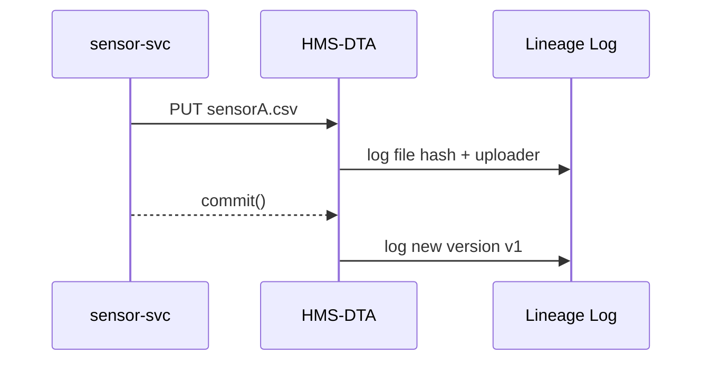

# Chapter 15: Data Core & Lake (HMS-DTA)

*(Just came from the dashboards & alerts in [Observability & Ops (HMS-OPS)](14_observability___ops__hms_ops__.md)?  Perfect—those logs and metrics have to live **somewhere** safe, searchable, and policy-compliant.  That “somewhere” is HMS-DTA.)*

---

## 1. Why Do We Need a “Federal Reservoir” for Data?

### Mini-story — *FOIA Friday*

1. A journalist files a **FOIA request**:  
   “Send me every wildfire sensor reading for July 4th.”
2. The Forestry Service scrambles—did they keep the raw CSVs, or only the averaged reports?
3. HMS-DTA calmly answers:  
   *“Dataset #WF-2024-07 has 6 GB, SHA-256 = …, collected by `sensor-svc`, never altered.”*  
   One click exports the exact snapshot.

Without a secure, versioned lake we would:

* lose raw evidence,  
* violate retention laws, or  
* spend weeks stitching together half-deleted files.

---

## 2. Key Concepts (one-by-one)

| Word            | Beginner Analogy           | What It Means in HMS-DTA |
|-----------------|----------------------------|--------------------------|
| **Dataset**     | A folder in the basement   | All files that belong together (e.g., “Wildfire July 4”) |
| **Tag**         | Sticky note “raw” / “clean”| Short label attached to a dataset version |
| **Version**     | Time-stamped photocopy     | Immutable snapshot; content hash is stored |
| **Lineage**     | Shipping manifest          | Who created / touched the data and when |
| **Retention**   | Shred-after-7-years stamp  | Automatic deletion or cold-storage rule |
| **Access Tier** | Hot / Warm / Glacier box   | Where the bits physically sit (SSD, S3, tape) |

---

## 3. Quick Tour: Storing & Retrieving a Dataset

Below **3 tiny files** show the entire cycle.

### 3.1 Ingest Raw Data (Python, ≤ 18 lines)

```python
# file: ingest_wildfire.py
from hms_dta import Dataset
ds = Dataset.create("WF-2024-07", tags=["raw"])

for path in ("sensorA.csv", "sensorB.csv"):
    ds.put_file(path)          # uploads & computes SHA-256

ds.commit("Initial sensor dump")   # creates version v1
print(ds.version_id)               # → WF-2024-07:v1
```

*Explanation*  
1. `create()` reserves an ID.  
2. `put_file()` streams each file; nothing is “committed” yet.  
3. `commit()` seals **Version v1** with a content hash.

### 3.2 Add a Cleaned Version

```python
# file: clean_and_save.py
from hms_dta import Dataset, Transform

ds = Dataset.open("WF-2024-07")
clean = Transform.csv_trim(ds, cols=["timestamp","temp","pm25"])
clean.commit("Removed unused columns", tags=["clean"])
```

`Transform` helpers **record lineage automatically**—the lake knows v2 came from v1 via `csv_trim`.

### 3.3 FOIA Export (CLI, 1 command)

```bash
hms dta export WF-2024-07:v1 --to zip wildfires_raw.zip
```

Output:

```
✔ Exported 6,102,144 bytes
✔ Provenance.txt attached
```

---

## 4. What Happens Under the Hood?



Only **three actors**—service, lake, lineage log.

---

## 5. A Peek Inside HMS-DTA

### 5.1 Minimal Table Schemas (SQLite, ≤ 15 lines)

```sql
CREATE TABLE datasets (
  id         TEXT PRIMARY KEY,
  created_at DATETIME
);
CREATE TABLE versions (
  ds_id      TEXT,
  ver        TEXT,
  ts         DATETIME,
  comment    TEXT,
  hash       TEXT,     -- SHA-256 of manifest
  tags       TEXT      -- CSV string
);
CREATE TABLE lineage (
  ds_id TEXT, ver TEXT, source_ver TEXT, transform TEXT
);
```

### 5.2 Retention Scheduler (Python, 18 lines)

```python
# file: retention.py
import sqlite3, datetime, os, shutil
DB = sqlite3.connect("dta.db")

def run():
    rows = DB.execute("""
      SELECT ds_id, ver FROM versions
      WHERE ts < date('now', '-7 years')
    """)
    for ds, ver in rows:
        path = f"/lake/{ds}/{ver}"
        shutil.move(path, "/tape/")          # cold archive
        print("📦 Archived", ds, ver)

if __name__ == "__main__":
    run()
```

Runs nightly via cron; satisfies 7-year federal record rules.

---

## 6. How Other HMS Pieces Talk to the Lake

```mermaid
graph TD
  DTA["🗄️ HMS-DTA"] --> OPS["🔭 HMS-OPS"]   %% logs
  DTA --> API["🌐 HMS-API"]                 %% signed URLs
  DTA --> AGT["🤖 HMS-AGT"]                 %% agents fetch data
  DTA --> ESQ["🛡️ HMS-ESQ"]                 %% audits retention
  DTA --> A2A["🔀 HMS-A2A"]                 %% next chapter
```

* Metrics/logs flow to **HMS-OPS**.  
* Signed download URLs are issued through the **API gateway** you met in [Backend API Layer](04_backend_api_layer__hms_svc___hms_api__.md).  
* Agents (HMS-AGT) stream data directly, respecting access tiers.  
* Legal auditors (HMS-ESQ) query retention & lineage tables.  
* **Inter-Agency Exchange (HMS-A2A)**—next chapter—syncs selected datasets across federal boundaries.

---

## 7. Common Beginner Questions

| Question | Quick Fix |
|----------|-----------|
| “Upload is slow.” | Use `ds.put_file(path, chunk=8*1024*1024)` to send 8 MB chunks in parallel. |
| “Can I rename a dataset?” | No—IDs are immutable for audit reasons. Add an alias tag instead. |
| “How to mark PHI?” | Attach `tags=["phi","encrypted"]`; ESQ scanners enforce extra encryption checks. |

---

## 8. Recap

You now know how HMS-DTA:

1. **Stores** raw and processed data in immutable, versioned buckets.  
2. **Tracks** provenance so every byte can testify in court.  
3. **Enforces** retention automatically—no more manual purges.  
4. **Serves** quick exports for FOIA, audits, or disaster recovery drills.  
5. **Connects** to OPS for metrics, AGT for agents, ESQ for compliance, and soon A2A for inter-agency sharing.

Ready to let other agencies subscribe to or mirror your pristine datasets without nightly FTP scripts?  
Hop to [Inter-Agency Exchange (HMS-A2A)](16_inter_agency_exchange__hms_a2a__.md).

---

---

Generated by [AI Codebase Knowledge Builder](https://github.com/The-Pocket/Tutorial-Codebase-Knowledge)