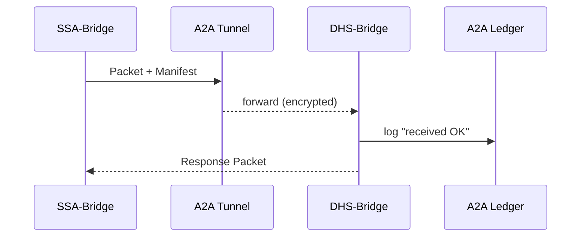

# Chapter 16: Inter-Agency Exchange (HMS-A2A)

*(Just came from the federal “data reservoir” in [Data Core & Lake (HMS-DTA)](15_data_core___lake__hms_dta__.md)? Perfect!  Those neat, versioned datasets are of little help if the **Social Security Administration (SSA)** still has to ship DVDs to **Department of Homeland Security (DHS)** every month.  HMS-A2A is the digital courier that lets agencies swap data as easily—and as safely—as dropping a sealed envelope into an armored truck.)*

---

## 1. Why Do We Need “Couriers” Between Agencies?

### Use-Case Story — *Fast-Track Disability Claim*

1. **Marcus** applies for Social-Security disability benefits online.  
2. SSA must verify Marcus’s immigration status with DHS **before** approving.  
3. Today that verification is a slow batch file, sometimes delayed by weekends.  
4. With **HMS-A2A** the SSA system sends a **sealed request**.  
5. DHS system replies in minutes—no personal data leaks, full audit trail.

Result: Marcus gets an answer the same afternoon instead of next month.

---

## 2. Key Concepts (one-by-one)

| Courier Analogy | HMS-A2A Term | What It Really Is |
|-----------------|--------------|-------------------|
| Sealed Envelope | **Packet**   | JSON payload + digital signature |
| Packing Slip on Envelope | **Manifest** | Who sent it, why, hashes of attachments |
| Armored Truck | **Tunnel** | mTLS channel created just for this exchange |
| Loading Dock | **Bridge** | Small service living inside each agency’s DMZ |
| Parcel Scanner | **Verifier** | Checks manifest signature + schema |
| Chain-of-Custody Log | **Ledger** | Append-only DB: every hop, checksum, decision |

*If you understand FedEx, you already understand A2A.*

---

## 3. Life of a Packet – 4 Steps



Only four actors keep the mental model easy.

---

## 4. A 3-File “Hello World”

Below we build the **entire** exchange: SSA asks for status; DHS answers—all with <20 lines each.

### 4.1 SSA Side – Send Packet

```python
# ssa_send.py  (≤18 lines)
import json, hashlib, httpx, os, uuid, datetime, jwt

pkt = {"ssn":"123-45-6789"}
manifest = {
  "id": str(uuid.uuid4()),
  "from": "ssa.gov",
  "to": "dhs.gov",
  "purpose": "immigration-status-check",
  "hash": hashlib.sha256(json.dumps(pkt).encode()).hexdigest(),
  "exp": (datetime.datetime.utcnow()+datetime.timedelta(minutes=5)).isoformat()
}
manifest["sig"] = jwt.encode(manifest, os.getenv("SSA_KEY"), algorithm="RS256")

httpx.post("https://a2a.ssa.gov/send",
           json={"manifest": manifest, "packet": pkt},
           timeout=30)
```

*Explanation*  
1. Calculate SHA-256 of the packet.  
2. Sign the manifest (our “packing slip”).  
3. POST to local **SSA-Bridge**; it opens a tunnel to DHS.

### 4.2 DHS Side – Receive & Reply

```python
# dhs_bridge.py  (≤18 lines)
from fastapi import FastAPI, HTTPException, Request
import hashlib, jwt, os

app = FastAPI()

@app.post("/recv")
async def recv(body: dict):
    m, pkt = body["manifest"], body["packet"]
    # ① verify signature
    jwt.decode(m["sig"], os.getenv("SSA_PUB"), algorithms=["RS256"])
    # ② verify hash
    if hashlib.sha256(json.dumps(pkt).encode()).hexdigest() != m["hash"]:
        raise HTTPException(400, "tampered")
    # ③ look up status (stub)
    status = {"lawful":"yes"}
    return {"manifest_id": m["id"], "answer": status}
```

### 4.3 SSA Side – Handle Response

```python
# ssa_handle.py  (≤14 lines)
import httpx, os, json
resp = httpx.get("https://a2a.ssa.gov/await?id=...")   # waits max 30 s
if resp.json()["answer"]["lawful"] == "yes":
    print("✅ OK – continue benefit flow")
else:
    print("⚠️ Flag for manual review")
```

*SSA-Bridge* blocks until a reply or timeout, simplifying downstream code.

---

## 5. What Happens Under the Hood?

1. **SSA-Bridge** wraps the manifest & packet into a **Packet** object.  
2. It opens a **Zero-Trust Tunnel**: mTLS handshake + 1-time session key.  
3. **DHS-Bridge** validates signature & hash with the **Verifier**.  
4. Both sides append an event to the **Ledger** (`sent`, `received`, `answered`).  
5. Any auditor can later replay the chain to prove integrity.

---

## 6. Inside A2A – Code-Light Peek

### 6.1 Bridge Config (YAML, 10 lines)

```yaml
# /etc/a2a/bridge.yaml
agency: ssa.gov
peer_endpoints:
  dhs.gov: https://a2a.dhs.gov/recv
tls_cert: /etc/ssl/ssa.crt
tls_key:  /etc/ssl/ssa.key
```

### 6.2 Ledger Table (SQLite, 8 lines)

```sql
CREATE TABLE a2a_ledger (
  id        TEXT,
  ts        DATETIME,
  agency    TEXT,
  event     TEXT,   -- sent / received / answered / error
  hash      TEXT
);
```

### 6.3 Tunnel Opener (Python, 15 lines)

```python
# tunnel.py
import httpx, ssl, pathlib
def open(peer, payload):
    ctx = ssl.create_default_context()
    ctx.load_cert_chain("tls_cert.pem","tls_key.pem")
    with httpx.Client(http2=True, verify=ctx) as c:
        return c.post(peer, json=payload, timeout=30)
```

*One helper hides all TLS ceremony.*

---

## 7. Linking A2A to the Rest of HMS

```mermaid
graph TD
  A2A["🔀 HMS-A2A"] --> API["🌐 HMS-API"]       %% signed URLs
  A2A --> MCP["🤝 HMS-MCP"]                     %% envelope inside packet
  A2A --> DTA["🗄️ HMS-DTA"]                     %% big file sync
  A2A --> ESQ["🛡️ HMS-ESQ"]                     %% compliance scans
  A2A --> OPS["🔭 HMS-OPS"]                     %% live tunnel metrics
```

*   Small JSON exchanges ride directly in the packet.  
*   Huge files live in **HMS-DTA**; A2A only sends **signed download URLs**.  
*   Packets automatically include an [MCP envelope](11_hms_mcp___model_context_protocol__.md) for consent & provenance.  
*   OPS monitors tunnel success-rate; ESQ audits ledger entries.

---

## 8. Common Beginner Questions

| Question | Quick Fix |
|----------|-----------|
| “My bridge says *peer unknown*.” | Add the peer host to `peer_endpoints` in `bridge.yaml`. |
| “Large file (>100 MB) fails.” | Upload to HMS-DTA first and place the signed URL in `packet["file_url"]`. |
| “Signature mismatch?” | Double-check you calculate the hash **before** signing the manifest. |
| “Need 2-way sync?” | Simply configure both bridges; each behaves as client & server. |

---

## 9. Recap

You learned:

1. **Why** agencies need a fast, secure courier instead of FTP or DVDs.  
2. Six simple parts: Packet, Manifest, Tunnel, Bridge, Verifier, Ledger.  
3. A full SSA ⇄ DHS exchange in **three files**, each under 20 lines.  
4. How A2A tunnels integrate with MCP, DTA, OPS, and ESQ.  

Marcus now gets his disability decision the same day—mission accomplished!

---

**Next stop:** moving actual dollars with the same rigor.  
See how payments clear in [Financial Clearinghouse (HMS-ACH)](17_financial_clearinghouse__hms_ach__.md).

---

Generated by [AI Codebase Knowledge Builder](https://github.com/The-Pocket/Tutorial-Codebase-Knowledge)