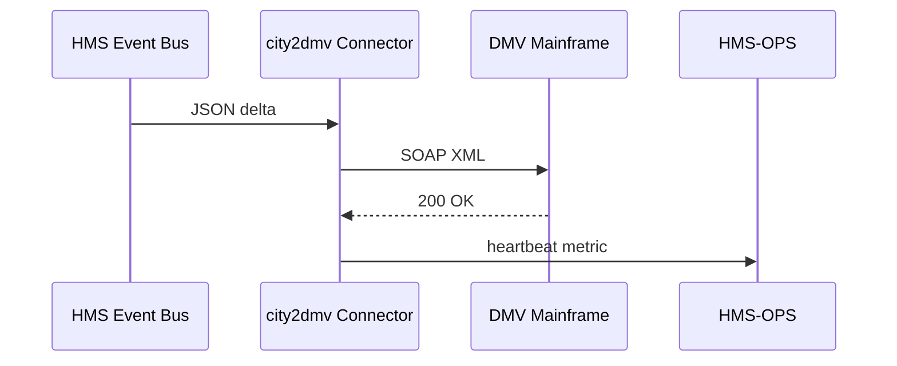

# Chapter 19: External System Synchronization

*(Coming from [Security, Compliance & Legal Reasoning (HMS-ESQ)](18_security__compliance___legal_reasoning__hms_esq__.md) where we learned how every HMS message is checked before leaving the house.  Today we cross the **cloud boundary** and make sure outside partners actually **receive** our updates—within seconds, not weeks.)*

---

## 1. Why Do We Need a “Translation Booth”?

### Story — *Zoning Permit Ping-Pong*

1. **Alex** submits a zoning-permit application in his city’s shiny HMS portal.  
2. The city must also alert the **State DMV** (heavy-truck traffic study) and the **County Tax Office** (property-value reassessment).  
3. Those external systems are 1990s mainframes. If HMS just *e-mails* them, staff will manually type the data next Thursday.  
4. With **External System Synchronization (ESS)** HMS pushes an event; **connectors** translate it into the exact COBOL record or SOAP call the mainframe expects—**within 5 seconds**.  
5. Alex sees *“All agencies notified”* on his dashboard the same minute.

No manual re-keying, no week-long lag.

---

## 2. Key Concepts (one-by-one)

| Friendly Nickname | ESS Term | What It Means |
|-------------------|----------|---------------|
| Plug Adapter | **Connector** | Tiny service that turns an HMS event into the target system’s dialect. |
| Packing Slip | **Manifest** | YAML file declaring *what* to send and *where*. |
| Tick-Tock | **Heartbeat** | “I’m alive” ping—ops can page if a connector dies. |
| Change List | **Delta Feed** | Only the fields that changed (saves bandwidth). |
| Time Machine | **Replay Window** | Buffer that can resend last N minutes if partner was down. |

> If HMS-OPS is our “NORAD,” ESS connectors are the **radios** that let NORAD talk to older outposts.

---

## 3. 3-File “Hello Connector” (City → State DMV)

We will:

1. Declare a manifest,  
2. Write a 15-line connector,  
3. Watch HMS push a delta feed.

### 3.1 Manifest (≤ 10 lines)

```yaml
# dmv_manifest.yml
id: city2dmv
listen_topic: "permits.changed"
target_url:  "https://dmv.state.gov/soap/permits"
fields: ["permit_id","street","truck_limit"]
heartbeat_sec: 30
```

*Explanation*  
• Listen to internal event `permits.changed`.  
• Forward only three fields to the DMV SOAP endpoint.  
• Send a heartbeat every 30 s so OPS can alert if it stops.

### 3.2 Connector Code (15 lines)

```python
# city2dmv.py
import httpx, json, os, time, pika

BUS = pika.BlockingConnection(pika.URLParameters(os.getenv("BUS_URL")))
CH  = BUS.channel()
TARGET = os.getenv("TARGET_URL")

def to_soap(payload):
    # 1-line XML wrapper (real life needs full schema)
    return f"<Permit><ID>{payload['permit_id']}</ID></Permit>"

def on_msg(ch, mthd, prop, body):
    data = json.loads(body)
    xml  = to_soap(data)
    httpx.post(TARGET, data=xml, timeout=5)

CH.basic_consume("permits.changed", on_msg, auto_ack=True)

while True:          # heartbeat loop
    httpx.post(f"{TARGET}/ping")
    time.sleep(30)
```

*What happens?*  
1. Connector listens to the HMS event bus.  
2. Converts JSON → minimal XML.  
3. Posts to DMV; sends “/ping” every 30 s.

### 3.3 Emit a Delta Feed (HMS side, 12 lines)

```python
# when a permit changes inside HMS
import pika, json, os
bus = pika.BlockingConnection(pika.URLParameters(os.getenv("BUS_URL")))
ch  = bus.channel()

delta = {"permit_id":"P-778", "street":"Main St", "truck_limit":5}
ch.basic_publish(exchange="hms.events", routing_key="permits.changed",
                 body=json.dumps(delta))
```

*Within seconds the DMV mainframe receives `<Permit><ID>P-778</ID></Permit>`.*

---

## 4. What Happens Under the Hood?



1. HMS publishes a delta.  
2. Connector translates & posts.  
3. Success/fail & heartbeat are logged in OPS.

---

## 5. Inside ESS (Code-Light Peek)

### 5.1 Offsets Table (SQLite, 8 lines)

```sql
CREATE TABLE sync_offsets (
  topic      TEXT PRIMARY KEY,
  last_ts    DATETIME        -- last event sent
);
```

• Protects against duplicate sends; replay starts from `last_ts`.

### 5.2 Replay Job (≤ 16 lines)

```python
# replay.py
import sqlite3, time, httpx, json
DB = sqlite3.connect("ess.db")
while True:
    for topic, last in DB.execute("SELECT topic,last_ts FROM sync_offsets"):
        events = bus.fetch_since(topic, last)   # pseudo helper
        for ev in events:
            httpx.post(TARGET, data=to_soap(ev))
            DB.execute("UPDATE sync_offsets SET last_ts=? WHERE topic=?", (ev["ts"], topic))
    time.sleep(60)
```

If DMV was offline for 30 min, replay resends missed events automatically.

---

## 6. Where ESS Fits in the HMS House

```mermaid
graph TD
  ESS["🔄 ESS Connectors"] --> BUS["🚌 Event Bus"]  %% Chapter 3
  ESS --> OPS["🔭 HMS-OPS"]                         %% heartbeats
  ESS --> ESQ["🛡️ HMS-ESQ"]                         %% scans outgoing
  ESS --> MCP["🤝 HMS-MCP"]                         %% envelopes if PHI
```

* Connectors **subscribe** to the event bus you built in [HMS Micro-services Backbone](03_hms_micro_services_backbone_.md).  
* Every outgoing payload is first checked by **HMS-ESQ** (legal).  
* Heartbeats & failures show up as `ess_connector_up` in **HMS-OPS** dashboards.  
* Sensitive data rides in an [MCP envelope](11_hms_mcp___model_context_protocol__.md) so consent & provenance follow it.

---

## 7. Common Beginner Questions

| Question | Quick Fix |
|----------|-----------|
| “Connector floods the partner.” | Add `debounce_sec` in the manifest; ESS will merge rapid changes. |
| “DMV endpoint times out.” | ESS automatically retries with back-off; tune `max_retry` in manifest. |
| “Need bi-directional sync.” | Deploy a **reverse connector** from DMV → HMS using the same pattern. |
| “How do I push huge files?” | Ship a signed HMS-DTA URL inside the event; connector only passes the link. |

---

## 8. Hands-On Checklist

1. Write a **manifest** (≤ 10 lines).  
2. Code a **connector** (≤ 20 lines) → drop into `connectors/`.  
3. Run `hms ess deploy city2dmv` → CI wires heartbeats & retries.  
4. Watch the **OPS dashboard** light up green boxes for every heartbeat.  
5. Toggle DMV endpoint off, verify replay after it comes back.

---

## 9. Summary

You just learned:

1. Why “translation booths” keep HMS in sync with legacy or partner systems.  
2. Five key pieces: Connector, Manifest, Heartbeat, Delta Feed, Replay Window.  
3. How to build a city-to-DMV connector in **under 20 lines of code**.  
4. Internal safeguards—offset table, retries, heartbeats—fit in coffee-break snippets.  
5. How ESS hooks into the Event Bus, OPS, ESQ, and MCP for a full end-to-end safety net.

This closes our beginner tour of HMS-DOC’s core layers.  
Grab a beverage, deploy your first connector, and watch legacy mainframes finally keep pace with the cloud!

---

Generated by [AI Codebase Knowledge Builder](https://github.com/The-Pocket/Tutorial-Codebase-Knowledge)