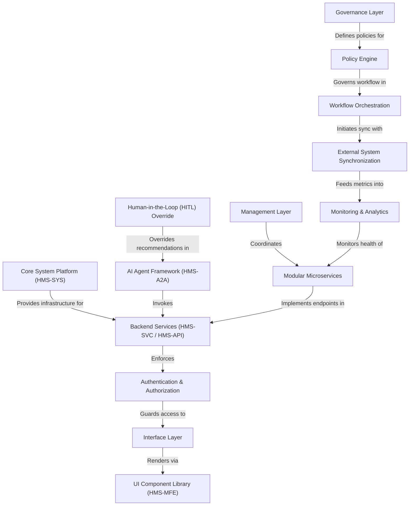

# Tutorial: HMS-DOC

The **Hardison Management Systems (HMS)** platform is an *AI-powered*, expert-led workflow automation suite designed for government and public sector use. It unifies **policy management**, **service orchestration**, and **human-in-the-loop oversight** to help agencies deliver citizen services, enforce compliance, and streamline operations. Users interact through customizable **UI components**, while administrators and policy-makers retain transparency, auditability, and *ethical AI governance* across every step.

**Source Repository:** [None](None)

## Chapters

1. [Interface Layer
](01_interface_layer_.md)
2. [UI Component Library (HMS-MFE)
](02_ui_component_library__hms_mfe__.md)
3. [Authentication & Authorization
](03_authentication___authorization_.md)
4. [Management Layer
](04_management_layer_.md)
5. [Governance Layer
](05_governance_layer_.md)
6. [Policy Engine
](06_policy_engine_.md)
7. [Workflow Orchestration
](07_workflow_orchestration_.md)
8. [AI Agent Framework (HMS-A2A)
](08_ai_agent_framework__hms_a2a__.md)
9. [Human-in-the-Loop (HITL) Override
](09_human_in_the_loop__hitl__override_.md)
10. [External System Synchronization
](10_external_system_synchronization_.md)
11. [Core System Platform (HMS-SYS)
](11_core_system_platform__hms_sys__.md)
12. [Backend Services (HMS-SVC / HMS-API)
](12_backend_services__hms_svc___hms_api__.md)
13. [Modular Microservices
](13_modular_microservices_.md)
14. [Monitoring & Analytics
](14_monitoring___analytics_.md)

---

Generated by [AI Codebase Knowledge Builder](https://github.com/The-Pocket/Tutorial-Codebase-Knowledge)