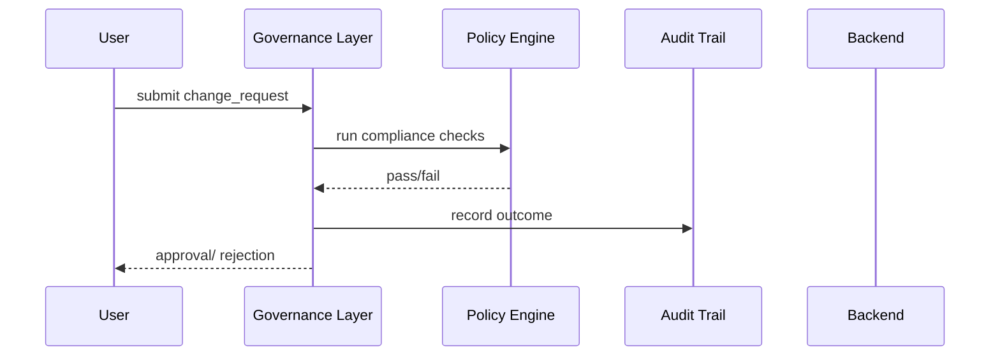
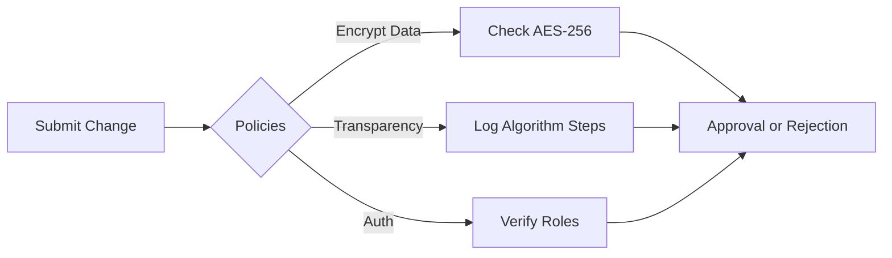

# Chapter 1: Governance Layer

Welcome to Chapter 1 of HMS-MCP! In this chapter, we’ll explore the **Governance Layer**, the rulebook and referee that keeps everything in check.

---

## 1.1 Why Do We Need a Governance Layer?

Imagine the Department of Transportation wants to roll out an AI optimizer that predicts maintenance needs for bridges. Before activating it, they must ensure:

- **Privacy**: Citizen and infrastructure data stay confidential.  
- **Transparency**: Stakeholders can see why the AI made each recommendation.  
- **Compliance**: All actions follow federal regulations.

The Governance Layer enforces these rules automatically—no surprises, no violations.

---

## 1.2 Key Concepts

1. **Policies**  
   Think of policies as laws in a rulebook.  
   - “All personal data must be encrypted.”  
   - “No algorithmic change goes live without a human sign-off.”

2. **Compliance Checks**  
   Before any update, the system runs through each policy to sign off:  
   - Data format checks  
   - Authorization verifications  

3. **Audit Trails**  
   Every action (policy check, approval, override) is logged with a timestamp and user ID.  
   This log is the referee’s notebook—so you can always prove you played by the rules.

---

## 1.3 Solving Our Use Case

Let’s walk through a simple script that:  
1. Registers a new policy.  
2. Validates an AI-driven change request.  
3. Generates an audit record.

```python
from hms_mcp import GovernanceLayer

# 1. Initialize the Governance Layer
gov = GovernanceLayer()

# 2. Add a policy: ensure data is encrypted
gov.add_policy(
    name="EncryptCitizenData",
    description="All citizen records must use AES-256 encryption",
    check=lambda data: data.is_encrypted()
)

# 3. Validate a request
change_request = {"user": "alice", "data": citizen_record}
result = gov.validate("EncryptCitizenData", change_request)

print(result)  # -> {"passed": True, "message": "OK"}
```

Explanation:  
- We create `gov` to manage rules.  
- We add an “EncryptCitizenData” policy with a simple `check` function.  
- We run `validate(...)`, which returns whether the policy passed.

---

## 1.4 What Happens Under the Hood?

Before diving deeper, here’s a step-by-step (non-code) sequence:



1. **User** sends a change request.  
2. **GovLayer** forwards it to **PolicyEng**.  
3. **PolicyEng** evaluates all relevant policies.  
4. **GovLayer** logs the result in **AuditLog**.  
5. **GovLayer** informs the **User**.

---

## 1.5 Inside the Code: Core Files

Here’s a peek at how `GovernanceLayer` ties things together.

#### File: governance_layer.py

```python
# governance_layer.py
from .policy_engine import PolicyEngine
from .audit_trail import AuditTrail

class GovernanceLayer:
    def __init__(self):
        self.engine = PolicyEngine()
        self.audit = AuditTrail()

    def add_policy(self, name, description, check):
        self.engine.register(name, description, check)

    def validate(self, policy_name, request):
        passed, msg = self.engine.check(policy_name, request)
        self.audit.record(policy_name, request, passed, msg)
        return {"passed": passed, "message": msg}
```

- **PolicyEngine** holds all policies and runs checks.  
- **AuditTrail** writes logs to a secure store.

#### File: policy_engine.py

```python
# policy_engine.py
class PolicyEngine:
    def __init__(self):
        self.policies = {}

    def register(self, name, description, check):
        self.policies[name] = (description, check)

    def check(self, name, request):
        _, check_fn = self.policies[name]
        if check_fn(request["data"]):
            return True, "OK"
        return False, "Policy failed"
```

---

## 1.6 Visualizing Policies

Here’s a simple mermaid chart showing how multiple policies fit:



---

## 1.7 Summary & Next Steps

You’ve learned how the Governance Layer:

- Defines and registers policies  
- Runs compliance checks  
- Records audit trails  

Next, we’ll see how these clean, governed actions surface to users and apps via the [Interface Layer](02_interface_layer_.md).  

See you in Chapter 2!

---

Generated by [AI Codebase Knowledge Builder](https://github.com/The-Pocket/Tutorial-Codebase-Knowledge)