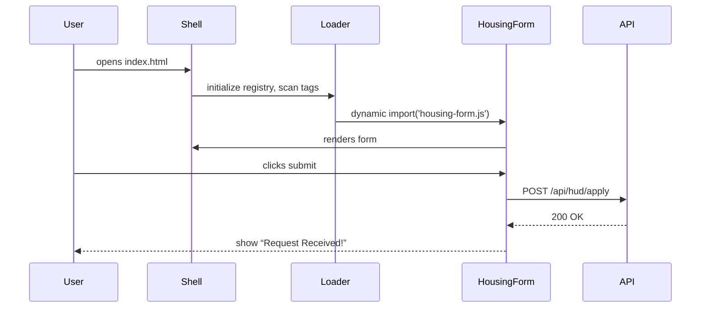

# Chapter 1: Micro-Frontend User Interface (HMS-MFE)

Welcome to the HMS Micro-Frontend world! In this chapter, you’ll learn how HMS-MFE stitches together small, reusable UI pieces so citizens and administrators can interact with government services—without one big, fragile monolith.

---

## 1. Motivation & Central Use Case

Imagine Jane, a citizen who needs both housing assistance (HUD) and a transit subsidy (FTA). Rather than navigating two entirely different portals, she lands on a single “citizen services” page. Each service appears as its own window—one for HUD, one for FTA—yet they share the same header, style, and navigation.

HMS-MFE makes this possible by treating each agency feature as a “micro-frontend.” You can swap in or update the HUD module without touching the FTA module or the overall shell.

---

## 2. Key Concepts

1. **Shell (Host App):**  
   The container that loads and displays micro-frontends in designated slots.

2. **Micro-Frontend Components:**  
   Self-contained UI pieces (e.g., `<housing-form>`, `<transit-status>`), each built and deployed independently.

3. **Registry & Loader:**  
   A small JavaScript runtime that maps component names to file URLs and dynamically imports them.

4. **Isolation & Styling:**  
   Each micro-frontend can include its own CSS/JS without interfering with others.

---

## 3. Hands-On: Building a Citizen Request Form

### 3.1 Create Your Shell

File: `index.html`
```html
<!DOCTYPE html>
<html>
<head>
  <title>Citizen Portal</title>
  <script src="hms-mfe-loader.js"></script> <!-- loader from HMS-MFE -->
</head>
<body>
  <h1>Citizen Services</h1>

  <!-- Slots for agency widgets -->
  <section id="hud-slot"><housing-form agency="HUD"></housing-form></section>
  <section id="fta-slot"><transit-status agency="FTA"></transit-status></section>
</body>
</html>
```
> This HTML is your shell. It references `hms-mfe-loader.js`, which will turn `<housing-form>` and `<transit-status>` tags into full apps.

### 3.2 Define a Simple HUD Form Component

File: `housing-form.js`
```js
class HousingForm extends HTMLElement {
  connectedCallback() {
    this.innerHTML = `
      <h2>HUD Assistance Request</h2>
      <button id="submit">Submit Request</button>
      <div id="response"></div>`;
    this.querySelector('#submit')
        .addEventListener('click', ()=> this.send());
  }
  async send() {
    // Simulate API call
    const res = await fetch(`/api/hud/apply`, {method:'POST'});
    this.querySelector('#response').textContent = 'Request Received!';
  }
}
customElements.define('housing-form', HousingForm);
```
> When Jane clicks “Submit Request,” it calls the HUD API and shows a confirmation message.

---

## 4. What Happens Under the Hood?

Below is a minimal sequence of events when the page loads and Jane hits “Submit.”



---

## 5. Internal Implementation Walkthrough

### 5.1 Non-Code Overview

1. **Shell loads** `hms-mfe-loader.js`.  
2. Loader scans the DOM for custom tags.  
3. For each tag, it looks up a URL in a registry.  
4. It dynamically imports the JS module, registers the web component, and hydrates the slot.

### 5.2 Code Snippet: The Loader

File: `hms-mfe-loader.js`
```js
// A tiny registry mapping names to URLs
const registry = {
  'housing-form': '/widgets/housing-form.js',
  'transit-status': '/widgets/transit-status.js'
};

window.addEventListener('DOMContentLoaded', () => {
  Object.keys(registry).forEach(tag => {
    if (document.querySelector(tag)) {
      import(registry[tag]); // dynamically load the component
    }
  });
});
```
> The loader finds `<housing-form>` in the page and does `import('/widgets/housing-form.js')`. That file calls `customElements.define()`, and the browser displays your UI.

---

## 6. Summary & Next Steps

You’ve seen how HMS-MFE lets you:
- Build a **shell** that hosts multiple micro-frontends.
- Define **reusable web components** for each agency.
- Dynamically **load** only what you need, keeping updates safe and isolated.

Up next, we’ll look under the hood of administration and governance with [Admin/Governance Portal (HMS-GOV)](02_admin_governance_portal__hms_gov__.md).

---

Generated by [AI Codebase Knowledge Builder](https://github.com/The-Pocket/Tutorial-Codebase-Knowledge)