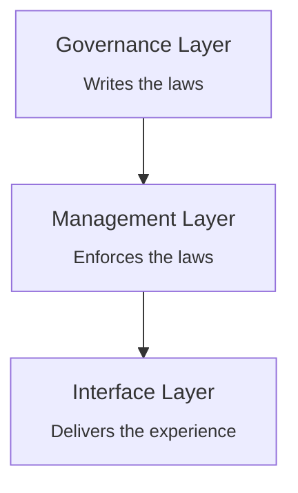
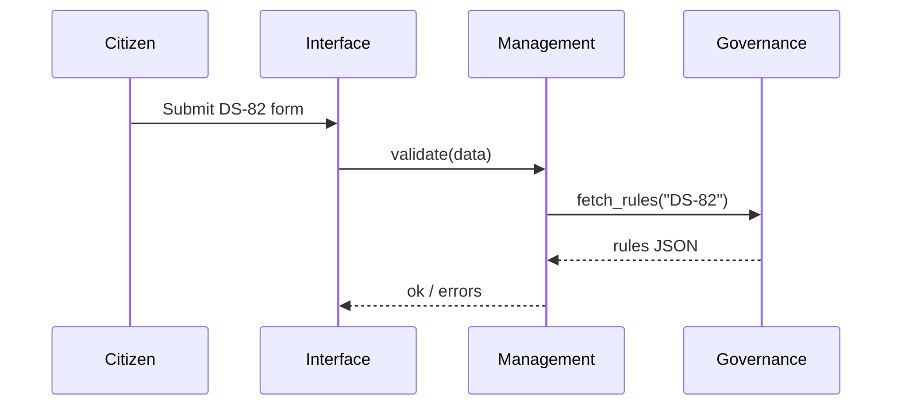

# Chapter 1: Multi-Layered Governance Architecture


> “If software were a city hall, where are the council chambers, the security desk, and the service window?”  
> —A bewildered new admin, day 1 on the HMS project

Welcome to HMS-MCP!  
Before we write a single line of policy or spin up any AI agents, we need to know **where decisions live**.  
Multi-Layered Governance Architecture gives us a floor-plan so clear that even a brand-new intern can point to it and say:

* “That rule was written upstairs in Governance.”  
* “Management enforces it right here.”  
* “Citizens feel it through this Interface widget.”

---

## 1. A Concrete Use-Case

Imagine María renewing her U.S. passport online.

1. She fills out Form DS-82 on a friendly web page.  
2. A fee is automatically charged and cross-checked against Treasury rules.  
3. An AI agent validates her photo using Department of Commerce facial-recognition guidelines.  
4. The system logs every step for the Office of the Comptroller of the Currency to audit payment flows.

Without a layered map, debugging a rejected application would take days.  
With Multi-Layered Governance, an auditor instantly sees:

* Rule DS-82-P05 (photo must be < 6 months old) → **Governance Layer**  
* AI-Photo-Checker micro-service → **Management Layer**  
* “Upload Photo” screen → **Interface Layer**

One glance. Zero confusion.

---

## 2. The Three Floors



| Floor | Real-world analogy | HMS role |
|-------|-------------------|----------|
| Governance | City council chamber | Stores policies, legal constraints, budget rules |
| Management | Security & records offices | Runs services, AI agents, workflows |
| Interface | Public service window | Screens, APIs, chatbots citizens touch |

### 2.1 Governance Layer
*Declarative rules, legal citations, versioning.*

> e.g., “All payments < $10,000 must clear ACH in 24 h (31 CFR 210).”

### 2.2 Management Layer
*Stateless services, agents, worker queues.*

> e.g., An agent that calls Treasury’s **Fiscal Service** API to settle fees.

### 2.3 Interface Layer
*React components, REST endpoints, voice bots.*

> e.g., The `/renew-passport` page and its “Pay & Submit” button.

---

## 3. Tagging Components with a Floor

Every file, micro-service, screen, or agent must declare its floor.  
We keep it stupid-simple—just add a one-liner in `component.yaml`.

```yaml
# passport_photo_checker/component.yaml
name: AI-Photo-Checker
layer: Management       # Governance | Management | Interface
owner: Dept_of_Commerce
```

Explanation  
1. `layer` answers “Where do I live?”  
2. Static analysis tools shout if the value is missing.  
3. Dashboards automatically group items by floor.

---

## 4. Walking Through the Passport Renewal

Below is the **happy path** in 10 lines of pseudo-code:

```python
def renew_passport(request):
    policy = get_policy("DS-82")        # Governance
    validate(request, policy)           # Management
    charge_card(request.card)           # Management
    render_success_screen()             # Interface
```

What happens?

1. `get_policy` fetches the rules from the Governance Layer.  
2. The Management Layer enforces them (validation & payment).  
3. The Interface Layer shows success.

Total trace depth: three clear hops—exactly one per floor.

---

## 5. Internal Flow (No PhD Needed)



* Four actors, **≤ 5** messages—easy to reason about.  
* Auditors can replay this exact flow.

---

## 6. A Peek Under the Hood

Let’s stub the rule fetcher (`rules.py`). Real code is larger; this is the idea.

```python
# rules.py  (Governance Layer)
RULES = {"DS-82": {"photo_age_months": 6}}

def get_policy(form_id):
    """Return policy dict for a form."""
    return RULES.get(form_id, {})
```

And the validator (`validator.py`) that lives one floor down.

```python
# validator.py  (Management Layer)
from rules import get_policy

def validate(req, policy_id):
    policy = get_policy(policy_id)
    if req.photo_age_months > policy["photo_age_months"]:
        raise ValueError("Photo too old")
```

Finally, Interface glue.

```python
# views.py  (Interface Layer)
from validator import validate

def submit(request):
    try:
        validate(request, "DS-82")
        return "Success 🎉"
    except ValueError as err:
        return f"Error: {err}"
```

All three snippets fit on one screen—layers stay obvious.

---

## 7. Why Administrators Love This

• **Traceability** – Map any citizen complaint back to the floor where it originated.  
• **Separation of Duties** – Legal teams update rules without touching code.  
• **Scalability** – New micro-services simply declare a floor; dashboards update instantly.  
• **Cross-Agency Clarity** – The Mississippi River Commission and the Department of Commerce can share services yet keep policies distinct.

---

## 8. Quick Checklist

☐ Every component has a `layer` tag  
☐ Governance rules are stored separately from executable code  
☐ Dashboards group logs by layer  
☐ Sequence diagrams stay under five participants

If you can tick these four boxes, you’re already using Multi-Layered Governance Architecture!

---

## 9. What’s Next?

Layers give us the blueprint; now we need a language to talk between them.  
In the next chapter we’ll introduce the **Model Context Protocol (MCP)**—the way policies, agents, and UIs exchange context safely.

👉 Continue to: [Model Context Protocol (HMS-MCP)](02_model_context_protocol__hms_mcp__.md)

Happy building!

---

Generated by [AI Codebase Knowledge Builder](https://github.com/The-Pocket/Tutorial-Codebase-Knowledge)