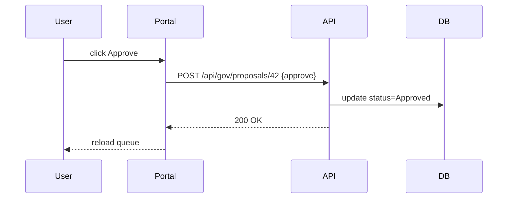

# Chapter 2: Admin/Governance Portal (HMS-GOV)

Welcome back! Now that you’ve seen how citizens interact with services using [HMS-MFE](01_micro_frontend_user_interface__hms_mfe__.md), let’s climb up to the “mayor’s office” and learn how decision-makers review, tweak, and approve AI-driven proposals.

---

## 1. Motivation & Central Use Case

Imagine the Farm Service Agency wants to let an AI suggest emergency aid allocations after a flood.  
A policy expert (the “mayor”) needs to:
- See all AI recommendations in one place  
- Adjust parameters (e.g., per-farm cap)  
- Approve or roll back proposals  
- Keep an audit trail for compliance  

The **Admin/Governance Portal** gives them dashboards, approval queues, and audit logs so every AI action has a human in the loop.

---

## 2. Key Concepts

1. **Dashboard**  
   A snapshot of all active proposals with status badges (Pending, Approved, Rolled Back).

2. **Approval Queue**  
   A list where each AI-generated proposal waits for a decision.

3. **Audit Trail**  
   A record of who did what, when—critical for public-sector compliance.

4. **Parameter Panel**  
   A form where decision-makers tweak AI settings (thresholds, budgets).

5. **Human-In-The-Loop (HITL) Oversight**  
   Ensures no AI recommendation auto-executes without human sign-off.

---

## 3. Hands-On: Building a Minimal Governance Portal

We’ll create a simple HTML + JS portal that:
1. Fetches proposals  
2. Shows them in a queue  
3. Lets a user approve or reject  
4. Logs actions  

### 3.1 The HTML Shell

File: `gov-portal.html`
```html
<!DOCTYPE html>
<html>
  <head>
    <title>HMS-GOV Portal</title>
    <script src="gov-portal.js"></script>
  </head>
  <body>
    <h1>HMS Governance Portal</h1>
    <section id="queue"></section>
  </body>
</html>
```
This loads `gov-portal.js`, which we’ll write next.

### 3.2 Fetching Proposals

File: `gov-portal.js` (part 1)
```js
async function loadQueue() {
  const resp = await fetch('/api/gov/proposals');
  const proposals = await resp.json();
  renderQueue(proposals);
}
window.addEventListener('load', loadQueue);
```
Explanation:  
- On page load, we GET `/api/gov/proposals`.  
- We pass the data to `renderQueue()`.

### 3.3 Rendering the Queue

File: `gov-portal.js` (part 2)
```js
function renderQueue(items) {
  const container = document.getElementById('queue');
  container.innerHTML = '';
  items.forEach(p => {
    container.innerHTML += `
      <div id="p${p.id}">
        <strong>${p.title}</strong>
        <button onclick="decide(${p.id}, 'approve')">Approve</button>
        <button onclick="decide(${p.id}, 'reject')">Reject</button>
      </div>`;
  });
}
```
Explanation:  
- For each proposal, we show title + two buttons.  
- Clicking calls `decide(id, action)`.

### 3.4 Approving or Rejecting

File: `gov-portal.js` (part 3)
```js
async function decide(id, action) {
  await fetch(`/api/gov/proposals/${id}`, {
    method: 'POST',
    body: JSON.stringify({ decision: action })
  });
  logAction(id, action);
  loadQueue(); // refresh
}
function logAction(id, action) {
  console.log(`User ${action}d proposal ${id} at ${new Date().toISOString()}`);
}
```
Explanation:  
- We POST the decision, then log and refresh the queue.

---

## 4. What Happens Under the Hood?

Here’s a simplified flow when the policy expert clicks “Approve”:



---

## 5. Internal Implementation Walkthrough

1. **User loads** `gov-portal.html`.  
2. **Browser** runs `gov-portal.js`, calling `loadQueue()`.  
3. **Portal** fetches proposals from the **API**.  
4. **API** queries the **DB**, returns JSON.  
5. Portal **renders** the queue.  
6. User **decides** → portal POSTs decision → API updates DB → portal reloads.

---

## 6. Deeper Dive: Audit Trail Service

In a real system, we don’t just `console.log()`. We call an audit service:

File: `audit.js`
```js
export async function record(action, userId, proposalId) {
  await fetch('/api/gov/audit', {
    method: 'POST',
    body: JSON.stringify({ action, userId, proposalId, timestamp: Date.now() })
  });
}
```
Then in `decide()` we’d import and call `record()` to store every action in a compliant log.

---

## 7. Summary & Next Steps

You’ve learned how HMS-GOV provides:
- A **queue** for AI proposals  
- Simple **approve/reject** workflows  
- A basic **audit trail**  

Next up: guiding users through choices with our [Intent-Driven Navigation Engine](03_intent_driven_navigation_engine_.md).

---

Generated by [AI Codebase Knowledge Builder](https://github.com/The-Pocket/Tutorial-Codebase-Knowledge)