# Chapter 2: Governance Layer (HMS-GOV)


*(“The City Hall of the Platform”)*

[← Back to Chapter 1](01_ai_governance_values__transparency__truth__safety__ethics__privacy__.md)

---

## 1. Motivation — The FCC Broadband Subsidy Story

The Federal Communications Commission (FCC) is about to roll out a brand-new broadband subsidy application.  
The web team finishes the form, the AI team trains a model to auto-qualify applicants, and the devs push **“Deploy.”**

Stop! 🛑  
Before a single byte reaches citizens, the platform must answer five questions from Chapter 1:

1. Is the new form Transparent?  
2. Is the data Truthful?  
3. Is the model Safe?  
4. Is the decision-making Ethical?  
5. Is personal data Private?

The place that asks (and records!) those questions is the **Governance Layer (HMS-GOV)**.  
Nothing touches production until HMS-GOV says **“Yes.”**

---

## 2. What Exactly *Is* HMS-GOV?

Think of a modern city hall:

• The **front desk** receives requests.  
• A **clerk** checks ordinances.  
• A **council** votes.  
• A **vault** stores decisions.

HMS-GOV does the same for software changes.

| City Hall Analogy | HMS-GOV Component | Why It Matters |
|-------------------|-------------------|----------------|
| Front desk        | Governance Portal | Humans open or review tickets |
| Clerk             | Policy Engine     | Inspects code / model against rules |
| Council           | Approval Workflow | Requires sign-off from legal, security, ethics |
| Vault             | Audit Log         | Immutable trail for auditors |

---

## 3. Breaking It Down

### 3.1 Policy Catalog  
A Git-like repo of YAML files (see below) containing all active rules.

### 3.2 Approval Workflow  
Configurable steps: *Submit → Auto Checks → Human Review → Sign-off*.

### 3.3 Runtime Guards  
Tiny code snippets automatically injected in services to enforce approved policies.

### 3.4 Accountability Reports  
PDF/CSV exports showing who changed what, when, and why.

---

## 4. Your First Governance Ticket (Hands-On)

We’ll walk through adding a policy that caps FCC subsidy payouts at \$600.

### 4.1 Draft the Policy File

`fcc_broadband_cap.yml`

```yaml
service: FCC_SUBSIDY_SERVICE
safety:
  max_payout_usd: 600
effective_date: 2024-10-01
owner: FCC_Finance_Dept
```

*Beginner breakdown*  
• `service` – which microservice this affects  
• `safety.max_payout_usd` – the new guardrail  
• `effective_date` – when it activates  
• `owner` – agency contact

### 4.2 Submit It to HMS-GOV (Toy Python)

```python
import requests, yaml, json
policy = yaml.safe_load(open("fcc_broadband_cap.yml"))
resp = requests.post("https://gov.example.org/api/policies",
                     json=policy, timeout=5)
print(resp.json())          # 👉  {"ticket_id": 42, "status": "PENDING"}
```

What happened?  
1. We sent a JSON copy of the YAML file.  
2. HMS-GOV returned a **ticket** (ID 42) now awaiting checks + approvals.

### 4.3 Auto Checks Run

Behind the scenes HMS-GOV validates:  
• schema (is it well-formed YAML?)  
• value ranges (negative payouts are rejected)  
• conflict detection (no duplicate policies)

You just watch the status bar in the portal flip from **PENDING → UNDER-REVIEW**.

### 4.4 Human Sign-off

• Legal team confirms \$600 complies with statute.  
• Security team ensures guard code can enforce it.  
• Ethics officer signs the fairness statement.

Click **“Approve”** → status becomes **APPROVED**.  
Congratulations! The policy now enters production in the next release.

---

## 5. What Happens at Runtime?

```mermaid
sequenceDiagram
participant User as Applicant
participant API as FCC_API
participant GOV as HMS-GOV
participant SVC as SubsidySvc
participant LOG as AuditLog
User->>API: Submit subsidy request (\$800)
API->>GOV: Fetch active caps
GOV-->>SVC: Inject guard (max \$600)
SVC-->>LOG: "Rejected – over cap"
SVC-->>API: Deny request
API-->>User: "Amount exceeds legal limit"
```



Key point: the *service* stays lightweight—HMS-GOV streams the rule just-in-time.

---

## 6. Tiny Glimpse at the Guard Code

`guards/safety.py`

```python
def enforce_max_payout(request, limit):
    if request.amount > limit:
        raise ValueError("Safety breach: amount exceeds cap")
```

Injected automatically by the build pipeline. Under 10 lines, but life-saving!

---

## 7. Under the Hood (Implementation Tour)

### 7.1 File Layout (Simplified)

```
hms-gov/
 ├─ api/            # REST endpoints
 ├─ engine/         # Policy validation & merge
 ├─ guards/         # Pre-built guard snippets
 ├─ workflows/      # YAML defining approval steps
 └─ audit/          # Append-only logs
```

### 7.2 Minimal Validation Function

`engine/validate.py`

```python
def validate(policy):
    req_fields = ["service", "safety"]
    for f in req_fields:
        if f not in policy:
            raise ValueError(f"Missing '{f}'")
    if policy["safety"]["max_payout_usd"] <= 0:
        raise ValueError("Payout must be > 0")
```

Explanation:  
• Checks mandatory keys.  
• Simple numeric sanity check.  
Real code calls advanced schemas, but this is the core idea.

### 7.3 Where Do Users Sign In?

Authentication & role checks live in [Role-Based Access Control (RBAC) & Multi-Tenant Security](04_role_based_access_control__rbac____multi_tenant_security_.md). HMS-GOV simply calls that service.

---

## 8. How HMS-GOV Talks to Other Layers

• It pulls privacy rules from the upcoming  
  [Data Privacy & Compliance Engine](03_data_privacy___compliance_engine_.md).  
• It tags each policy with the author’s role from  
  [RBAC & Multi-Tenant Security](04_role_based_access_control__rbac____multi_tenant_security_.md).  
• It ships metrics to the  
  [Monitoring & Metrics Dashboard](16_monitoring___metrics_dashboard_.md).

Everything is stitched together through the  
[Microservice Mesh & Service Discovery](06_microservice_mesh___service_discovery_.md).

---

## 9. Recap

1. HMS-GOV is the “city hall” that approves every rule, model, and code change.  
2. You created a policy file, submitted it, watched automated and human checks, and saw how a guard enforces it in production.  
3. Internally, HMS-GOV is little more than a policy repo + validation engine + approval workflow + audit log—yet it keeps the entire platform honest.

Ready to dive deeper into **how privacy laws like HIPAA or FERPA become machine-enforceable rules?**  
Continue to [Data Privacy & Compliance Engine](03_data_privacy___compliance_engine_.md).

---

---

Generated by [AI Codebase Knowledge Builder](https://github.com/The-Pocket/Tutorial-Codebase-Knowledge)