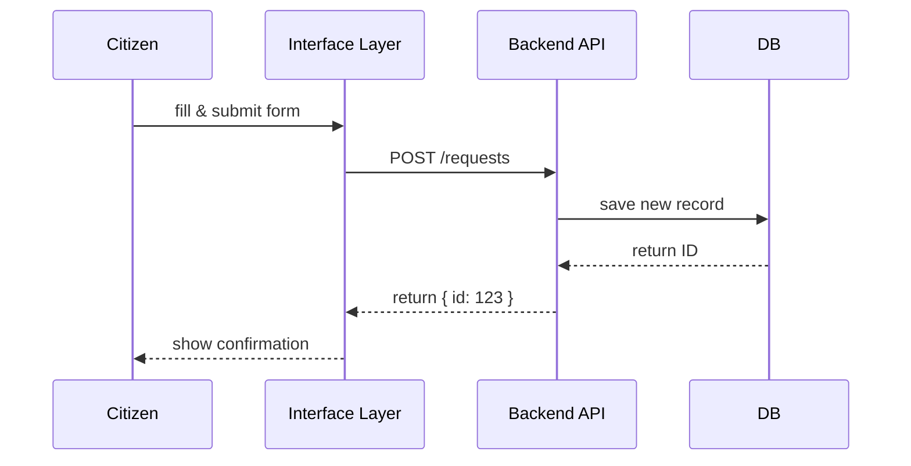

# Chapter 2: Interface Layer

In [Chapter 1: Governance Layer](01_governance_layer_.md) we saw how rules and policies keep our system on track. Now let’s build the **front door**—the screens and forms where citizens and staff actually interact with HMS-MCP.

## 2.1 Why We Need an Interface Layer

Imagine a coastal energy company wants to apply for an offshore drilling permit. They need a simple web portal to:

1. Fill out a permit application form.  
2. Track the application status.  
3. Let government reviewers approve or reject.

The **Interface Layer** (HMS-MFE for citizens, HMS-GOV for admins) is like a well-designed service kiosk. It guides visitors step-by-step, shows data clearly, and hands off requests to the backend.

## 2.2 Key Concepts

1. **Citizen Portal (HMS-MFE)**  
   - Public-facing site where users submit new requests and check status.  
2. **Admin Dashboard (HMS-GOV)**  
   - Protected site for staff to review, approve, or send back for more information.  
3. **UI Components**  
   - Forms, tables, status badges, approval buttons.  
4. **Client-Server Flow**  
   - The portal calls the [Backend API (HMS-API)](03_backend_api__hms_api___hms_svc__.md), which then enforces governance and stores data.

## 2.3 Building the Permit Request Form

Let’s create a minimal form for a “Drilling Permit” request:

```javascript
// 1. Define form fields
const formFields = [
  { name: "companyName", label: "Company Name", type: "text" },
  { name: "siteLocation", label: "Site Location", type: "text" },
  { name: "drillDepth", label: "Drill Depth (ft)", type: "number" }
];

// 2. Render the form
renderForm("Offshore Permit Request", formFields, onSubmit);

// 3. Handle submission
function onSubmit(data) {
  API.submitRequest("drilling-permit", data)
     .then(res => alert("Request ID: " + res.id));
}
```

Explanation:  
- `formFields` describes each input.  
- `renderForm` draws the form and ties the `onSubmit` handler.  
- `API.submitRequest(...)` posts data to HMS-API and shows the new request ID.

## 2.4 Creating the Admin Approval Screen

Staff need to see pending permits and approve them:

```javascript
// 1. Fetch all pending drilling permits
API.getPending("drilling-permit").then(list => {
  list.forEach(item => {
    // 2. Show a row with Approve/Reject buttons
    renderApprovalRow(item, (action) =>
      API.updateStatus(item.id, action)
         .then(() => refreshList())
    );
  });
});
```

Explanation:  
- We call `getPending("drilling-permit")` to list all open requests.  
- For each, we render a row with “Approve” or “Reject.”  
- When clicked, we call `updateStatus(...)` and refresh the table.

## 2.5 What Happens Under the Hood

Here’s the simplified end-to-end flow:



1. **Citizen** submits the form.  
2. **Interface Layer** forwards to the **Backend API**.  
3. **API** saves into the **Database**.  
4. IDs and statuses flow back so the UI can update.

## 2.6 Inside the Code: Core Files

### File: interface_layer.py

```python
# interface_layer.py
class InterfaceLayer:
    def __init__(self, api_client):
        self.api = api_client

    def show_citizen_form(self, config):
        # load form fields and render in browser
        ui = FormRenderer(config)
        ui.on_submit(self.handle_submit)

    def handle_submit(self, form_data):
        # send data to the backend and return response
        return self.api.submit_request(form_data)
```

- `show_citizen_form` drives the front-end form rendering.  
- `handle_submit` is the bridge to HMS-API, which then invokes the [Governance Layer](01_governance_layer_.md) before saving.

## 2.7 Summary & Next Steps

You’ve learned how HMS-MCP’s Interface Layer:

- Defines citizen and admin screens.  
- Guides users with forms, tables, and status flows.  
- Calls into the [Backend API (HMS-API)](03_backend_api__hms_api___hms_svc__.md) to enforce rules and persist data.

Up next: dive into the [Backend API (HMS-API / HMS-SVC)](03_backend_api__hms_api___hms_svc__.md) where the real business logic and AI proposals live!

---

Generated by [AI Codebase Knowledge Builder](https://github.com/The-Pocket/Tutorial-Codebase-Knowledge)